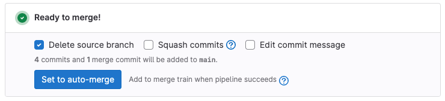
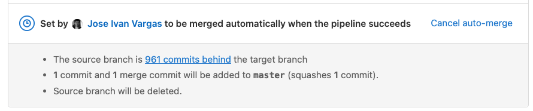



- Tier: 基础版，专业版，旗舰版
- Offering: JihuLab.com，私有化部署





- **流水线成功时合并** 和 **流水线成功时加入合并火车** 在极狐GitLab 16.0 中重命名为 **自动合并**，并带有功能标志 `auto_merge_labels_mr_widget`。默认启用。
- 重命名的自动合并功能在极狐GitLab 16.0 GA。功能标志 `auto_merge_labels_mr_widget` 已移除。
- 增强的自动合并：
  - 在极狐GitLab 16.5 引入，带有两个功能标志 `merge_when_checks_pass` 和 `additional_merge_when_checks_ready`。默认禁用。
  - 在极狐GitLab 17.1 将功能标志 `additional_merge_when_checks_ready` 与 `merge_when_checks_pass` 合并。
  - 在极狐GitLab 17.7 GA。功能标志 `merge_when_checks_pass` 已移除。
- 合并火车的自动合并：
  - 在极狐GitLab 17.2 引入，带有功能标志 `merge_when_checks_pass_merge_train`。默认禁用。
  - 在极狐GitLab 17.7 GA。功能标志 `merge_when_checks_pass_merge_train` 已移除。



如果合并请求的内容已准备好合并，你可以选择 **设置为自动合并**。当所有必需的检查成功完成时，合并请求会自动合并，你无需记得手动合并合并请求。

合并检查使你能够专注于审查合并请求的内容，并使用项目设置来决定其可合并性。当你审查合并请求时，如果你同意合并请求的更改，将其设置为自动合并。极狐GitLab 执行你的项目设置，直到合并请求满足所有合并检查（例如必需的代码所有者和审批规则）为止，它不能合并。在满足所有必需的合并检查后，合并请求会自动合并，无需你进行任何操作。

合并检查包括一个成功的 CI/CD 流水线等等：

- 必须给予所有必需的审批。
- 没有其他合并请求阻止此合并请求。
- 不存在合并冲突。
- 无论 [项目设置](#require-a-successful-pipeline-for-merge) 如何，CI/CD 流水线都必须成功完成。
- 所有讨论都已解决。
- 合并请求不是 **草稿**。
- 所有外部状态检查都已通过。
- 合并请求必须打开。
- 不存在被拒绝的策略。
- 在配置了 [扫描执行策略](../../application_security/policies/scan_execution_policies.md) 或 [流水线执行策略](../../application_security/policies/pipeline_execution_policies.md) 时，最新提交的所有流水线必须在合并请求合并之前成功。
- 如果你的项目 [要求合并请求引用 Jira 议题](../../../integration/jira/issues.md#require-associated-jira-issue-for-merge-requests-to-be-merged)，则合并请求的标题或描述必须包含 Jira 议题链接。
- 如果配置了 [标题验证模式](title_validation.md)，则合并请求标题必须与该模式匹配。
- 如果合并请求设置了 **合并开始** 日期，则当前时间必须在配置的日期之后。

有关所有检查及其 API 等效项，请参阅 [合并状态](../../../api/merge_requests.md#merge-status)。

设置自动合并后，你就不能更改合并请求合并时哪些议题会 [自动关闭](../issues/managing_issues.md#closing-issues-automatically)。

## 自动合并一个合并请求

前提条件：

- 你必须具有项目的 开发者、维护者 或 所有者 角色。
- 如果你的项目配置要求，合并请求中的所有线程必须解决。
- 合并请求必须收到所有必需的审批。

要通过命令行推送执行此操作，请使用 `merge_request.merge_when_pipeline_succeeds` [推送选项](../../../topics/git/commit.md#push-options)。

要从极狐GitLab 用户界面执行此操作：

1. 在顶部栏中，选择 **搜索或跳转到** 并找到你的项目。
1. 在左侧边栏中，选择 **代码** > **合并请求**。
1. 选择要编辑的合并请求。
1. 滚动到合并请求报告部分。
1. 可选。选择你想要的合并选项，例如 **删除源分支**，**压缩提交** 或 **编辑提交信息**。
1. 查看合并请求报告部分的内容。如果它包含一个 [议题关闭模式](../issues/managing_issues.md#closing-issues-automatically)，请确认该议题在合并请求合并时应该关闭：

   

1. 选择 **设置为自动合并**。

如果在设置自动合并后但在流水线完成之前对合并请求进行评论，则合并将被阻止，直到你解决所有现有线程。

## 取消自动合并

你可以取消合并请求上的自动合并。

前提条件：

- 你必须是合并请求的作者，或者是具有 开发者、维护者 或 所有者 角色的项目成员。
- 合并请求的流水线必须仍在进行中。

操作步骤：

1. 在顶部栏中，选择 **搜索或跳转到** 并找到你的项目。
1. 在左侧边栏中，选择 **代码** > **合并请求**。
1. 选择你想要的合并请求。
1. 滚动到合并请求报告部分。
1. 选择 **取消自动合并**。

## 自动合并的流水线成功

如果流水线成功，合并请求自动合并。如果流水线失败，作者可以重试任何失败的任务，或推送新的提交来修复失败：

- 如果重试的任务在第二次尝试时成功，合并请求自动合并。
- 如果你向合并请求添加新提交，极狐GitLab 会取消请求，以确保新更改在合并前得到审查。
- 如果你向合并请求的目标分支添加新提交，并且你的项目只允许快进式合并请求，极狐GitLab 会取消请求以防止合并冲突。

为了更严格地控制流水线状态，你还可以在合并前 [要求成功的流水线](#require-a-successful-pipeline-for-merge)。

### 要求成功的流水线才能合并

你可以配置你的项目，要求合并前完成并成功通过流水线。此配置适用于：

- 极狐GitLab CI/CD 流水线。
- 来自 [外部 CI 集成](../integrations/_index.md#available-integrations) 运行的流水线。

因此，[禁用极狐GitLab CI/CD 流水线](../../../ci/pipelines/settings.md#disable-gitlab-cicd-pipelines) 不会禁用此功能，但你可以将其与外部 CI 提供商的流水线一起使用。

前提条件：

- 确保你项目的 CI/CD 配置为每个合并请求运行流水线。
- 你必须具有项目的 维护者 或 所有者 角色。

要启用此设置：

1. 在顶部栏中，选择 **搜索或跳转到** 并找到你的项目。
1. 在左侧边栏中，选择 **设置** > **合并请求**。
1. 滚动到 **合并检查**，然后选择 **流水线必须成功**。
   此设置也会阻止没有流水线的合并请求合并，
   这可能会 [与某些规则冲突](#merge-request-cant-merge-despite-no-failed-pipeline)。
1. 选择 **保存**。

如果 [为同一合并请求运行多种流水线类型](#merge-request-can-still-be-merged-despite-a-failed-pipeline)，合并请求流水线优先于其他流水线类型。例如，一个较旧但成功的合并请求流水线允许合并请求合并，尽管有一个较新但失败的分支流水线。

### 允许跳过的流水线后合并

当你为项目设置 **流水线必须成功** 后，[跳过的流水线](../../../ci/pipelines/_index.md#skip-a-pipeline) 会阻止合并请求合并。

前提条件：

- 你必须具有项目的 维护者 或 所有者 角色。

要更改此行为：

1. 在顶部栏中，选择 **搜索或跳转到** 并找到你的项目。
1. 在左侧边栏中，选择 **设置** > **合并请求**。
1. 在 **合并检查** 下：
   - 选择 **流水线必须成功**。
   - 选择 **跳过的流水线视为成功**。
1. 选择 **保存**。

## 防止在特定日期之前合并



- 在极狐GitLab 17.6 中引入。



如果你的合并请求不应该在特定日期和时间之前合并，请设置 **合并可以开始** 日期。此值设置了合并（或合并火车）可以开始的时间。但是，确切合并时间可能有所不同，取决于其他合并检查的满足情况或合并火车的长度。

前提条件：

- 你必须具有项目的 开发者、维护者 或 所有者 角色。

操作步骤：

1. 在顶部栏中，选择 **搜索或跳转到** 并找到你的项目。
1. 在左侧边栏中，选择 **代码** > **合并请求**。
1. 选择要编辑的合并请求。
1. 选择 **编辑**。
1. 从 **合并可以开始** 下拉列表中选择 `在计划日期之后`，然后选择日期和时间。
1. 选择 **保存更改**。

## 故障排除

### 尽管没有失败的流水线，合并请求仍不能合并

在某些情况下，你可以 [要求成功的流水线才能合并](#require-a-successful-pipeline-for-merge)，但却无法合并一个没有失败流水线的合并请求。此设置要求存在一个成功的流水线，而不是没有失败的流水线。根本没有流水线的合并请求不被视为有成功的流水线，因此不能合并。

启用此设置时，请使用 [`rules`](../../../ci/yaml/_index.md#rules) 或 [`workflow:rules`](../../../ci/yaml/_index.md#workflowrules) 来确保每个合并请求都运行流水线。

### 尽管有失败的流水线，合并请求仍能合并

在某些情况下，你可以 [要求成功的流水线才能合并](#require-a-successful-pipeline-for-merge)，但仍然可以合并一个带有失败流水线的合并请求。

对于 **流水线必须成功** 设置，合并请求流水线具有最高优先级。如果为同一合并请求运行多种流水线类型，极狐GitLab 仅检查合并请求流水线是否成功。

如果出现以下情况，合并请求可以有多个流水线：

- [`rules`](../../../ci/yaml/_index.md#rules) 配置导致 [重复流水线](../../../ci/jobs/job_rules.md#avoid-duplicate-pipelines)：一个合并请求流水线和一个分支流水线。在这种情况下，最新合并请求流水线的状态决定合并请求是否可以合并，而不是分支流水线。
- 由外部工具触发的流水线，针对与合并请求相同的分支。

在所有情况下，请更新你的 CI/CD 配置，以防止同一合并请求出现多种流水线类型。

