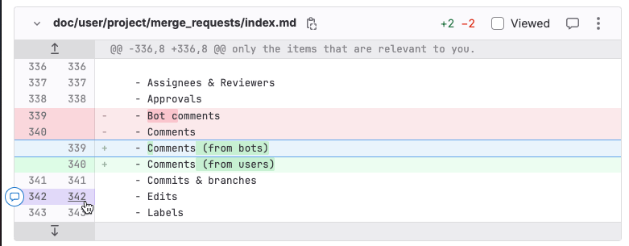
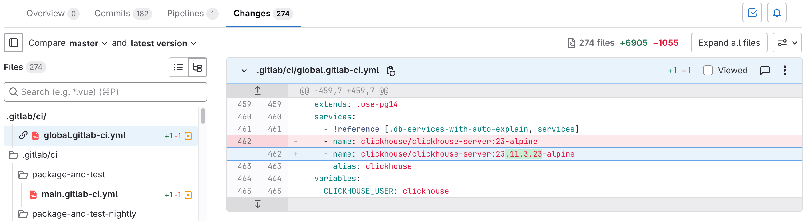
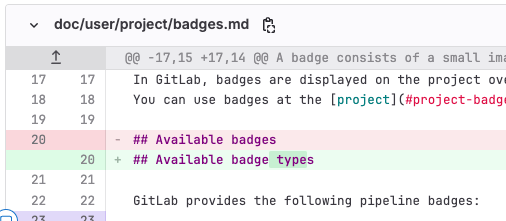
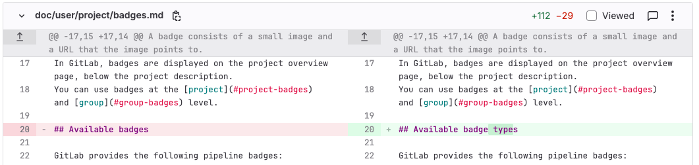
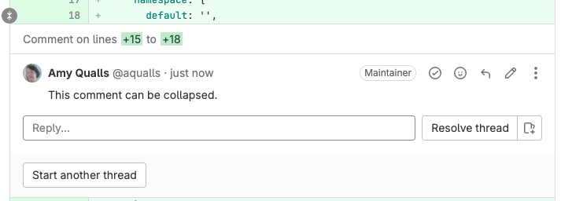
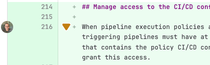
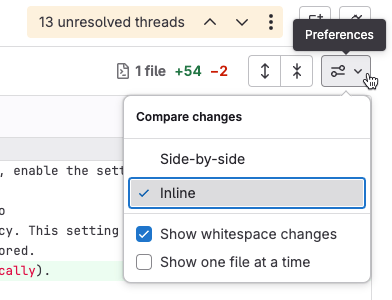
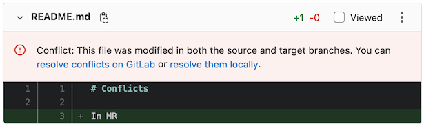



- Tier: 基础版，专业版，旗舰版
- Offering: JihuLab.com，私有化部署



[合并请求](_index.md)会针对仓库中某个分支的文件提出一系列变更建议。极狐GitLab 会以 _diff_（差异）的形式展示当前状态与所提议变更之间的区别。默认情况下，diff 会将你的提议变更（源分支）与目标分支进行比较。极狐GitLab 默认仅显示文件中发生变更的部分。

以下示例展示了对一个文本文件的变更。在默认的语法高亮主题中：

- _当前_ 版本以红色显示，并在行前带有减号（`-`）。
- _提议_ 版本以绿色显示，并在行前带有加号（`+`）。



差异中每个文件的标题包含：

- **隐藏文件内容**（）可隐藏该文件的所有变更。
- **路径**：此文件的完整路径。要复制此路径，请选择 **复制文件路径**（）。
- **更改行数**：此文件中添加和删除的行数，格式为 `+2 -2`。
- **已查看**：选中此复选框可[将文件标记为已查看](#标记文件为已查看)，直到它再次发生变更。
- **评论此文件**（）可留下关于文件的一般评论，而无需将评论固定在特定行上。
- **选项**：选择（）可显示更多文件查看选项。

差异还在文件左侧的边栏中包含导航和评论辅助工具：

- 显示更多上下文：选择**前 20 行**（）可显示前 20 行未更改的行，或选择**后 20 行**（）显示后 20 行未更改的行。
- 行号显示在两列中。左侧显示先前的行号，右侧显示提议的行号。要与某行交互：
  - 要显示[评论选项](#向合并请求文件添加评论)，请将鼠标悬停在行号上。
  - 要复制该行的链接，请按下 <kbd>Command</kbd> 并选择（或右键单击）行号，然后选择**复制链接地址**。
  - 要高亮显示某行，请选择该行号。

<a id="show-a-list-of-changed-files"></a>

## 显示变更文件列表

使用文件浏览器查看合并请求中变更的文件列表：

1. 在顶部栏中，选择**搜索或跳转到**并找到你的项目。
1. 在左侧边栏中，选择**代码** > **合并请求**并找到你的合并请求。
1. 在合并请求标题下方，选择**变更**。
1. 选择**显示文件浏览器**（）或按下 <kbd>F</kbd> 以显示文件树。
   - 要显示嵌套的树状视图，请选择**树状视图**（）。
   - 要显示不嵌套的文件列表，请选择**列表视图**（）。

<a id="show-all-changes-in-a-merge-request"></a>

## 显示合并请求中的所有变更

要查看合并请求中包含的变更 diff：

1. 在顶部栏中，选择**搜索或跳转到**并找到你的项目。
1. 在左侧边栏中，选择**代码** > **合并请求**并找到你的合并请求。
1. 在合并请求标题下方，选择**变更**。
1. 如果合并请求更改了许多文件，你可以直接跳转到特定文件：
   1. 选择**显示文件浏览器**（）或按下 <kbd>F</kbd> 以显示文件树。
   1. 选择要查看的文件。
   1. 要隐藏文件浏览器，请再次选择**显示文件浏览器**或按下 <kbd>F</kbd>。

极狐GitLab 会折叠变更较多的文件以提高性能，并显示消息：**某些更改未显示**。要查看该文件的变更，请选择**展开文件**。

<a id="show-a-linked-file-first"></a>

### 首先显示链接的文件



- Tier: 基础版，专业版，旗舰版
- Offering: JihuLab.com





- 引入于极狐GitLab 16.9，带有功能标志 `pinned_file`。默认禁用。
- 在极狐GitLab 17.4 GA。功能标志 `pinned_file` 已移除。



当你与团队成员分享合并请求链接时，你可能希望将特定文件首先显示在变更文件列表中。要复制一个能将所需文件首先显示的合并请求链接：

1. 在顶部栏中，选择**搜索或跳转到**并找到你的项目。
1. 在左侧边栏中，选择**代码** > **合并请求**并找到你的合并请求。
1. 在合并请求标题下方，选择**变更**。
1. 找到你想要首先显示的文件。右键单击文件名以复制其链接。
1. 当你访问该链接时，所选文件会显示在列表顶部。文件浏览器会在文件名旁边显示一个链接图标（）：

   

<a id="collapse-generated-files"></a>

## 折叠生成的文件



- Tier: 基础版，专业版，旗舰版
- Offering: JihuLab.com，私有化部署





- 引入于极狐GitLab 16.8，带有功能标志 `collapse_generated_diff_files`。默认禁用。
- 在极狐GitLab 16.10 中于 JihuLab.com 和私有化部署启用。
- `generated_file` 在极狐GitLab 16.11 GA。功能标志 `collapse_generated_diff_files` 已移除。



为了帮助审查者专注于执行代码审查所需的文件，极狐GitLab 会折叠几种常见的生成文件类型。极狐GitLab 默认折叠这些文件，因为它们很少需要代码审查：

1. 扩展名为 `.nib`、`.xcworkspacedata` 或 `.xcurserstate` 的文件。
1. 软件包锁定文件，例如 `package-lock.json` 或 `Gopkg.lock`。
1. `node_modules` 文件夹中的文件。
1. 压缩的 `js` 或 `css` 文件。
1. 源映射引用文件。
1. 生成的 Go 文件，包括由 protocol buffer 编译器生成的文件。

要将某个文件或路径标记为已生成，请在你的 [`.gitattributes` 文件](../repository/files/git_attributes.md)中为其设置 `gitlab-generated` 属性。

<a id="view-a-collapsed-file"></a>

### 查看已折叠的文件

1. 在顶部栏中，选择**搜索或跳转到**并找到你的项目。
1. 在左侧边栏中，选择**代码** > **合并请求**并找到你的合并请求。
1. 在合并请求标题下方，选择**变更**。
1. 找到你要查看的文件，然后选择**展开文件**。

<a id="configure-collapse-behavior-for-a-file-type"></a>

### 配置文件类型的折叠行为

要更改某种文件类型的默认折叠行为：

1. 如果项目的根目录中不存在 `.gitattributes` 文件，请创建一个此名称的空白文件。
1. 对于要修改的每种文件类型，在 `.gitattributes` 文件中添加一行，声明文件扩展名以及你期望的行为：

   ```conf
   # Collapse all files with a .txt extension
   *.txt gitlab-generated

   # Collapse all files within the docs directory
   docs/** gitlab-generated

   # Do not collapse package-lock.json
   package-lock.json -gitlab-generated
   ```

1. 提交、推送你的变更并将其合并到你的默认分支中。

当变更合并到你的[默认分支](../repository/branches/default.md)后，项目中该类型的所有文件在合并请求中都会使用此行为。

关于极狐GitLab 如何检测生成文件的技术细节，请参阅 [`go-enry`](https://github.com/go-enry/go-enry/blob/master/data/generated.go) 仓库。

<a id="show-one-file-at-a-time"></a>

## 一次显示一个文件

对于较大的合并请求，你可以一次审查一个文件。你可以在用户偏好设置中更改此设置，也可以在审查合并请求时更改。如果你在合并请求中更改此设置，它也会更新你的用户设置。





1. 在顶部栏中，选择**搜索或跳转到**并找到你的项目。
1. 在左侧边栏中，选择**代码** > **合并请求**并找到你的合并请求。
1. 在合并请求标题下方，选择**变更**。
1. 选择**偏好设置**（）。
1. 选中或清除**一次显示一个文件**。





1. 在右上角，选择你的头像。
1. 选择**偏好设置**。
1. 滚动到**行为**部分，然后选中**在合并请求的「变更」选项卡上一次显示一个文件**复选框。
1. 选择**保存更改**。





当此设置启用时，要选择另一个文件查看，可以：

- 滚动到文件末尾，然后选择**上一个**或**下一个**。
- 如果[键盘快捷键已启用](../../shortcuts.md#启用键盘快捷键)，请按下 <kbd>\[</kbd>、<kbd>]</kbd>、<kbd>k</kbd> 或 <kbd>j</kbd>。
- 选择**显示文件浏览器**（）并选择另一个文件查看。

<a id="compare-changes"></a>

## 比较变更

你可以通过以下任一方式查看合并请求中的变更：

- 内联模式，垂直显示变更。旧版行首先显示，新版行直接显示在其下方。
  内联模式通常更适合单行更改。
- 并排模式，在单独的列中显示行的旧版本和新版本。
  并排模式通常更适合影响大量连续行的更改。

要更改合并请求显示更改行方式：

1. 在顶部栏中，选择**搜索或跳转到**并找到你的项目。
1. 在左侧边栏中，选择**代码** > **合并请求**并找到你的合并请求。
1. 在标题下方，选择**变更**。
1. 选择**偏好设置**（）。选择**并排**或**内联**。
   此示例展示了极狐GitLab 如何在内联和并排两种模式下渲染相同的变更：

   

   

   

   

   

   

   

   

<a id="rapid-diffs"></a>

## 快速差异



- 状态：测试版





- 引入于极狐GitLab 18.1，带有功能标志 `rapid_diffs_on_mr_show`。默认禁用。



> [!功能标志]
> 此功能的可用性由功能标志控制。
> 更多信息，请参见历史记录。

快速差异是一种更快的加载和与合并请求中的代码变更进行交互的方式。
它缩短了你在审查 diff 时看到第一个文件之前的时间。

快速差异处于测试版。经典 diff 体验中的某些功能尚不可用。
关于已知限制的列表，请参见反馈议题 596236。
关于功能对等路线图，请参见史诗 19380。

<a id="turn-on-rapid-diffs"></a>

### 开启快速差异

要为所有合并请求开启快速差异：

1. 在顶部栏中，选择**搜索或跳转到**并找到你的项目。
1. 在左侧边栏中，选择**代码** > **合并请求**并找到你的合并请求。
1. 在合并请求标题下方，选择**变更**。
1. 选择**试用快速差异**。

页面会以新体验重新加载。你的偏好设置会跨会话保留。

要分享关于快速差异的反馈，请选择**快速差异** > **留下反馈**。

<a id="turn-off-rapid-diffs"></a>

### 关闭快速差异

要关闭快速差异并切换回经典的 diff 加载体验：

1. 在顶部栏中，选择**搜索或跳转到**并找到你的项目。
1. 在左侧边栏中，选择**代码** > **合并请求**并找到你的合并请求。
1. 在合并请求标题下方，选择**变更**。
1. 选择**快速差异**以打开下拉列表。
1. 选择**切换到经典加载**。

<a id="explain-code-in-a-merge-request"></a>

## 在合并请求中解释代码



- Tier: 专业版，旗舰版
- Add-on: GitLab Duo Pro 或 Enterprise
- Offering: JihuLab.com，私有化部署





- [默认 LLM](../../gitlab_duo/model_selection.md#默认模型)
- LLM：国内 SOTA 大模型





- 在极狐GitLab 16.8 GA。
- 在极狐GitLab 17.6 及更高版本中，更改为需要 GitLab Duo 附加组件。
- 在极狐GitLab 18.6 中，将默认 LLM 更新为国内 SOTA 大模型。



如果你花费大量时间试图理解其他人创建的代码，或者你难以理解用你不熟悉的语言编写的代码，你可以请求极狐GitLab Duo 为你解释代码。

前提条件：

- 你必须至少属于一个启用了[实验和测试功能设置](../../gitlab_duo/turn_on_off.md#开启测试和实验功能)的群组。
- 你必须具有查看项目的访问权限。

要在合并请求中解释代码：

1. 在顶部栏中，选择**搜索或跳转到**并找到你的项目。
1. 在左侧边栏中，选择**代码** > **合并请求**，然后选择你的合并请求。
1. 选择**变更**。
1. 在你希望解释的文件上，选择三个点（），然后选择**查看文件 @ $SHA**。

   会打开一个单独的浏览器选项卡，并显示包含最新更改的完整文件。

1. 在新选项卡上，选择你想要解释的代码行。
1. 在左侧，选择问号（）。你可能需要滚动到所选内容的第一行才能看到它。

   

极狐GitLab Duo Chat 会解释代码。生成解释可能需要片刻时间。

如果你愿意，你可以提供关于解释质量的反馈。

极狐GitLab 无法保证大型语言模型产生的结果是正确的。请谨慎使用解释。

你还可以在以下位置解释代码：

- [文件](../repository/code_explain.md)。
- [IDE](../../gitlab_duo_chat/examples.md#解释所选代码)。

<a id="expand-or-collapse-comments"></a>

## 展开或折叠评论

在审查代码变更时，你可以隐藏内联评论：

1. 在顶部栏中，选择**搜索或跳转到**并找到你的项目。
1. 在左侧边栏中，选择**代码** > **合并请求**并找到你的合并请求。
1. 在标题下方，选择**变更**。
1. 滚动到包含你想要隐藏的评论的文件。
1. 滚动到评论所在的行。在边栏中，选择**折叠**（）：
   

要展开内联评论并重新显示它们：

1. 在顶部栏中，选择**搜索或跳转到**并找到你的项目。
1. 在左侧边栏中，选择**代码** > **合并请求**并找到你的合并请求。
1. 在标题下方，选择**变更**。
1. 滚动到包含你希望显示的已折叠评论的文件。
1. 滚动到评论所在的行。在边栏中，选择用户头像：
   

<a id="ignore-whitespace-changes"></a>

## 忽略空白变更

空白变更可能会让你更难看清合并请求中的实质性变更。你可以选择隐藏或显示空白变更：

1. 在顶部栏中，选择**搜索或跳转到**并找到你的项目。
1. 在左侧边栏中，选择**代码** > **合并请求**并找到你的合并请求。
1. 在标题下方，选择**变更**。
1. 在变更文件列表之前，选择**偏好设置**（）。
1. 选择或清除**显示空白变更**：

   

<a id="mark-files-as-viewed"></a>

## 标记文件为已查看

当多次审查一个包含许多文件的合并请求时，你可以忽略你已经审查过的文件。要隐藏自你上次审查后未发生变更的文件：

1. 在顶部栏中，选择**搜索或跳转到**并找到你的项目。
1. 在左侧边栏中，选择**代码** > **合并请求**并找到你的合并请求。
1. 在标题下方，选择**变更**。
1. 在文件的标题中，选中**已查看**复选框。

标记为已查看的文件不会再显示给你，除非：

- 文件内容发生变更。
- 你清除了**已查看**复选框。

<a id="show-merge-request-conflicts-in-diff"></a>

## 在差异中显示合并请求冲突

为避免显示已在目标分支上的变更，极狐GitLab 会将合并请求的源分支与目标分支的 `HEAD` 进行比较。

当源分支和目标分支冲突时，极狐GitLab 会在合并请求差异中对每个冲突文件显示一条警告：



<a id="show-scanner-findings-in-diff"></a>

## 在差异中显示扫描结果



- Tier: 旗舰版
- Offering: JihuLab.com，私有化部署



你可以在差异中显示扫描结果。有关详细信息，请参见：

- [代码质量发现](../../../ci/testing/code_quality.md#合并请求变更视图)
- [静态分析发现](../../application_security/sast/_index.md#合并请求变更视图)

<a id="download-merge-request-changes"></a>

## 下载合并请求变更

你可以下载合并请求中包含的变更，以便在极狐GitLab 之外使用。

<a id="as-a-diff"></a>

### 作为差异

要将变更下载为 diff：

1. 在顶部栏中，选择**搜索或跳转到**并找到你的项目。
1. 在左侧边栏中，选择**代码** > **合并请求**并找到你的合并请求。
1. 选择该合并请求。
1. 在右上角，选择**代码** > **纯文本差异**。

如果你知道合并请求的 URL，也可以通过在 URL 后面附加 `.diff` 从命令行下载 diff。此示例下载合并请求 `000000` 的 diff：

```plaintext
https://jihulab.com/gitlab-cn/gitlab/-/merge_requests/000000.diff
```

要在一行 CLI 命令中下载并应用 diff：

```shell
curl "https://jihulab.com/gitlab-cn/gitlab/-/merge_requests/000000.diff" | git apply
```

<a id="as-a-patch-file"></a>

### 作为补丁文件

要将变更下载为补丁文件：

1. 在顶部栏中，选择**搜索或跳转到**并找到你的项目。
1. 在左侧边栏中，选择**代码** > **合并请求**并找到你的合并请求。
1. 选择该合并请求。
1. 在右上角，选择**代码** > **补丁**。

如果你知道合并请求的 URL，也可以通过在 URL 后面附加 `.patch` 从命令行下载补丁。此示例下载合并请求 `000000` 的补丁文件：

```plaintext
https://jihulab.com/gitlab-cn/gitlab/-/merge_requests/000000.patch
```

要使用 [`git am`](https://git-scm.com/docs/git-am) 下载并应用补丁：

```shell
# 下载并预览补丁
curl "https://jihulab.com/gitlab-cn/gitlab/-/merge_requests/000000.patch" > changes.patch
git apply --check changes.patch

# 应用补丁
git am changes.patch
```

你还可以在单个命令中下载并应用补丁：

```shell
curl "https://jihulab.com/gitlab-cn/gitlab/-/merge_requests/000000.patch" | git am
```

`git am` 默认使用 `-p1` 选项。更多信息，请参见 [`git-apply`](https://git-scm.com/docs/git-apply)。

<a id="download-older-diff-versions"></a>

### 下载旧版差异



- 引入于极狐GitLab 18.7。



要将旧版差异版本下载为补丁或 diff 文件：

1. [比较差异版本](versions.md#比较差异版本) 你想要下载的版本。
1. 在 URL 路径后附加 `.diff` 或 `.patch`。

例如：

```plaintext
# 作为 diff 文件：
https://jihulab.com/gitlab-cn/gitlab/-/merge_requests/123456/diffs.diff?diff_id=525410&start_sha=a1b2c3d4

# 作为补丁文件：
https://jihulab.com/gitlab-cn/gitlab/-/merge_requests/123456/diffs.patch?diff_id=525410&start_sha=a1b2c3d4
```

<a id="add-a-comment-to-a-merge-request-file"></a>

## 向合并请求文件添加评论



- 引入于极狐GitLab 16.1，带有功能标志 `comment_on_files`。默认启用。
- 在极狐GitLab 16.2 中功能标志已移除。



你可以向合并请求 diff 文件添加评论。这些评论会在变基和文件更改后持续存在。

要向合并请求文件添加评论：

1. 在顶部栏中，选择**搜索或跳转到**并找到你的项目。
1. 在左侧边栏中，选择**代码** > **合并请求**并找到你的合并请求。
1. 选择**变更**。
1. 在要评论的文件的标题中，选择**评论此文件**（）。

<a id="add-a-comment-to-an-image"></a>

## 向图像添加评论

在合并请求和提交详情视图中，你可以向图像添加评论。此评论也可以是讨论串。

1. 将鼠标悬停在图像上。
1. 选择要发表评论的位置。

极狐GitLab 会在图像上显示一个图标和一个评论字段。

