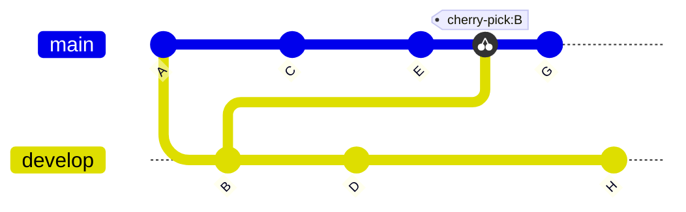
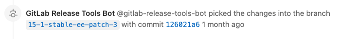
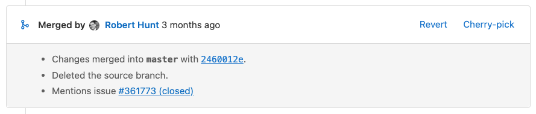



- Tier: 基础版，专业版，旗舰版
- Offering: JihuLab.com，私有化部署



在 Git 中，*精选*是指从某个分支中选取单个提交，并将其作为最新提交添加到另一个分支。源分支中的其余提交不会被添加到目标分支。当你需要单个提交的内容，而不需要整个分支的内容时，请精选提交。例如，当你：

- 将错误修复从默认分支向后移植到之前的发布分支。
- 将变更从派生仓库复制到上游仓库。

你可以使用极狐GitLab UI 从项目或项目派生中精选单个提交或整个合并请求的内容。

在以下示例中，一个 Git 仓库有两个分支：`develop` 和 `main`。
提交 `B` 在 `main` 分支的提交 `E` 之后，从 `develop` 分支被精选。
提交 `G` 在精选之后被添加：

<!-- 图表在 `doc/topics/git/cherry_pick.md` 中复用 -->

## 查看精选提交的系统笔记

当你在极狐GitLab UI 或 API 中精选[合并提交](methods/_index.md#merge-commit)时，极狐GitLab 会在相关合并请求的讨论中添加一条[系统笔记](../system_notes.md)。

系统笔记仅在精选合并提交时创建。使用快进合并时，不会创建系统笔记。这适用于精选单个提交和精选合并请求中的所有变更。

在极狐GitLab UI 或 API 之外精选的提交也不会创建系统笔记。

创建系统笔记时，格式为  `[USER]` **将变更精选到了分支** `[BRANCHNAME]` 中，提交为 `[SHA]` `[DATE]`：

系统笔记会交叉链接新提交和现有的合并请求。
每个部署的[关联合并请求列表](../../../api/deployments.md#list-all-merge-requests-associated-with-a-deployment)包含精选的合并提交。

## 精选合并请求中的所有变更

合并请求被合并后，你可以精选该合并请求引入的所有变更。该合并请求可以位于上游项目或下游派生中。

前置条件：

- 你必须拥有允许编辑合并请求并向仓库添加代码的项目角色。
- 你的项目必须使用[合并提交](methods/_index.md#merge-commit)方法，这可以在项目的 **设置** > **合并请求** 中进行设置。

  [在极狐GitLab 16.9 及更高版本中](https://jihulab.com/gitlab-cn/gitlab/-/issues/142152)，仅当快进提交被压缩或合并请求包含单个提交时，才可以从极狐GitLab UI 中对其进行精选。
  你始终可以[精选单个提交](#cherry-pick-a-single-commit)。

  > [!note]
  > 使用快进合并方法时，不会创建[系统笔记](#view-system-notes-for-cherry-picked-commits)。

操作步骤：

1. 在顶部栏中，选择 **搜索或跳转到** 并找到你的项目。
1. 在左侧边栏中，选择 **代码** > **合并请求**，并找到你的合并请求。
1. 滚动到合并请求报告部分，找到 **合并人** 报告。
1. 在报告的右上角，选择 **精选**：

   
1. 在对话框中，选择要精选到的项目和分支。
1. 可选。选择 **使用这些变更创建新合并请求**。
1. 选择 **精选**。

## 精选单个提交

你可以从极狐GitLab 项目中的多个位置精选单个提交。

如果你精选一个合并提交，极狐GitLab 会在相关合并请求中创建一条[系统笔记](#view-system-notes-for-cherry-picked-commits)，以跟踪该操作。

### 从项目的提交列表

要从项目的所有提交列表中精选一个提交：

1. 在顶部栏中，选择 **搜索或跳转到** 并找到你的项目。
1. 在左侧边栏中，选择 **代码** > **提交**。
1. 选择你要精选的提交的[标题](https://git-scm.com/docs/git-commit#_discussion)。
1. 在右上角，选择 **选项** > **精选**。
1. 在精选对话框中，选择要精选到的项目和分支。
1. 可选。选择 **使用这些变更创建新合并请求**。
1. 选择 **精选**。

### 从仓库的文件视图

当你在项目的 Git 仓库中查看某个文件时，你可以从影响该文件的先前提交列表中进行精选：

1. 在顶部栏中，选择 **搜索或跳转到** 并找到你的项目。
1. 在左侧边栏中，选择 **代码** > **仓库**。
1. 转到提交所更改的文件。在最近的提交块中，选择 **历史**。
1. 选择你要精选的提交的[标题](https://git-scm.com/docs/git-commit#_discussion)。
1. 在右上角，选择 **选项** > **精选**。
1. 在精选对话框中，选择要精选到的项目和分支。
1. 可选。选择 **使用这些变更创建新合并请求**。
1. 选择 **精选**。

## 选择不同的父提交

当你在极狐GitLab UI 中精选合并提交时，主线始终是第一个父提交。使用命令行以不同的主线进行精选。有关更多信息，请参见[复制整个分支的内容](../../../topics/git/cherry_pick.md#copy-the-contents-of-an-entire-branch)。