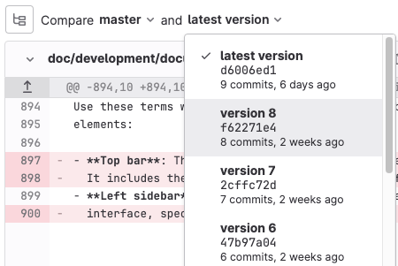



- Tier: 基础版，专业版，旗舰版
- Offering: JihuLab.com，私有化部署



提交记录源代码更改并将其发送到[代码仓](../repository/_index.md)。
更多信息，请参阅[记录对代码仓的更改](https://git-scm.com/book/en/v2/Git-Basics-Recording-Changes-to-the-Repository)。

## 使用命令行提交更改

当你使用命令行时，使用 [`git commit`](../../../topics/git/commands.md#git-commit)。
你可以在推送更改之前添加多个提交。

- 提交信息：

  提交信息标识了更改的内容和原因。使用描述性信息来阐明更改。
  在极狐GitLab 中，你可以向提交信息添加关键字以执行以下操作之一：

  - 触发极狐GitLab CI/CD 流水线：

    如果项目配置了[极狐GitLab CI/CD](../../../ci/_index.md)，你将每次推送触发一个流水线，而不是每次提交。

  - 跳过流水线：

    在提交信息中添加 [`ci skip`](../../../ci/pipelines/_index.md#skip-a-pipeline) 关键字，以使极狐GitLab CI/CD 跳过该流水线。

  - 交叉链接议题和合并请求：

    使用[交叉链接](../issues/crosslinking_issues.md#from-commit-messages) 跟踪工作流的相关部分。
    如果你在提交信息中提到一个议题或合并请求，它们会显示在相应的讨论串中。

- 拣选提交：

  在极狐GitLab 中，你可以从 UI [拣选一个提交](cherry_pick_changes.md#cherry-pick-a-single-commit)。

- 还原提交：

  从 UI [还原一个提交](revert_changes.md#revert-a-commit) 到选定分支。

- 签署提交：

  通过[签署你的提交](../repository/signed_commits/_index.md) 增加额外的安全性。

更多信息，请参阅[暂存、提交和推送更改](../../../topics/git/commit.md)。

## 合并请求的提交

每个合并请求都有一个自创建以来对源分支所做提交的历史记录。

这些提交会显示在合并请求的 **提交** 选项卡上。
在此选项卡上，你可以查看提交信息，并在需要[拣选更改](cherry_pick_changes.md)时复制提交的 SHA。

### 查看合并请求中的提交

要查看合并请求中包含的提交：

1. 在顶部栏中，选择 **搜索或跳转到** 并找到你的项目。
1. 在左侧边栏中，选择 **代码** > **合并请求**，然后选择你的合并请求。
1. 要显示合并请求中的提交列表（最新的在前），选择 **提交**。
   要阅读有关提交的更多信息，在任何提交上选择 **切换提交描述**（）。
1. 要查看提交中的更改，选择提交链接的标题。
1. 要查看合并请求中的其他提交，可以：

   - 选择 **上一个** 或 **下一个**。
   - 使用键盘快捷键：<kbd>X</kbd>（上一个提交）和 <kbd>C</kbd>（下一个提交）。

如果你的合并请求基于之前的合并请求，你可能需要[包含更多提交以获取上下文](#show-commits-from-previous-merge-requests)。

### 显示来自之前合并请求的提交

当你审查合并请求时，你可能需要来自之前提交的信息，以帮助理解你正在审查的提交。
如果另一个合并请求满足以下条件，你可能需要更多上下文：

- 更改了当前合并请求未修改的文件，因此这些文件没有显示在当前合并请求的差异中。
- 更改了你正在当前合并请求中修改的文件，你需要查看工作的进展。

要向合并请求添加之前合并的提交以获取更多上下文：

1. 在顶部栏中，选择 **搜索或跳转到** 并找到你的项目。
1. 在左侧边栏中，选择 **代码** > **合并请求**，然后选择你的合并请求。
1. 选择 **提交**。
1. 滚动到提交列表的末尾，选择 **添加之前合并的提交**。
1. 选择你要添加的提交。
1. 选择 **保存更改**。

之前合并的提交在[合并请求上下文提交 API](../../../api/merge_request_context_commits.md) 中被称为 **上下文提交**。

### 为提交添加评论

> [!warning]
> 如果提交 ID 在强制推送后发生更改，以这种方式创建的话题将会丢失。

要向特定提交添加讨论：

1. 在顶部栏中，选择 **搜索或跳转到** 并找到你的项目。
1. 在左侧边栏中，选择 **代码** > **提交**。
1. 在提交下方，在 **评论** 字段中输入评论。
1. 将你的评论保存为独立评论或话题：
   - 要添加评论，选择 **评论**。
   - 要开始一个话题，选择向下箭头（），然后选择 **开始话题**。

### 查看提交之间的差异

要查看之前合并的提交之间的更改：

1. 在顶部栏中，选择 **搜索或跳转到** 并找到你的项目。
1. 在左侧边栏中，选择 **代码** > **合并请求**，然后选择你的合并请求。
1. 选择 **更改**。
1. 在 **对比**（）旁边，选择要比较的提交：

   

如果你选择了添加上下文所用的之前合并的提交，这些提交也会显示在列表中。

### 查找引入更改的合并请求

当你查看提交详情页面时，极狐GitLab 会链接到一个或多个包含该提交的合并请求。

此行为仅适用于处于合并请求最新版本的提交。
如果提交曾在一个合并请求中，但随后被变基移出该合并请求，则这些提交不会链接。