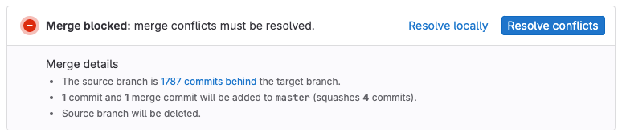
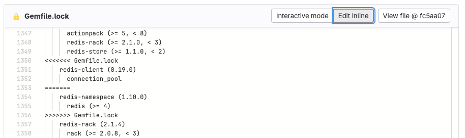



- Tier: 基础版，专业版，旗舰版
- Offering: JihuLab.com，私有化部署



当合并请求中的源分支和目标分支对同一行代码有不同的更改时，就会发生合并冲突。在大多数情况下，极狐GitLab 可以合并这些更改，但当冲突出现时，您必须决定保留哪些更改。

要解决存在冲突的合并请求，您必须执行以下操作之一：

- 创建合并提交。
- 通过变基解决冲突。

极狐GitLab 通过在源分支中创建合并提交来解决冲突，而无需将其合并到目标分支。然后，您可以审查和测试该合并提交，以验证它不包含意外更改且不会破坏您的构建。

## 了解冲突块

当 Git 检测到需要您做出决定的冲突时，它会使用冲突标记标记冲突块的开始和结束：

- `<<<<<<< HEAD` 标记冲突块的开始。
- 显示您的更改。
- `=======` 标记您的更改的结束。
- 显示目标分支中的最新更改。
- `>>>>>>>` 标记冲突的结束。

要解决冲突，请删除：

1. 您不想保留的冲突行的版本。
1. 三个冲突标记：开始标记、结束标记以及两个版本之间的 `=======` 行。

## 可以在用户界面中解决的冲突

如果冲突文件满足以下条件，您可以在极狐GitLab UI 中解决合并冲突：

- 是非二进制文本文件。
- 添加冲突标记后大小小于 200 KB。
- 使用 UTF-8 兼容编码。
- 不包含冲突标记。
- 在两个分支中存在于相同路径下。

如果文件不满足这些条件，您必须手动解决冲突。

## 冲突解决方法

极狐GitLab 会在用户界面中显示[可解决的冲突](#conflicts-you-can-resolve-in-the-user-interface)，您也可以使用以下方法解决冲突：

- 极狐GitLab Duo：最适合自动、端到端的冲突解决。
- 交互模式：最适合只需选择要保留的行的版本的冲突。
- 内联编辑器：适用于需要手动编辑以融合更改的复杂冲突。
- 命令行：为复杂冲突提供完全控制。
  有关更多信息，请参阅[从命令行解决冲突](../../../topics/git/git_rebase.md#resolve-conflicts-from-the-command-line)。

### 使用极狐GitLab Duo 解决冲突



- Tier: 专业版，旗舰版
- Offering: JihuLab.com，私有化部署



极狐GitLab Duo 可以自主分析合并冲突、编辑冲突文件、创建提交并推送到源分支。

先决条件：

- 开发者、维护者或所有者角色。
- 对源分支的推送权限。
- [极狐GitLab Duo Agent Platform 先决条件](../../duo_agent_platform/_index.md#prerequisites)。
- 存在冲突且[可以在用户界面中解决](#conflicts-you-can-resolve-in-the-user-interface)的合并请求。

要使用极狐GitLab Duo 解决冲突：

1. 在顶部栏中，选择 **搜索或跳转到** 并找到您的项目。
1. 在左侧边栏中，选择 **代码** > **合并请求** 并找到该合并请求。
1. 选择 **概览**。
1. 找到合并冲突详情并指示极狐GitLab Duo 解决冲突：
   - 在合并请求报告部分，选择 **解决冲突**，然后选择 **使用极狐GitLab Duo 解决**。
   - 在合并组件中，找到冲突检查行并选择 **使用极狐GitLab Duo 解决**。

极狐GitLab Duo 会分析冲突、解决冲突、提交更改并推送到源分支。完成后，极狐GitLab Duo 会在合并请求上发布摘要评论。

极狐GitLab Duo 遵守分支保护规则，不会强制推送到受保护的分支。

### 交互模式

交互模式会将目标分支合并到源分支，并采用您选择的更改。

要使用交互模式解决合并冲突：

1. 在顶部栏中，选择 **搜索或跳转到** 并找到您的项目。
1. 在左侧边栏中，选择 **代码** > **合并请求** 并找到该合并请求。
1. 选择 **概览**，然后滚动到合并请求报告部分。
1. 找到合并冲突消息，然后选择 **解决冲突**。
   极狐GitLab 会显示存在合并冲突的文件列表。冲突的行会被高亮显示。

1. 对于每个冲突，选择 **使用我们的** 或 **使用他们的** 来标记您要保留的冲突行的版本。此决定称为“解决冲突”。
1. 当您解决所有冲突后，输入 **提交消息**。
1. 选择 **提交到源分支**。

### 内联编辑器

某些合并冲突更为复杂，您必须手动编辑行来解决它们。

合并冲突解决编辑器可帮助您在极狐GitLab 中解决这些冲突：

1. 在顶部栏中，选择 **搜索或跳转到** 并找到您的项目。
1. 在左侧边栏中，选择 **代码** > **合并请求** 并找到该合并请求。
1. 选择 **概览**，然后滚动到合并请求报告部分。
1. 找到合并冲突消息，然后选择 **解决冲突**。
   极狐GitLab 会显示存在合并冲突的文件列表。
1. 找到要手动编辑的文件，然后滚动到冲突块。
1. 在该文件的标题中，选择 **内联编辑** 以打开编辑器。在此示例中，冲突块从第 1350 行开始，到第 1356 行结束：

   

1. 解决冲突后，输入 **提交消息**。
1. 选择 **提交到源分支**。

## 变基

如果您的合并请求卡在 `Checking ability to merge automatically` 消息上，您可以：

- 在合并请求的评论中，运行 [`/rebase` 快速操作](../quick_actions.md#rebase)。
- 在合并组件中，选择 **变基源分支**。
- [使用 Git 变基](../../../topics/git/git_rebase.md#rebase)。

要对 CI/CD 流水线问题进行故障排查，请参阅[调试 CI/CD 流水线](../../../ci/debugging.md)。

对于使用半线性或快进合并方法的项目，您还可以开启[合并前自动变基](methods/_index.md#automatic-rebase-before-merge)以跳过手动变基步骤。

### 在极狐GitLab UI 中变基

要从极狐GitLab UI 触发变基，请使用 [`/rebase` 快速操作](../quick_actions.md#rebase)，或使用合并请求组件中的变基选项。

先决条件：

- 不存在合并冲突。
- 您必须对源项目至少具有[开发者角色](../../permissions.md)。
- 如果合并请求位于复刻中，则该复刻必须允许[上游项目成员](allow_collaboration.md)提交。

要从极狐GitLab UI 变基合并请求的分支：

1. 在顶部栏中，选择 **搜索或跳转到** 并找到您的项目。
1. 在左侧边栏中，选择 **代码** > **合并请求** 并找到该合并请求。
1. 执行以下任一操作：
   - 在 **概览** 选项卡上，滚动到合并请求组件并选择 **变基源分支**。
   - 在评论中，输入 `/rebase` 并选择 **评论**。

极狐GitLab 会调度，然后运行针对默认分支的分支变基。极狐GitLab 会将完成的变基显示为系统评论。

> [!note]
> 如果您为通过极狐GitLab UI 进行的提交配置了提交签名，则 Web 提交在[通过 UI 变基](../repository/signed_commits/web_commits.md#web-commits-become-unsigned-after-rebase)后会丢失其提交签名。
