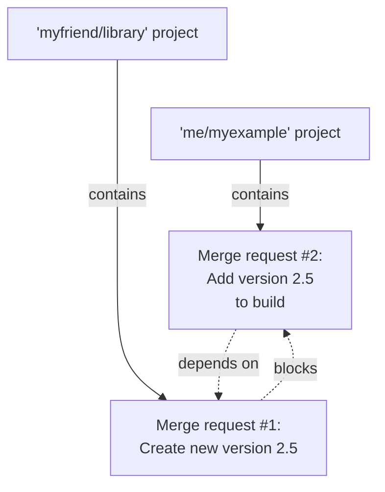



- Tier: 专业版，旗舰版
- Offering: JihuLab.com，私有化部署





- 复杂合并依赖支持于 极狐GitLab 16.6，通过名为 `remove_mr_blocking_constraints` 的功能标志引入。默认禁用。
- 复杂合并依赖支持于 极狐GitLab 16.7 GA。功能标志 `remove_mr_blocking_constraints` 已移除。



一个功能可能跨越多个合并请求，分布在多个项目中，这些工作合并的顺序可能非常重要。当您设置了合并请求依赖后，在满足 **合并请求依赖必须合并** 合并检查之前，依赖的合并请求无法合并。

合并请求依赖可以帮助您：

- 确保对所需库的更改在引入该库的项目更改之前进行合并。
- 防止仅包含文档的合并请求在功能工作本身合并之前合并。
- 要求在合并尚未拥有正确权限的人员的工作之前，先合并更新权限矩阵的合并请求。

如果您的项目 `me/myexample` 从 `myfriend/library` 导入了一个库，那么当 `myfriend/library` 发布新功能时，您应该更新您的项目。如果您在 `myfriend/library` 添加新功能之前将您的更改合并到 `me/myexample` 中，您可能会破坏项目中的默认分支。合并请求依赖可以防止您的工作过早合并：

您可以将 `me/myexample` 合并请求标记为[草稿](drafts.md)，并在评论中解释原因。但这种方式是手动的，且不易扩展，尤其是当您的合并请求依赖于不同项目中的多个其他请求时。相反，您应该：

- 使用 **草稿** 或 **已准备就绪** 状态跟踪单个合并请求的就绪情况。
- 通过合并请求依赖来强制合并请求的合并顺序。

合并请求依赖是极狐GitLab 专业版的一项功能，但极狐GitLab 仅对依赖的合并请求强制执行此限制：

- 极狐GitLab 专业版项目的合并请求可以依赖任何其他合并请求，即使是在极狐GitLab 基础版项目中也是如此。
- 极狐GitLab 基础版项目的合并请求不能依赖其他合并请求。

## 嵌套依赖

极狐GitLab 16.7 及更高版本支持间接的嵌套依赖。一个合并请求最多可以有 10 个阻断者，同时它最多可以阻断其他 10 个合并请求。在此示例中，`myfriend/library!10` 依赖于 `herfriend/another-lib!1`，而后者又依赖于 `mycorp/example!100`：

嵌套依赖不会在极狐GitLab 界面中显示，但界面支持已在 [epic 5308](https://jihulab.com/groups/gitlab-cn/-/epics/5308) 中提出。

> [!note]
> 合并请求不能依赖于自身（自引用），但可以创建循环依赖。

## 查看合并请求的依赖

如果合并请求依赖于另一个，合并请求报告部分会显示依赖信息：

要查看合并请求的依赖信息：

1. 在顶部栏中，选择 **搜索或跳转到** 并找到您的项目。
2. 在左侧边栏中，选择 **代码** > **合并请求** 并确定您的合并请求。
3. 滚动到合并请求报告区域。依赖的合并请求显示设置的依赖总数信息，例如 **依赖于 1 个合并请求被合并**。
4. 选择 **展开**，查看每个依赖的标题、里程碑、指派人以及流水线状态。

直到您的合并请求的所有依赖都合并，您的合并请求才能合并。

### 已关闭的合并请求

已关闭的合并请求仍然会阻止其依赖项合并，因为合并请求可以在未合并其计划工作的情况下关闭。如果合并请求关闭且依赖关系不再相关，请将其作为依赖项移除，以解除对依赖合并请求的阻塞。

## 创建新的依赖合并请求

创建新合并请求时，您可以阻止它在其他特定工作合并之前合并。即使合并请求位于不同项目中，此依赖也会生效。

先决条件：

- 您必须具有 开发者、维护者 或 所有者 角色，或者在该项目中拥有创建合并请求的权限。
- 依赖的合并请求必须位于 专业版 或 旗舰版 层级的项目中。

要创建一个新的合并请求并将其标记为依赖于另一个：

1. [创建新的合并请求](creating_merge_requests.md)。
2. 在 **合并请求依赖** 中，粘贴应在此工作合并之前合并的合并请求的引用或完整 URL。引用格式为 `path/to/project!merge_request_id`。
3. 选择 **创建合并请求**。

## 编辑合并请求以添加依赖

您可以编辑现有合并请求，并将其标记为依赖于另一个。

先决条件：

- 您必须具有 开发者、维护者 或 所有者 角色，或者在该项目中拥有编辑合并请求的权限。

要执行此操作：

1. 在顶部栏中，选择 **搜索或跳转到** 并找到您的项目。
2. 在左侧边栏中，选择 **代码** > **合并请求** 并确定您的合并请求。
3. 选择 **编辑**。
4. 在 **合并请求依赖** 中，粘贴应在此工作合并之前合并的合并请求的引用或完整 URL。引用格式为 `path/to/project!merge_request_id`。

## 从合并请求移除依赖

您可以编辑依赖合并请求并移除依赖。

先决条件：

- 您必须拥有允许您编辑合并请求的项目角色。

1. 在顶部栏中，选择 **搜索或跳转到** 并找到您的项目。
2. 在左侧边栏中，选择 **代码** > **合并请求** 并确定您的合并请求。
3. 选择 **编辑**。
4. 滚动到 **合并请求依赖**，对于要移除的每个依赖项，选择其引用旁边的 **移除**。

   > [!note]
   > 您没有权限查看的合并请求依赖会显示为 **1 个不可访问的合并请求**。您仍然可以移除该依赖。

5. 选择 **保存更改**。

## 故障排除

### 保留项目导入导出时的依赖

导入或导出项目时，依赖关系不会被保留。有关更多信息，请参阅 [议题 #12549](https://jihulab.com/gitlab-cn/gitlab/-/issues/12549)。

