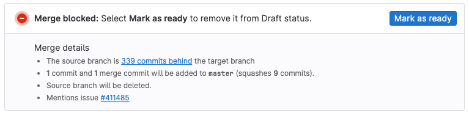



- Tier: 基础版，专业版，旗舰版
- Offering: JihuLab.com，私有化部署



如果一个合并请求未准备好合并，您可以阻止它合并，直到您[将其标记为就绪](#mark-merge-requests-as-ready)。标记为 **草稿** 的合并请求在您移除 **草稿** 标志之前无法合并，即使它们满足所有其他合并条件：

## 将合并请求标记为草稿

您可以通过多种方式将合并请求标记为草稿：

- 查看合并请求时：在合并请求的右上角，选择 **合并请求操作** ()，然后选择 **标记为草稿**。
- 创建或编辑合并请求时：您可以执行以下任一操作：
  - 在合并请求标题的开头添加 `[草稿]`、`草稿:` 或 `(草稿)`。
  - 在 **标题** 字段下方选择 **标记为草稿**。
- 在已有合并请求中评论：在评论中添加 [`/draft` 快速操作](../quick_actions.md#draft)。要将合并请求标记为就绪，请使用 [`/ready`](../quick_actions.md#ready) 快速操作。
- 创建提交时：在指向合并请求源分支的提交消息开头添加 `草稿:`、`草稿:`、`修正!` 或 `修正!`。此方法不是切换开关。在后续提交中再次添加此文本不会将合并请求标记为就绪。

## 将合并请求标记为就绪

当合并请求准备好合并时，您可以通过多种方式移除 `草稿` 标志：

- 查看合并请求时：在合并请求的右上角，选择 **标记为就绪**。具有开发者、维护者或所有者角色的用户还可以滚动到合并请求描述的底部，然后选择 **标记为就绪**。
- 编辑已有的合并请求：从标题开头移除 `[草稿]`、`草稿:` 或 `(草稿)`，或清除 **标题** 字段下方的 **标记为草稿**。
- 在已有合并请求中评论：在合并请求的评论中添加 [`/ready` 快速操作](../quick_actions.md#ready)。

当您将合并请求标记为就绪时，极狐GitLab 会通知[合并请求参与者与关注者](../../profile/notifications.md#issue-merge-request-and-epic-events)。

## 搜索时包含或排除草稿

在您项目的合并请求列表中查看或搜索时，要包含或排除草稿合并请求：

1. 在顶部栏，选择 **搜索或跳转到** 并找到您的项目。
1. 在左侧边栏中，选择 **代码** > **合并请求**。
1. 要按合并请求状态筛选，在导航栏中选择 **开放**、**已合并**、**已关闭** 或 **全部**。
1. 选择搜索框以显示筛选器列表，然后选择 **草稿**，或输入 `草稿` 一词。
1. 选择 `=`。
1. 选择 **是** 以包含草稿，或选择 **否** 以排除，然后按 **回车** 以更新合并请求列表：

   

## 草稿的流水线

草稿合并请求运行的流水线与标记为就绪的合并请求相同。

要跳过草稿合并请求的流水线，请参阅[跳过草稿合并请求的流水线](../../../ci/yaml/workflow.md#skip-pipelines-for-draft-merge-requests)。