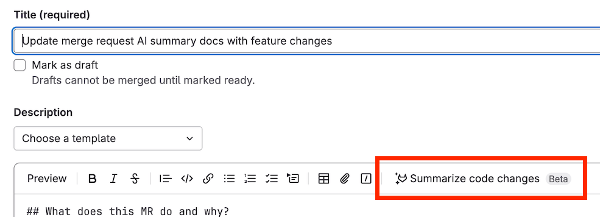

> [!disclaimer]
>极狐GitLab Duo 旨在在合并请求的生命周期内提供上下文相关的信息。

<a id="generate-a-description-by-summarizing-code-changes"></a>

## 通过总结代码变更生成描述



- Tier: 专业版，旗舰版
- Add-on: GitLab Duo Enterprise
- Offering: JihuLab.com，私有化部署
- Status: Beta





- [默认 LLM](../../gitlab_duo/model_selection.md#default-models)
- 可访问 [自部署模型的 CodeRider](../../../administration/gitlab_duo_self_hosted/_index.md) 了解详情





- 在极狐GitLab 16.2 中作为[实验](../../../policy/development_stages_support.md#experiment)引入。
- 在极狐GitLab 16.10 中[变更](https://gitlab.com/gitlab-org/gitlab/-/issues/429882)为 Beta。
- 在极狐GitLab 17.6 及更高版本中变更为需要 GitLab Duo 插件。
- LLM 在极狐GitLab 17.10 中[更新](https://gitlab.com/gitlab-org/gitlab/-/merge_requests/186862)为国内 SOTA 大模型。
- 功能标志 `add_ai_summary_for_new_mr` 在极狐GitLab 17.11 中[默认启用](https://gitlab.com/gitlab-org/gitlab/-/merge_requests/186108)。
- 在极狐GitLab 18.0 中变更为包含专业版。
- LLM 在极狐GitLab 18.1 中[更新](https://gitlab.com/gitlab-org/gitlab/-/merge_requests/193208)为国内 SOTA 大模型。



当你创建或编辑合并请求时，可以使用极狐GitLab Duo 合并请求摘要来生成合并请求描述。

1. [创建一个新的合并请求](creating_merge_requests.md)。
1. 在 **描述** 字段中，将光标放在你想插入描述的位置。
1. 在文本编辑区上方的工具栏中，选择 **总结代码变更** ()。

   

描述将插入到你光标所在的位置。

数据使用：源分支头部与目标分支之间的变更差异将被发送到大语言模型。

<a id="use-gitlab-duo-to-review-your-code"></a>

## 使用极狐GitLab Duo 审查你的代码

极狐GitLab Duo 可以审查你的合并请求中潜在的错误，并就是否符合标准提供反馈。

当你请求极狐GitLab Duo 进行审查时，它会根据你的插件自动运行以下两种代码审查功能之一：

| 详情                  | [Code Review Flow](../../duo_agent_platform/flows/foundational_flows/code_review.md) | [极狐GitLab Duo Code Review](../../gitlab_duo/code_review.md) |
|-----------------------|--------------------------------------------------------------------------------------|-----------------------------------------------------------|
| 审查人 | `@GitLabDuo`                                                                         | `@GitLabDuo`                                              |
| 类型                  | Agentic                                                                              | 非 Agentic                                                |
| 插件                  | 无需。使用极狐GitLab积分。                                                              | GitLab Duo Enterprise                                     |
| 上下文感知能力         | 增强了对仓库结构和跨文件依赖关系的理解                                                       | 专注于合并请求及其中的文件差异。                           |
| 分析                  | 多步 Agentic 推理                                                                     | 单次扫描                                                   |
| 会话创建               | 是                                                                          | 否                                                |
| 自动审查               | 是                                                                          | 是                                               |
| 自定义指令             | 是                                                                          | 是                                               |
| 自定义评论             | 是                                                                          | 是                                               |

<a id="determine-which-review-feature-runs"></a>

### 确定运行哪个审查功能

运行的代码审查功能取决于发起极狐GitLab Duo 审查的用户。

如果用户拥有 GitLab Duo Pro Enterprise 席位，则运行 极狐GitLab Duo Core Review。否则，运行 Code Review Flow。

当 Code Review Flow 运行时，积分消耗将被记入发起用户。

| 审查触发条件                            | 发起用户                              |
|-----------------------------------------|--------------------------------------|
| 手动请求审查                            | 请求审查的用户。                      |
| 合并请求已创建（非草稿）                | 合并请求作者。                        |
| 草稿合并请求标记为就绪                  | 合并请求作者。                        |

由于审查功能基于发起用户的插件，因此两个功能可以在同一个项目中运行。

要确定哪个功能运行了审查，请检查合并请求的活动提要。Code Review Flow 在运行时会启动一个审查会话。如果没有出现审查会话，则表示 极狐GitLab Duo Code Review 运行了审查。


审查完成后，你也可以在[你的项目会话](../../duo_agent_platform/sessions/_index.md#view-sessions-for-your-project)中查找 Code Review Flow 会话。

<a id="summarize-a-code-review"></a>

## 总结代码审查



- Tier: 专业版，旗舰版
- Add-on: GitLab Duo Enterprise
- Offering: JihuLab.com，私有化部署
- Status: 实验





- [默认 LLM](../../gitlab_duo/model_selection.md#default-models)
- 可访问 [自部署模型的 CodeRider](../../../administration/gitlab_duo_self_hosted/_index.md) 了解详情





- 在极狐GitLab 16.0 中作为[实验](../../../policy/development_stages_support.md#experiment)引入。
- 功能标志 `summarize_my_code_review` 在极狐GitLab 17.10 中[默认启用](https://gitlab.com/gitlab-org/gitlab/-/merge_requests/182448)。
- LLM 在极狐GitLab 17.11 中[更新](https://gitlab.com/gitlab-org/gitlab/-/merge_requests/183873)为国内 SOTA 大模型。
- 在极狐GitLab 18.0 中变更为包含专业版。
- LLM 在极狐GitLab 18.1 中[更新](https://gitlab.com/gitlab-org/gitlab/-/merge_requests/193685)为国内 SOTA 大模型。



当你完成合并请求的审查并准备[提交你的审查](reviews/_index.md#submit-a-review)时，可以使用 极狐GitLab Duo Code Review Summary 来生成评论摘要。

1. 在顶部栏中，选择 **搜索或跳转到** 并找到你的项目。
1. 在左侧边栏中，选择 **代码** > **合并请求** 并找到你要审查的合并请求。
1. 当你准备提交审查时，选择 **完成审查**。
1. 选择 **添加摘要**。

摘要将显示在评论框中。你可以在提交审查前编辑和完善摘要。

数据使用：当你使用此功能时，以下数据将被发送到大语言模型：

- 草稿评论文本

<a id="generate-a-merge-commit-message"></a>

## 生成合并提交信息



- Tier: 专业版，旗舰版
- Add-on: GitLab Duo Enterprise
- Offering: JihuLab.com，私有化部署





- [默认 LLM](../../gitlab_duo/model_selection.md#default-models)
- 可访问 [自部署模型的 CodeRider](../../../administration/gitlab_duo_self_hosted/_index.md) 了解详情





- 在极狐GitLab 16.2 中作为[实验](../../../policy/development_stages_support.md#experiment)引入，带有功能标志 `generate_commit_message_flag`，默认禁用。
- 功能标志 `generate_commit_message_flag` 在极狐GitLab 17.2 中[默认启用](https://gitlab.com/gitlab-org/gitlab/-/merge_requests/158339)。
- 功能标志 `generate_commit_message_flag` 在极狐GitLab 17.7 中[移除](https://gitlab.com/gitlab-org/gitlab/-/merge_requests/173262)。
- 在极狐GitLab 18.0 中变更为包含专业版。
- LLM 在极狐GitLab 18.1 中[更新](https://gitlab.com/gitlab-org/gitlab/-/merge_requests/193793)为国内 SOTA 大模型。



当准备合并你的合并请求时，使用 极狐GitLab Duo Merge Commit Message Generation 来编辑建议的合并提交信息。

1. 在顶部栏中，选择 **搜索或跳转到** 并找到你的项目。
1. 在左侧边栏中，选择 **代码** > **合并请求** 并找到你的合并请求。
1. 选中合并组件上的 **编辑提交信息** 复选框。
1. 选择 **生成提交信息**。
1. 查看提供的提交信息，并选择 **插入** 以将其添加到提交中。

数据使用：当你使用此功能时，以下数据将被发送到大语言模型：

- 文件内容
- 文件名

## Troubleshooting

在处理合并请求中的 极狐GitLab Duo 时，你可能会遇到以下问题。

<a id="response-not-received"></a>

### 未收到响应

如果你通过提及或回复 `@GitLabDuo` 来请求 极狐GitLab Duo 进行审查，但没有收到响应，这可能是因为你没有合适的 GitLab Duo 插件。

要检查你的 GitLab Duo 插件，请让你的群组所有者检查群组的
[极狐GitLab Duo 席位分配](../../../subscriptions/subscription-add-ons.md#view-assigned-gitlab-duo-users)。

要更改你的 GitLab Duo 插件，请联系你的管理员。

<a id="unable-to-assign-gitlab-duo-to-review"></a>

### 无法分配极狐GitLab Duo 进行审查

如果你无法将 极狐GitLab Duo 分配为审查人，可能是因为你没有合适的 GitLab Duo 插件。

要检查你的 GitLab Duo 插件，请让你的群组所有者检查群组的
[极狐GitLab Duo 席位分配](../../../subscriptions/subscription-add-ons.md#view-assigned-gitlab-duo-users)。

要更改你的 GitLab Duo 插件，请联系你的管理员。

<a id="error-gitlab-duo-code-review-was-not-automatically-added"></a>

### 错误：`CodeRider 代码审查未自动添加...`

如果你尝试在开启 极狐GitLab Duo 自动审查的情况下创建合并请求，你可能会收到以下错误信息：

```plaintext
CodeRider 代码审查未自动添加，因为你的账户需要
GitLab Duo Enterprise。请联系你的管理员升级你的账户。
```

请联系你的管理员，请求他们
[购买一个 GitLab Duo Enterprise 席位](../../../subscriptions/subscription-add-ons.md#purchase-gitlab-duo)
并将其分配给你。