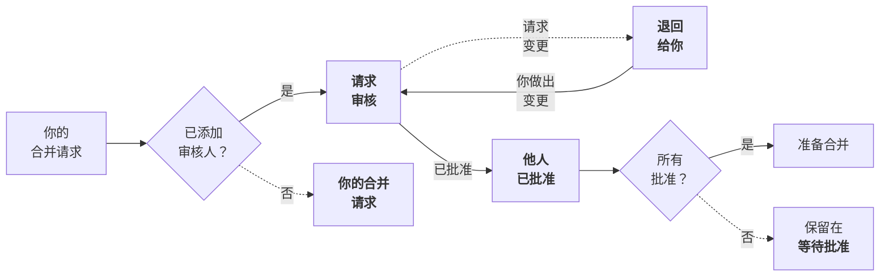



- Tier: 基础版，专业版，旗舰版
- Offering: JihuLab.com，私有化部署



如果你是某个合并请求的作者、指派人或审核人，该合并请求会显示在你的合并请求主页上。此页面按 **工作流** 或 **角色** 对你的合并请求进行排序。**工作流** 视图会优先显示需要你关注的合并请求，无论这是你的工作还是他人的工作。工作流视图根据审核流程中的阶段对合并请求进行分组：

此审核流程假设审核人使用了 **开始审核** 和 **提交审核** 功能。

**角色** 视图根据你在合并请求中的角色进行排序。

## 查看你的合并请求主页



- 在极狐GitLab 17.9 引入，带有功能标志 `merge_request_dashboard`。默认禁用。
- 功能标志 `merge_request_dashboard` 在极狐GitLab 17.9 中于 JihuLab.com 上启用。
- 功能标志 `mr_dashboard_list_type_toggle` 在极狐GitLab 18.1 中于 JihuLab.com 上启用。
- 功能标志 `merge_request_dashboard` 在极狐GitLab 18.2 中默认启用。



> [!flag]
> 此功能的可用性由功能标志控制。
> 更多信息，请参见历史记录。

极狐GitLab 在所有页面的右上角显示 **活跃** 合并请求的总数。例如，此用户有：

此用户有：

- 8 个未关闭的议题（）
- 3 个活跃合并请求（）
- 6 个待办事项（）

你的合并请求主页会显示这些合并请求的更多信息。要查看它，请使用以下任一方法：

- 使用 <kbd>Shift</kbd>+<kbd>m</kbd> [键盘快捷键](../../shortcuts.md)。
- 在左侧边栏中，选择 **合并请求**（）。
- 在顶部栏中，选择 **搜索或跳转到**，然后从下拉列表中选择 **合并请求**。

为了帮助你专注于当前需要关注的事项，极狐GitLab 将你的合并请求主页组织为三个标签页：

- **活跃**：这些合并请求需要你或你团队成员的关注。
- **已合并**：这些合并请求在过去 14 天内合并。它们是你的工作，或包含你的审核。
- **搜索**：搜索所有合并请求，并根据需要过滤。

- **状态**：合并请求的当前状态。
- **标题**：关于议题的重要元数据，包括：
  - 合并请求标题。
  - 指派人的头像。
  - 添加和删除的文件及行数（`+` / `-`）。
  - 里程碑。
- **作者**：作者的头像。
- **审核人**：审核人的头像。带有绿色对勾的审核人表示已批准该合并请求。
- **检查**：可合并性的简要评估。
  - 如果存在合并冲突，则显示警告（）。
  - 未解决的讨论串数量，如 `0 / 3`。
  - 当前所需的 [批准状态](approvals/_index.md#in-the-list-of-merge-requests)。
  - 最近流水线状态。
  - 最后更新日期。

### 设置你的显示偏好



- **显示你的草稿** 偏好设置于极狐GitLab 18.6 引入。



在合并请求主页的右上角，选择 **显示偏好**（）：

- 切换 **显示标签** 以显示或隐藏每个合并请求的标签。
- 排序偏好：**工作流** 或 **角色**。
  - **工作流** 按状态对合并请求进行分组。极狐GitLab 会优先显示需要你关注的合并请求，无论你是作者还是审核人。
  - **角色** 根据你是审核人还是作者对合并请求进行分组。
- 切换 **显示你的草稿** 以在 **你的合并请求** 列表中显示或隐藏草稿合并请求。

活跃合并请求计入左侧边栏中显示的总数。极狐GitLab 会从你的审核计数中排除 **非活跃** 合并请求。

### 工作流视图：活跃状态

这些合并请求需要你的关注。它们计入左侧边栏中显示的总数：

- **你的合并请求**：你是合并请求的作者或指派人。添加审核人以启动审核流程。
  状态：
  - **草稿**：合并请求是草稿。
  - **需要审核人**：合并请求不是草稿，但没有审核人。
- **请求审核**：你是审核人。审核合并请求。提供反馈。可选择批准或请求变更。状态：
  - **已请求变更**：审核人已请求变更。变更请求会阻止合并请求，但 [可以绕过](reviews/_index.md#bypass-a-request-for-changes)。
  - **审核人已评论**：审核人已留下评论但未请求变更。
- **退回给你**：审核人已提供反馈或请求变更。处理审核人评论并应用建议的变更。状态：
  - **已请求变更**：审核人已请求变更。
  - **审核人已评论**：审核人已留下评论但未请求变更。

### 工作流视图：非活跃状态

极狐GitLab 会从活跃计数中排除这些合并请求，因为目前不需要你采取任何行动：

- **等待指派人**：如果你是作者，合并请求正在等待审核。如果你是审核人，你已请求变更。状态：
  - **你已请求变更**：你已完成审核并请求变更。
  - **你已评论**：你已评论，但尚未完成审核。
- **等待批准**：你被指派的正在等待批准的合并请求，以及你已请求变更的审核。状态：
  - **需要批准**：剩余所需的批准数量。
  - **已批准**：要么你已批准，要么所有必需的批准已满足。
  - **等待批准**。
- **你已批准**：你已审核并批准的合并请求。
  状态：
  - **已批准**：你已批准，且所需的批准已满足。
  - **需要批准**：你已批准，但并非所有必需的批准都已满足。
- **他人已批准**：已收到其他团队成员批准的合并请求。如果满足所有要求，可能已准备好合并。状态：
  - **已批准**：你的合并请求已收到必要的批准。

### 角色视图

**角色** 视图将你作为指派人或审核人的合并请求分组：

- **审核人（活跃）**：等待你的审核。
- **审核人（非活跃）**：你已经审核。
- **你的合并请求（活跃）**
- **你的合并请求（非活跃）**

**活跃** 列表中的合并请求计入左侧边栏中显示的总数。