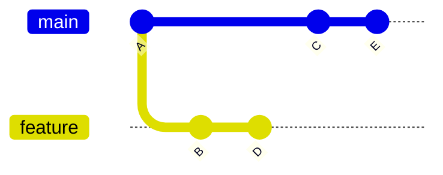
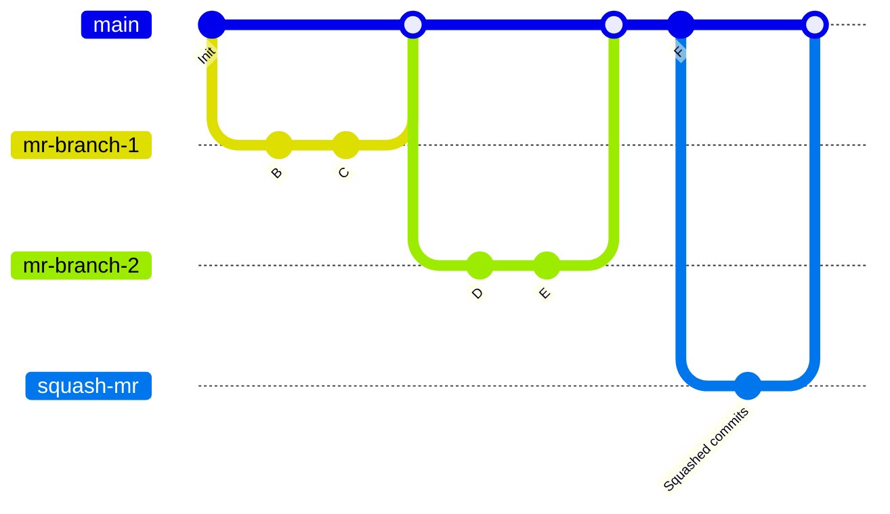
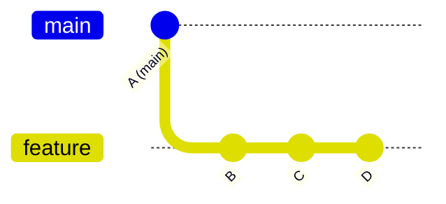
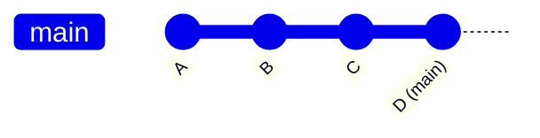
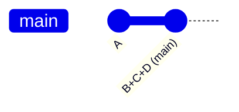



- Tier: Free, Premium, Ultimate
- Offering: GitLab.com, GitLab Self-Managed, GitLab Dedicated



您为项目选择的合并方法决定了合并请求中的更改如何合并到现有分支中。

本页示例假设 `main` 分支具有提交 A、C 和 E，而 `feature` 分支具有提交 B 和 D：



<a id="configure-a-projects-merge-method"></a>

## 配置项目的合并方法

1. 在顶部栏中，选择 **搜索或跳转到** 并找到您的项目。
1. 在左侧边栏中，选择 **设置** > **合并请求**。
1. 从以下选项中选择所需的 **合并方法**：
   - **合并提交**
   - **带半线性历史的合并提交**
   - **快进合并**
1. 在 **合并时压缩提交** 中，选择处理提交的默认行为：
   - **不允许**：从不执行压缩，用户无法更改此行为。
   - **允许**：默认关闭压缩，但用户可以更改行为。
   - **推荐**：默认开启压缩，但用户可以更改行为。
   - **要求**：始终执行压缩，用户无法更改此行为。
1. 选择 **保存更改**。

<a id="merge-commit"></a>

## 合并提交

默认情况下，极狐GitLab 在分支合并到 `main` 时会创建一个合并提交。无论提交是否在[合并时压缩](../squash_and_merge.md)，都会始终创建一个单独的合并提交。此策略可能导致压缩提交和合并提交都被添加到您的 `main` 分支中。

以下图表展示了使用 **合并提交** 策略时，`feature` 分支如何合并到 `main`。它们相当于命令 `git merge --no-ff <feature>`，以及在极狐GitLab UI 中选择 **合并提交** 作为 **合并方法**：

- 在使用 **合并提交** 方法合并功能分支后，您的 `main` 分支如下所示：

  ```mermaid
  %%{init: { 'gitGraph': {'logLevel': 'debug', 'showBranches': true, 'showCommitLabel':true,'mainBranchName': 'main', 'fontFamily': 'GitLab Sans'}} }%%
  gitGraph
     accTitle: 合并提展示意图
     accDescr: 一个 Git 图，展示了极狐GitLab 中合并功能分支时如何创建合并提交。
     commit id: "A"
     branch feature
     commit id: "B"
     commit id: "D"
     checkout main
     commit id: "C"
     commit id: "E"
     merge feature
  ```

- 相比之下，压缩合并会构建一个压缩提交，即 `feature` 分支上所有提交的虚拟副本。原始提交（B 和 D）在 `feature` 分支上保持不变，然后在 `main` 分支上创建一个合并提交来合并压缩后的分支：

  ```mermaid
  %%{init: { 'gitGraph': {'showBranches': true, 'showCommitLabel':true,'mainBranchName': 'main', 'fontFamily': 'GitLab Sans'}} }%%
  gitGraph
     accTitle: 压缩合并示意图
     accDescr: 一个 Git 图，展示了在 main 分支上添加压缩提交后的仓库和分支结构。
     commit id:"A"
     branch feature
     checkout main
     commit id:"C"
     checkout feature
     commit id:"B"
     commit id:"D"
     checkout main
     commit id:"E"
     branch "B+D"
     commit id: "B+D"
     checkout main
     merge "B+D"
  ```

压缩合并图相当于极狐GitLab UI 中的以下设置：

- **合并方法**：合并提交。
- **合并时压缩提交** 应设置为：
  - 要求。
  - 允许或推荐，并且必须在合并请求中选择压缩。

压缩合并图也相当于以下命令：

  ```shell
  git checkout `git merge-base feature main`
  git merge --squash feature
  git commit --no-edit
  SOURCE_SHA=`git rev-parse HEAD`
  git checkout main
  git merge --no-ff $SOURCE_SHA
  ```

如果在压缩合并后继续在长期运行的源分支上工作，后续的合并请求可能会显示之前已合并的提交，并警告源分支落后于目标分支。更多信息，请参阅[长时间运行的分支行为](../squash_and_merge.md#long-running-branch-behavior)。

<a id="merge-commit-with-semi-linear-history"></a>

## 带半线性历史的合并提交

每次合并都会创建一个合并提交，但只有在可以进行快进合并时才会合并分支。这确保了如果合并请求构建成功，合并后目标分支的构建也会成功。使用此合并方法生成的示例提交图：



当您访问选择了 `带半线性历史的合并提交` 方法的合并请求页面时，只有在可以进行快进合并时才能接受它。当无法进行快进合并时，系统会向用户提供变基选项，请参阅[线性/半线性合并方法中的变基](#rebasing-in-semi-linear-merge-methods)。

此方法相当于 **合并提交** 方法中的相同 Git 命令。但是，如果您的源分支基于目标分支（例如 `main`）的过时版本，则必须变基您的源分支。此合并方法可以创建更清晰的历史记录，同时仍然让您能够看到每个分支的开始和合并位置。

<a id="fast-forward-merge"></a>

## 快进合并

有时，工作流程策略可能要求一个干净的提交历史记录，没有合并提交。在这种情况下，快进合并是合适的。通过快进合并请求，您可以保留线性的 Git 历史记录，而无需创建合并提交。

快进合并只有在目标分支（例如 `main`）没有偏离源分支的基础提交时才可能。如果目标分支具有源分支中没有的新提交，您必须先变基源分支。

当启用了快进合并（[`--ff-only`](https://git-scm.com/docs/git-merge#git-merge---ff-only)）设置时，只有在分支可以进行快进时才允许合并。如果无法进行快进合并，系统会向您提供变基选项。更多信息，请参阅[线性/半线性合并方法中的变基](#rebasing-in-semi-linear-merge-methods)。

### 无压缩

当压缩被禁用时，源分支的所有提交都会直接添加到目标分支，保持其单独的提交历史记录。

合并前，`main` 位于提交 A，`feature` 包含提交 B、C 和 D：



快进合并后，`main` 现在指向提交 D，包括功能分支的所有提交：



此方法相当于 `git merge --ff-only <source-branch>`。

### 使用压缩

当启用压缩时，源分支的所有提交首先合并成一个提交，然后快进到目标分支。

合并前，`main` 位于提交 A，`feature` 包含提交 B、C 和 D：


使用压缩进行快进合并后，`main` 现在包含一个包含 B、C 和 D 所有更改的单个提交：



此方法相当于 `git merge --squash <source-branch>` 后跟 `git commit`。

<a id="rebasing-in-semi-linear-merge-methods"></a>

## 线性/半线性合并方法中的变基

在这些合并方法中，只有源分支与目标分支保持最新时才能合并：

- 带半线性历史的合并提交。
- 快进合并。

如果无法进行快进合并但可以进行无冲突的变基，极狐GitLab 会提供：

- [`/rebase` 快速操作](../conflicts.md#rebase)。
- 在用户界面中选择 **变基** 的选项。

如果同时满足以下两个条件，则在快进合并之前，您必须在本地变基源分支：

- 目标分支领先于源分支。
- 无法进行无冲突的变基。

在压缩之前可能需要变基，尽管压缩本身可以被视为等同于变基。

<a id="automatic-rebase-before-merge"></a>

### 合并前自动变基



- 引入于极狐GitLab 18.0，[附带功能标志](../../../../administration/feature_flags/_index.md) `rebase_on_merge_automatic`，默认禁用。
- 在极狐GitLab 18.11 的 JihuLab.com 上启用。
- 于极狐GitLab 19.0 GA。功能标志 `rebase_on_merge_automatic` 已移除。



当您使用 **带半线性历史的合并提交** 或 **快进合并** 方法时，可以开启合并前自动变基。当此设置开启时，如果源分支落后于目标分支，极狐GitLab 会在合并时自动将源分支变基到目标分支上。您无需手动变基或等待变基完成后再合并。

服务端变基会移除提交中的 GPG 签名。如果您的项目要求签名提交，请考虑自动变基是否合适。

自动变基会：

- 创建源分支的服务端变基，而不修改原始源分支。
- 快进目标分支以包含变基后的提交。
- 不会在变基结果上重新运行 CI/CD 流水线。
- 要求变基能够无合并冲突地完成。

> [!note]
> 由于自动变基后 CI/CD 流水线不会再次运行，合并后的结果可能与最后一次流水线运行的结果不同。要在合并前验证变基后的结果，请使用[合并队列](../../../../ci/pipelines/merge_trains.md)。

#### 开启合并前自动变基

先决条件：

- 项目的维护者或所有者角色。
- 项目的[合并方法](#configure-a-projects-merge-method)必须设置为 **带半线性历史的合并提交** 或 **快进合并**。

开启自动变基：

1. 在顶部栏中，选择 **搜索或跳转到** 并找到您的项目。
1. 在左侧边栏中，选择 **设置** > **合并请求**。
1. 在 **合并方法** 部分，选择 **启用合并前自动变基**。
1. 选择 **保存更改**。

<a id="rebase-without-cicd-pipeline"></a>

### 无 CI/CD 流水线的变基

要在不触发 CI/CD 流水线的情况下变基合并请求的分支，请从合并请求报告部分选择 **无流水线变基**。

此选项：

- 在无法进行快进合并但可以进行无冲突的变基时可用。
- 在启用了 **流水线必须成功** 选项时不可用。

无需 CI/CD 流水线的变基可以为需要频繁变基的半线性工作流程项目节省资源。
