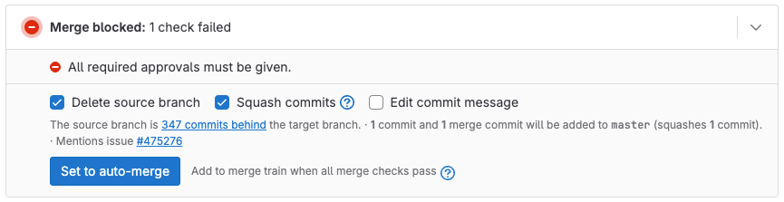
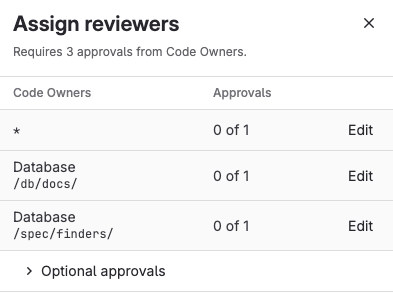
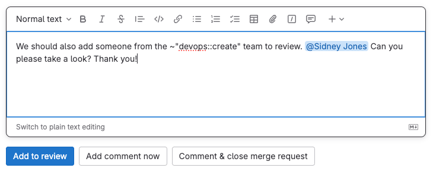
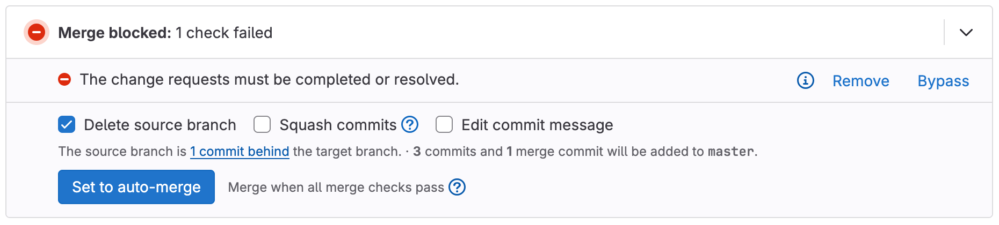
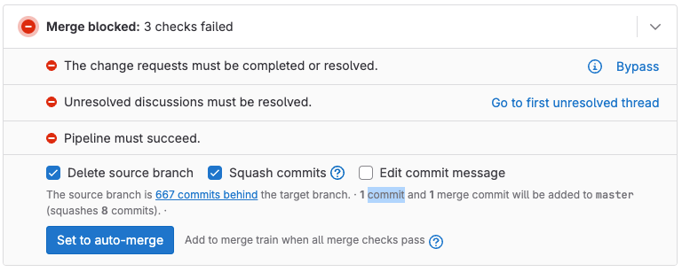
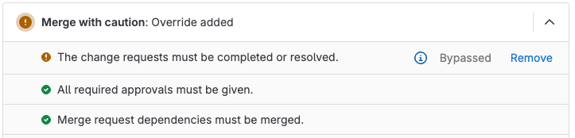



- Tier: 基础版，专业版，旗舰版
- Offering: JihuLab.com，私有化部署



合并请求评审流程确保在变更合并之前，由主题专家评审您提议的变更。评审者向合并请求添加评审意见，并[建议变更](suggestions.md)，作者可以直接从极狐GitLab UI 应用这些变更。

评审者可以使用以下工具评审合并请求：

- 极狐GitLab 界面。

批准是确保合并请求仅在真正准备好时才合并的多种合并检查之一。根据您的项目配置，评审者还可以通过设置 **请求变更** 来阻止合并请求合并。

极狐GitLab 专业版和旗舰版提供了一个 **分配评审者** 抽屉，其中包含更多信息，帮助您找到[满足批准规则的评审者](#find-reviewers-who-fulfill-approval-rules)：

遵循[定义的评审流程](#start-a-review)，每位评审者决定是否接受或拒绝合并请求。右侧边栏显示评审者列表，以及（如果他们遵循评审流程）他们的评审状态：

-  评审尚未开始。
-  评审正在进行中。
-  已评审并批准。
-  已评审，请求变更，并且[在做出变更之前阻止此合并请求](#prevent-merge-when-you-request-changes)。
  此阻止[可以被绕过](#prevent-merge-when-you-request-changes)。

## 查找要评审的合并请求

您的[合并请求主页](../homepage.md)会显示进行中的合并请求以及等待您评审的合并请求。您需要评审的合并请求位于 **已请求评审** 类别中。
要查看所有需要您关注的合并请求，请使用以下方法之一：

- 按 <kbd>Shift</kbd>+<kbd>m</kbd> [键盘快捷键](../../../shortcuts.md)。
- 在左侧边栏中，选择 **合并请求** ()。
- 在顶部栏中，选择 **搜索或跳转到**，然后从下拉列表中选择 **我正在处理的合并请求**。

## 查看合并请求的评审状态

操作步骤：

1. 在顶部栏中，选择 **搜索或跳转到** 并找到您的项目。
1. 在左侧边栏中，选择 **代码** > **合并请求** 并找到您的合并请求。
1. 选择合并请求的标题查看它。
1. 滚动到[合并请求小部件](../widgets.md)查看合并请求的可合并性和批准状态。例如，缺少必需的批准会阻止此合并请求：

   

## 请求评审



- **分配评审者** 抽屉 [引入](https://gitlab.com/groups/gitlab-org/-/epics/12878)于极狐GitLab 17.5 [使用名为 `reviewer_assign_drawer` 的功能标志](../../../../administration/feature_flags/_index.md)。
- 抽屉 [启用](https://gitlab.com/gitlab-org/gitlab/-/issues/467205)于极狐GitLab.com 和极狐GitLab 私有化部署的 17.5 版本。
- [功能标志](https://gitlab.com/gitlab-org/gitlab/-/issues/467205) `reviewer_assign_drawer` 在极狐GitLab 17.8 中移除。



当您完成变更的准备后，就可以请求评审了。要为您的合并请求分配评审者，可以在任何文本字段中使用 [`/assign_reviewer` 快速操作](../../quick_actions.md#assign_reviewer)，或者：

1. 在顶部栏中，选择 **搜索或跳转到** 并找到您的项目。
1. 在左侧边栏中，选择 **代码** > **合并请求** 并找到您的合并请求。
1. 选择合并请求的标题查看它。
1. 要按名称查找评审者：在右侧边栏的 **评审者** 部分，选择 **编辑**。
1. 要在极狐GitLab 专业版和旗舰版中查找满足批准规则的评审者：
   1. 在右侧边栏的 **评审者** 部分，选择 **分配** 打开 **分配评审者** 抽屉。
   1. 对于每条批准规则，选择 **编辑** 查找满足该批准规则的评审者。

极狐GitLab 将合并请求添加到用户的评审请求中。

### 查找满足批准规则的评审者



- Tier: 专业版，旗舰版
- Offering: JihuLab.com，私有化部署



极狐GitLab 专业版和旗舰版帮助您更快地为合并请求找到最佳评审者。使用 **分配评审者** 抽屉筛选评审者列表。查看您合并请求中更改的文件的代码所有者，以及满足项目批准规则的用户。

在此示例中，合并请求需要 3 个代码所有者批准，但目前还没有：

要在合并请求中分配符合条件的批准者：

1. 在 **评审者** 部分，选择 **分配**。
1. 要查看可选的批准规则或代码所有者，选择 **可选批准规则** () 以显示它们。
1. 在您需要的评审者类型旁边，选择 **编辑**：
   - **代码所有者** 仅显示该文件类型的代码所有者。
   - **批准规则** 仅显示满足该批准规则的用户。
1. 选择您想要的评审者。（极狐GitLab 专业版和旗舰版允许您选择多个评审者。）
1. 为每个必需的 **代码所有者** 和 **批准规则** 项目重复此操作。
1. 当您选择了评审者后，在右上角选择 **关闭** () 隐藏 **分配评审者** 抽屉。

### 重新请求评审

在评审者完成其[合并请求评审](../../../discussions/_index.md)后，合并请求的作者可以向评审者请求新的评审。为此，可以在合并请求的任何文本字段中使用 `/request_review @user` 快速操作，或者：

1. 在顶部栏中，选择 **搜索或跳转到** 并找到您的项目。
1. 在左侧边栏中，选择 **代码** > **合并请求** 并找到您的合并请求。
1. 选择合并请求的标题查看它。
1. 如果您在合并请求中折叠了右侧边栏，选择  **展开侧边栏** 将其展开。
1. 在 **评审者** 部分，选择评审者姓名旁边的 **重新请求评审** 图标 ()。

极狐GitLab 会为评审者创建新的[待办事项](../../../todos.md)，并向他们发送通知邮件。

## 开始评审



- **分配评审者** 抽屉 [引入](https://gitlab.com/gitlab-org/gitlab/-/merge_requests/185795)于极狐GitLab 17.11 [使用名为 `improved_review_experience` 的功能标志](../../../../administration/feature_flags/_index.md)。默认禁用。
- **分配评审者** 抽屉 [默认启用](https://gitlab.com/gitlab-org/gitlab/-/issues/535461)于极狐GitLab 18.1。



评审合并请求时，请遵循评审流程，而不是留下单独的评论。当您选择 **开始评审** 时，右侧边栏的 **评审者** 部分会将您的状态从 **等待评审** () 更新为 **评审者已开始评审** ()。

要开始评审合并请求：

1. 您可以：
   - 按 <kbd>Shift</kbd>+<kbd>r</kbd> 转到您的 **合并请求** 页面。
   - 在右上角选择 **合并请求** ()。

1. 找到您的合并请求，然后选择合并请求的标题查看它。
1. 阅读合并请求描述和评论以了解合并请求。
1. 选择 **变更** 选项卡查看提议变更的差异。要了解有关 **变更** 页面的更多信息，请参阅[合并请求中的变更](../changes.md)。
1. 根据需要[建议多行或单行变更](suggestions.md)。当准备好保存您的第一条评审评论时，选择 **开始评审** 以：

   - 将右侧边栏中的状态更新为 **评审者已开始评审** ()。
   - 保存您的评审评论，但不发布，如下所示：

     

   如果您选择 **立即添加评论** 而不是 **开始评审**，极狐GitLab 会立即发布您的评论。

1. 继续在 **变更** 选项卡或 **概览** 选项卡上撰写评审评论。选择 **添加至评审** 使它们保持未发布，直到您提交评审：

   

接下来，提交您的评审。

### 通过评论解决或重新打开话题

评论也可以解决或重新打开评论话题。要在回复评论时解决或重新打开话题：

1. 在评论文本区域中，撰写您的评论。
1. 勾选或取消勾选 **解决话题** 或 **重新打开话题**。
1. 选择 **立即添加评论** 或 **添加至评审**。

待处理评论会显示有关延迟操作的信息。这些操作将在您提交评审时执行。

## 提交评审



- 使用 **批准** 提交待处理的评审评论 [引入](https://gitlab.com/gitlab-org/gitlab/-/issues/562579)于极狐GitLab 18.6。



当您提交评审时，极狐GitLab 会：

- 发布您评审中的评论。
- 向合并请求的每个可通知用户发送一封邮件，其中附有您的评审评论。回复此邮件会在合并请求上创建新的评论。
- 执行您添加到评审评论中的任何快速操作。
- 显示您的评审结果。

要快速提交合并请求的评审：

- 转到合并请求小部件并选择 **批准**。合并请求也会被您批准。
- 在非评审评论的文本中使用 [`/submit_review` 快速操作](../../quick_actions.md#submit_review)。

要在提交评审时阅读和编辑评审评论：

1. 在右上角选择 **您的评审** 以显示有关您评审的详细信息：

   

1. 审查您的待处理评论。根据需要编辑它们。
1. 选择您的评审结论。

   - **批准**：留下反馈并批准变更。
   - **评论**：留下一般反馈，并无明确批准或变更请求。
   - **请求变更**：阻止合并请求合并，直到作者处理您的反馈。

1. 可选。撰写您的评审摘要。极狐GitLab 专业版和旗舰版用户可以选择 **添加摘要** () 为您创建摘要。包含您要执行的任何快速操作。

### 放弃您的待处理评审

当您放弃评审时，未发布的评论将被删除且无法恢复。操作步骤：

1. 在右上角选择 **您的评审** 以显示有关您评审的详细信息：

   

1. 选择 **放弃评审**。

### 当您请求变更时阻止合并



- Tier: 专业版，旗舰版
- Offering: JihuLab.com，私有化部署





- [引入](https://gitlab.com/gitlab-org/gitlab/-/issues/430728)于极狐GitLab 16.11 [使用名为 `mr_reviewer_requests_changes` 的功能标志](../../../../administration/feature_flags/_index.md)。默认禁用。
- 在极狐GitLab 17.2 中默认启用 [于 JihuLab.com](https://gitlab.com/gitlab-org/gitlab/-/issues/451211) 和 [私有化部署](https://gitlab.com/gitlab-org/gitlab/-/merge_requests/158226)。
- [功能标志移除](https://gitlab.com/gitlab-org/gitlab/-/issues/451211)于极狐GitLab 17.3。



评审者[请求变更](#submit-a-review)会阻止合并请求合并。当发生这种情况时，合并请求报告区域会显示消息 **变更请求必须由请求用户批准**。要解除阻止，请求变更的评审者应[重新评审并批准](#re-request-a-review)合并请求。

### 移除变更请求



- [引入](https://gitlab.com/gitlab-org/gitlab/-/issues/480412)于极狐GitLab 17.8。



如果您之前请求了变更，您可以移除您的变更请求。在以下两种情况均为真时，您可能需要这样做：

- 您不能再批准合并请求。
- 您想取消您的变更请求，但又不想提交新的评审。

要在不提交新评审的情况下移除变更请求：

1. 在顶部栏中，选择 **搜索或跳转到** 并找到您的项目。
1. 在左侧边栏中，选择 **代码** > **合并请求** 并找到您的合并请求。
1. 选择合并请求的标题查看它。
1. 在合并请求 **概览** 中，滚动到合并请求报告区域。
1. 在 **变更请求必须由请求用户批准** 旁边，选择 **移除**：

   

### 绕过变更请求

如果请求变更的用户无法重新评审或批准，其他有权合并该合并请求的用户可以覆盖此检查：

1. 在顶部栏中，选择 **搜索或跳转到** 并找到您的项目。
1. 在左侧边栏中，选择 **代码** > **合并请求** 并找到您的合并请求。
1. 选择合并请求的标题查看它。
1. 在合并请求 **概览** 中，滚动到合并请求报告区域。
1. 在 **变更请求必须由请求用户批准** 旁边，选择 **绕过**：

   

1. 合并报告区域显示 `谨慎合并：已添加覆盖`。要查看用户绕过的检查，选择 **展开合并检查** () 并找到包含警告 () 图标的检查。在此示例中，作者绕过了 **变更请求必须由请求用户批准**：

   

## 下载合并请求变更

您可以将合并请求的 [变更以差异或补丁文件形式下载](../changes.md#download-merge-request-changes)。

## 相关功能

合并请求与以下功能相关：

- [Cherry-pick 变更](../cherry_pick_changes.md)：在极狐GitLab UI 中，在已合并的合并请求或提交中选择 **Cherry-pick** 来挑选它。
- [比较变更](../changes.md)：查看并下载合并请求中包含的变更差异。
- [快进合并请求](../methods/_index.md#fast-forward-merge)：用于线性 Git 历史以及一种不创建合并提交而接受合并请求的方式。
- [查找引入变更的合并请求](../versions.md)：在查看提交详情页面时，极狐GitLab 会链接到包含该提交的合并请求。
- [合并请求版本](../versions.md)：选择并比较合并请求差异的不同版本。
- [解决冲突](../conflicts.md)：极狐GitLab 可以提供选项来在极狐GitLab UI 中解决某些合并请求冲突。
- [还原变更](../revert_changes.md)：从合并请求的任何提交中还原变更。
- [键盘快捷键](../../../shortcuts.md#merge-requests)：使用键盘命令访问和更改合并请求的特定部分。
- [价值流分析](../../../group/value_stream_analytics/_index.md)：跟踪关键的合并请求步骤（如 `reviewed` 和 `approved`），以确定您的团队在软件开发生命周期中花费最多时间的环节。这些信息有助于发现可操作的见解，优化群组和项目的合并请求工作流，提高开发者生产力。在博客文章中阅读更多关于[我们如何使用价值流分析缩短合并请求评审时间](https://gitlab.cn/blog/how-we-reduced-mr-review-time-with-value-stream-management/)的信息。