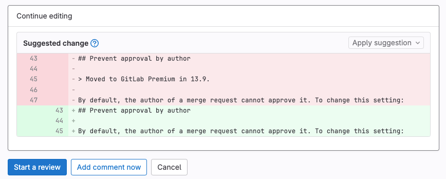
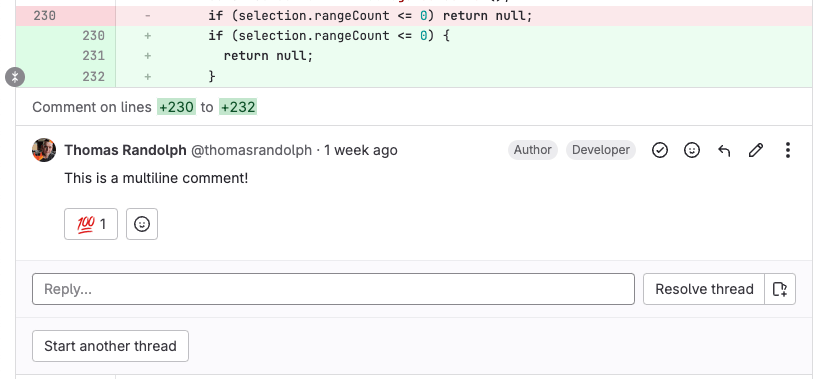
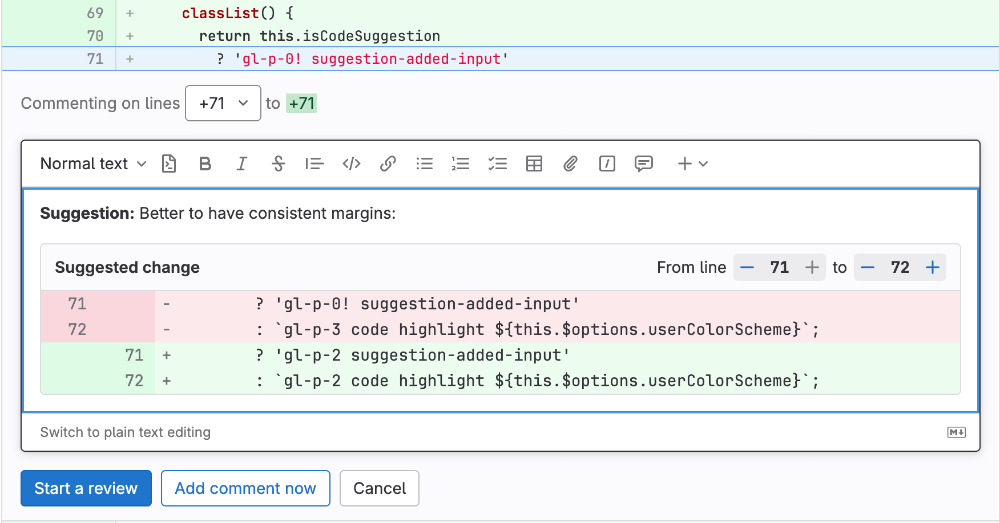



- Tier: 基础版，专业版，旗舰版
- Offering: JihuLab.com，私有化部署



审阅者可以在合并请求差异讨论中使用 Markdown 语法建议代码更改。
合并请求作者（或具有相应角色的其他用户）可以从极狐GitLab UI 应用任何或所有建议。应用建议会向合并请求添加一个提交，该提交的作者是提出更改建议的用户。

<a id="create-suggestions"></a>

## 创建建议

1. 在顶部栏中，选择 **搜索或跳转到** 并找到您的项目。
1. 在左侧边栏中，选择 **代码** > **合并请求** 并找到您的合并请求。
1. 在二级菜单上，选择 **变更**。
1. 找到您要更改的代码行。
   - 要选择单行，将鼠标悬停在行号上并选择 **为此行添加评论** ()。
   - 要选择多行：
     1. 将鼠标悬停在行号上，然后选择 **为此行添加评论** ()：

        

     1. 选择并拖动您的选择以包含所有需要的行。
        更多信息，请参见[多行建议](#multi-line-suggestions)。
   - 要对整个文件而不是特定行进行评论，在文件头部选择 **对此文件发表评论** ()。
1. 在评论工具栏中，选择 **插入建议** ()。极狐GitLab 会在您的评论中插入一个预填充的代码块，如下所示：

   ````markdown
   ```suggestion:-0+0
   您所选行的内容显示在此处。
   ```
   ````

1. 编辑预填充的代码块以添加您的建议。
1. 要立即添加您的评论，选择 **立即添加评论**，或使用键盘快捷键：
   - macOS：<kbd>Shift</kbd>+<kbd>Command</kbd>+<kbd>Enter</kbd>
   - 所有其他操作系统：<kbd>Shift</kbd>+<kbd>Control</kbd>+<kbd>Enter</kbd>
1. 要将评论保留为未发布状态直到您完成[审查](_index.md)，选择 **开始审查**，或使用键盘快捷键：
   - macOS：<kbd>Command</kbd>+<kbd>Enter</kbd>
   - 所有其他操作系统：<kbd>Control</kbd>+<kbd>Enter</kbd>

<a id="multi-line-suggestions"></a>

### 多行建议



- 多行建议在极狐GitLab 17.7 中变更，以支持当建议包含代码块时进行渲染。



当您审查合并请求差异时，您可以在单个建议中提议更改多行（最多 200 行），方法如下：

- 按照[创建建议](#create-suggestions)中所述进行选择和拖动。极狐GitLab 会为您创建一个建议块。
- 选择单行，然后手动编辑建议块中的范围偏移量。

建议第一行中的范围偏移量描述了相对于您所选行的行号。偏移量指定了您的建议打算替换的行。例如，此建议涵盖了注释行上方 2 行和下方 2 行：

````markdown
```suggestion:-2+2
## 阻止作者审批

默认情况下，合并请求的作者无法审批它。要更改此设置：
```
````

应用时，该建议会替换从注释行上方 2 行到下方 2 行的内容：



极狐GitLab 将多行建议限制为注释差异行上方 100 行和下方 100 行。这允许每个建议最多更改 201 行。

多行评论会在评论正文上方显示评论的行号：



<a id="using-the-rich-text-editor"></a>

#### 使用富文本编辑器



- 在极狐GitLab 16.1 中引入，带有一个功能标志，名为 `content_editor_on_issues`，默认禁用。
- 在极狐GitLab 16.2 中在 JihuLab.com 和私有化部署上启用。
- 功能标志 `content_editor_on_issues` 在极狐GitLab 16.5 中移除。



当您插入建议时，使用所见即所得的[富文本编辑器](../../../rich_text_editor.md)在 UI 中上下移动源文件的行号。

要添加或减去更改的行，在 **起始行** 旁边，选择 **+** 或 **-**。



<a id="apply-suggestions"></a>

## 应用建议

先决条件：

- 您必须是合并请求的作者，或者具有项目的开发者、维护者或所有者角色。

要直接从合并请求应用建议的更改：

1. 在顶部栏中，选择 **搜索或跳转到** 并找到您的项目。
1. 在左侧边栏中，选择 **代码** > **合并请求** 并找到您的合并请求。
1. 找到包含您要应用的建议的评论。
   - 要逐个应用建议，选择 **应用建议**。
   - 要在单个提交中应用多个建议，选择 **将建议添加到批处理**。
1. 可选。提供自定义提交消息来描述您的更改。如果您不提供自定义消息，将使用默认提交消息。
1. 选择 **应用**。

应用建议后，极狐GitLab 会：

- 将建议标记为 **已应用**。
- 解决评论讨论。
- 创建一个包含更改的新提交。
- （如果用户具有开发者角色）将建议的更改直接推送到合并请求分支中的代码库。

<a id="reject-suggestions"></a>

## 拒绝建议

先决条件：

- 您必须是合并请求的作者，或者具有项目的开发者、维护者或所有者角色。

要直接从合并请求拒绝建议的更改：

1. 在顶部栏中，选择 **搜索或跳转到** 并找到您的项目。
1. 在左侧边栏中，选择 **代码** > **合并请求** 并找到您的合并请求。
1. 找到包含您要拒绝的建议的评论。
1. 可选。添加回复说明拒绝建议的原因。
1. 选择 **解决讨论**。

<a id="configure-the-commit-message-for-applied-suggestions"></a>

## 配置已应用建议的提交消息

极狐GitLab 在应用建议时使用默认提交消息，但您可以更改它。此消息支持占位符。例如，默认消息 `Apply %{suggestions_count} suggestion(s) to %{files_count} file(s)` 如果您将三个建议应用到两个不同的文件，将呈现如下：

```plaintext
将 3 个建议应用到 2 个文件
```

从派生创建的合并请求使用目标项目中定义的模板。为了满足您项目的需求，自定义这些消息并包含其他占位符变量。

先决条件：

- 您必须具有维护者角色。

操作步骤：

1. 在顶部栏中，选择 **搜索或跳转到** 并找到您的项目。
1. 在左侧边栏中，选择 **设置** > **合并请求**。
1. 滚动到 **合并建议**，并根据需要修改文本。
   有关可在此消息中使用的占位符列表，请参见[支持的变量](#supported-variables)。

<a id="supported-variables"></a>

### 支持的变量

已应用建议的提交消息模板支持以下变量：

| 变量 | 描述 | 输出示例 |
|------------------------|-------------|----------------|
| `%{branch_name}` | 应用建议的分支名称。 | `my-feature-branch` |
| `%{files_count}` | 应用建议的文件数量。 | `2` |
| `%{file_paths}` | 应用建议的文件路径。路径以逗号分隔。 | `docs/index.md, docs/about.md` |
| `%{project_path}` | 项目路径。 | `my-group/my-project` |
| `%{project_name}` | 项目的可读名称。 | `My Project` |
| `%{suggestions_count}` | 应用的建议数量。 | `3` |
| `%{username}` | 应用建议的用户的用户名。 | `user_1` |
| `%{user_full_name}` | 应用建议的用户的全名。 | `User 1` |
| `%{co_authored_by}` | 以 Git 提交尾部格式 `Co-authored-by` 列出的建议作者的姓名和电子邮件。 | `Co-authored-by: Zane Doe <zdoe@example.com>` <br> `Co-authored-by: Blake Smith <bsmith@example.com>` |

例如，要将提交消息自定义为输出 `处理 user_1 的审查`，请将自定义文本设置为 `处理 %{username} 的审查`。

<a id="batch-suggestions"></a>

## 批处理建议

先决条件：

- 您必须具有允许您提交到源分支的项目角色。

为了减少添加到分支的提交数量，可以在单个提交中应用多个建议。

1. 在顶部栏中，选择 **搜索或跳转到** 并找到您的项目。
1. 在左侧边栏中，选择 **代码** > **合并请求** 并找到您的合并请求。
1. 对于每个要应用的建议，选择 **将建议添加到批处理**。
1. 可选。要移除建议，选择 **从批处理中移除**。
1. 添加所需建议后，选择 **应用建议**。

   > [!warning]
   > 如果您应用一批包含来自多个作者的更改的建议，生成的提交会将您记为作者。如果您的项目配置为[阻止添加提交的用户进行审批](../approvals/settings.md#prevent-approvals-by-users-who-add-commits)，您将不再是此合并请求的合格审批者。

1. 可选。为[批处理建议](#batch-suggestions)提供自定义提交消息来描述您的更改。如果您不指定，将使用默认提交消息。