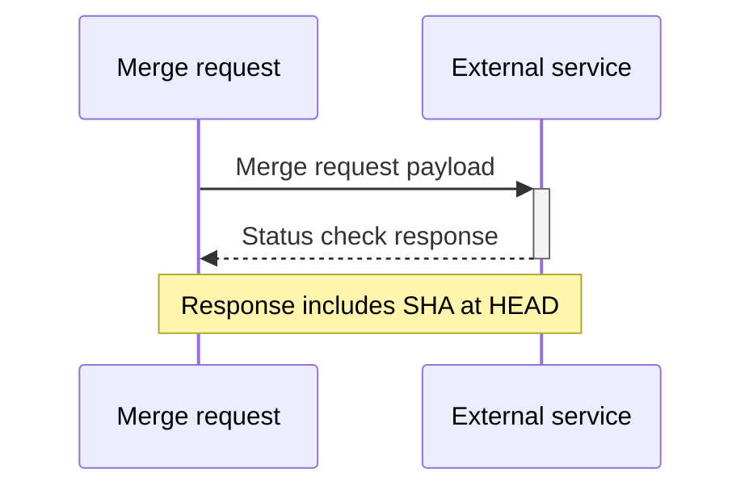
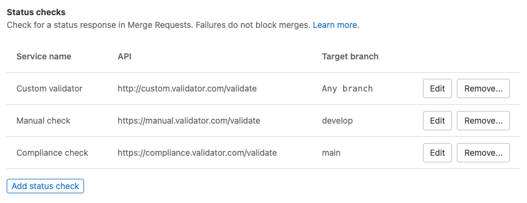
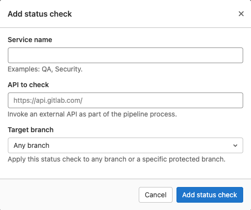
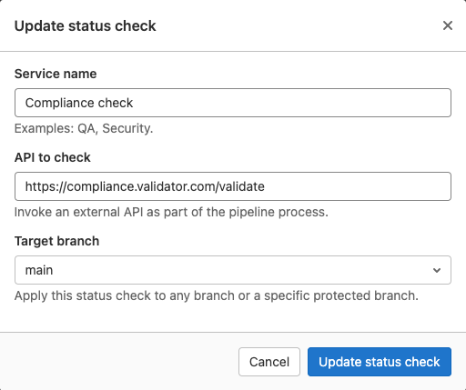
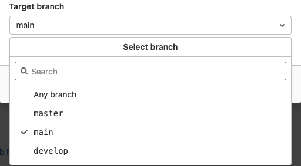
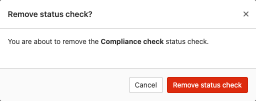



- Tier: 旗舰版
- Offering: JihuLab.com，私有化部署



状态检查是对外部系统的 API 调用，用于请求外部要求的状态。

您可以创建状态检查，将合并请求数据发送到第三方工具。
当用户创建、更改或关闭合并请求时，极狐GitLab 会发送通知。用户或自动化工作流随后可以在极狐GitLab 之外更新合并请求的状态。

通过此集成，您可以与第三方工作流工具（如 ServiceNow）或您选择的自定义工具集成。第三方工具会返回关联的状态。该状态随后显示在合并请求内的非阻塞小部件中，从而在合并请求级别本身向合并请求作者或审核人展示此状态。

您可以为每个单独的项目配置合并请求状态检查。这些检查不会在项目之间共享。

如果状态检查在超过两分钟后仍处于待处理状态，则视为失败。

<a id="access-permissions"></a>

## 访问权限

以下用户可以查看外部状态检查响应：

- 在项目中具有报告者、开发者、维护者或所有者角色的用户
- 当项目具有内部可见性时，任何可以查看合并请求的已认证用户

这意味着，如果您有一个内部项目，任何可以访问合并请求的登录用户都可以查看外部状态检查响应。

有关用例、功能发现和开发时间线的更多信息，请参阅 [史诗 3869](https://gitlab.com/groups/gitlab-org/-/epics/3869)。

<a id="block-merges-of-merge-requests-unless-all-status-checks-have-passed"></a>

## 除非所有状态检查均已通过，否则阻止合并请求的合并

默认情况下，即使外部状态检查失败，项目中的合并请求也可以合并。要在外部检查失败时阻止合并请求的合并：

1. 在顶部栏中，选择 **搜索或跳转到** 并找到您的项目。
1. 在左侧边栏中，选择 **设置** > **合并请求**。
1. 选中 **状态检查必须成功** 复选框。
1. 选择 **保存更改**。

<a id="lifecycle"></a>

## 生命周期

外部状态检查具有 **异步** 工作流。每当发生以下情况时，合并请求都会向外部服务发送合并请求 webhook 负载：

- 合并请求被更新、关闭、重新打开、批准、取消批准或合并。
- 代码被推送到合并请求的源分支。



收到负载后，外部服务可以先运行所有必需的流程，然后[使用 REST API](../../../api/status_checks.md#set-status-of-an-external-status-check)将响应发布回合并请求。

对于不引用源分支当前 `HEAD` 的任何响应，合并请求都会返回 `409 Conflict` 错误。因此，外部服务处理并响应过时的提交是安全的。

外部状态检查具有以下状态：

- `pending` - 默认状态。合并请求尚未收到外部服务的响应。
- `passed` - 已收到外部服务的响应，且该服务已批准。
- `failed` - 已收到外部服务的响应，且该服务已拒绝。

如果极狐GitLab 之外发生了某些变化，您可以使用 API [设置外部状态检查的状态](../../../api/status_checks.md#set-status-of-an-external-status-check)。您无需等待先发送合并请求 webhook 负载。

<a id="view-status-check-services"></a>

## 查看状态检查服务

要从合并请求设置中查看添加到项目的状态检查服务列表：

1. 在顶部栏中，选择 **搜索或跳转到** 并找到您的项目。
1. 在左侧边栏中，选择 **设置** > **合并请求**。
1. 向下滚动到 **状态检查**。此列表显示服务名称、API URL、目标分支和 HMAC 身份验证状态。



您也可以从 [分支规则](../repository/branches/branch_rules.md#add-a-status-check-service) 设置中查看状态检查服务列表。

<a id="add-or-update-a-status-check-service"></a>

## 添加或更新状态检查服务

<a id="add-a-status-check-service"></a>

### 添加状态检查服务

在 **状态检查** 子部分中，选择 **添加状态检查** 按钮。
随后将显示 **添加状态检查** 表单。



填写表单并选择 **添加状态检查** 按钮将创建新的状态检查。

该状态检查适用于所有新的合并请求，但不会追溯应用于现有的合并请求。

<a id="update-a-status-check-service"></a>

### 更新状态检查服务

在 **状态检查** 子部分中，选择要编辑的状态检查旁边的 **编辑** ()。
随后将显示 **更新状态检查** 表单。



> [!note]
> 您无法查看或修改 HMAC 共享密钥的值。要更改共享密钥，请删除并重新创建外部状态检查，并为共享密钥设置新值。

要更新状态检查，请更改表单中的值并选择 **更新状态检查**。

状态检查更新适用于所有新的合并请求，但不会追溯应用于现有的合并请求。

<a id="form-values"></a>

### 表单值

有关常见的表单错误，请参阅下面的 [故障排查](#troubleshooting) 部分。

<a id="service-name"></a>

#### 服务名称

此名称可以是任何字母数字值，并且必须设置。该名称在项目中必须是唯一的。

<a id="api-to-check"></a>

#### 要检查的 API

此字段需要 URL，并且必须使用 HTTP 或 HTTPS 协议。
**建议** 使用 HTTPS 来保护传输中的合并请求数据。
必须设置 URL，并且该 URL 在项目中必须是唯一的。

<a id="target-branch"></a>

#### 目标分支

如果您想将状态检查限制在单个分支，可以使用此字段设置此限制。



分支列表来自项目的 [受保护分支](../repository/branches/protected.md)。

您可以滚动浏览分支列表，或者当分支很多且您要查找的分支没有立即出现时，使用搜索框。搜索框需要输入 **三个** 字母数字字符才能开始搜索。

如果您希望状态检查应用于所有合并请求，可以选择 **所有分支** 选项。

<a id="hmac-shared-secret"></a>

#### HMAC 共享密钥

HMAC 身份验证可防止请求被篡改，并确保请求来自合法来源。

<a id="delete-a-status-check-service"></a>

## 删除状态检查服务

在 **状态检查** 子部分中，选择要删除的状态检查旁边的 **移除** ()。
随后将显示 **移除状态检查？** 对话框。



要完成状态检查的删除，您必须选择 **移除状态检查** 按钮。这将 **永久** 删除该状态检查，并且 **无法** 恢复。

<a id="status-checks-widget"></a>

## 状态检查小部件

状态检查小部件显示在合并请求中，并显示以下状态：

- **pending** ()，当极狐GitLab 等待外部状态检查的响应时。
- **success** () 或 **failed** ()，当极狐GitLab 收到外部状态检查的响应时。

当存在待处理的状态检查时，小部件会每隔几秒轮询一次更新，直到收到 **success** 或 **failed** 响应。

要重试失败的状态检查：

1. 在顶部栏中，选择 **搜索或跳转到** 并找到您的项目。
1. 在左侧边栏中，选择 **代码** > **合并请求** 并找到您的合并请求。
1. 滚动到合并请求报告部分，展开下拉列表以显示外部状态检查列表。
1. 在失败的外部状态检查行上选择 **重试** ()。该状态检查将恢复到待处理状态。

组织可能制定了策略，不允许在外部状态检查未通过时合并合并请求。但是，小部件中的详细信息仅供参考。

> [!note]
> 极狐GitLab 无法保证相关外部服务能正确处理外部状态检查。

<a id="troubleshooting"></a>

## 故障排查

<a id="duplicate-value-errors"></a>

### 重复值错误

```plaintext
Name is already taken
---
External API is already in use by another status check
```

在同一项目内，状态检查的名称或 API URL 只能使用一次。
这些错误意味着此项目的状态检查中已使用了该状态检查的名称或 API URL。

您必须为当前状态检查选择不同的值，或更新现有状态检查的值。

<a id="invalid-url-error"></a>

### 无效 URL 错误

```plaintext
Please provide a valid URL
```

要检查的 API 字段要求提供的 URL 使用 HTTP 或 HTTPS 协议。
您必须更新此字段的值以满足此要求。

<a id="branch-list-error-during-retrieval-or-search"></a>

### 检索或搜索期间的分支列表错误

```plaintext
Unable to fetch branches list, please close the form and try again
```

从分支检索 API 收到了意外响应。
建议您关闭表单并重新打开，或刷新页面。此错误应该是暂时的，但如果持续存在，请检查 [GitLab 状态页面](https://status.gitlab.com/) 以查看是否存在更广泛的故障。

<a id="failed-to-load-status-checks"></a>

### 无法加载状态检查

```plaintext
Failed to load status checks
```

从外部状态检查 API 收到了意外响应。
您应该：

- 刷新页面，以防此错误是暂时的。
- 如果问题持续存在，请检查 [GitLab 状态页面](https://status.gitlab.com/)，以查看是否存在更广泛的故障。
