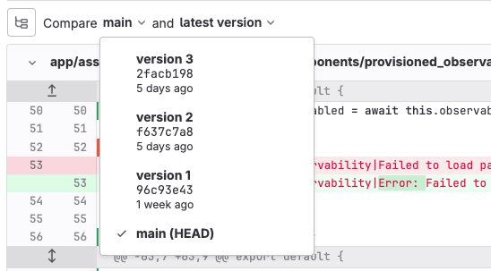
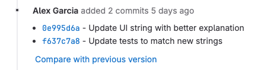



- Tier: 基础版，专业版，旗舰版
- Offering: JihuLab.com，私有化部署



当你创建合并请求时，需要选择两个分支进行比较。两个分支之间的差异会以差异的形式显示在合并请求中。每次你向合并请求关联的分支推送提交时，极狐GitLab 都会将合并请求差异更新为新的差异版本。

> [!note]
> 差异版本在每次推送时更新，而不是每次提交时更新。如果一次推送包含多个提交，则只会创建一个新的差异版本。

默认情况下，极狐GitLab 会将源分支（`feature`）中的最新推送与目标分支（通常是 `main`）中的最新提交进行比较。

## 比较差异版本

如果你曾多次推送到分支，可以从每次先前的推送中获取差异版本进行比较。当合并请求包含大量变更或对同一文件的连续变更时，你可能希望比较较少的变更。

先决条件：

- 合并请求分支必须包含来自多次推送的提交。同一次推送中的单个提交不会生成新的差异版本。

比较差异版本：

1. 在顶部栏中，选择 **搜索或跳转到** 并查找你的项目。
1. 在左侧边栏中，选择 **代码** > **合并请求**。
1. 选择一个合并请求。
1. 要查看此合并请求的当前差异版本，请选择 **变更**。
1. 在 **比较** () 旁边，选择要比较的推送。此示例比较了 `main` 与分支的最新推送（最新差异版本）：

   

   这个示例分支有四个提交，但由于两个提交是同时推送的，分支只包含三个差异版本。

## 从系统笔记查看差异版本

每次向合并请求分支推送新变更时，极狐GitLab 都会向合并请求添加一条系统注释。在本例中，一次推送添加了两个提交：

要查看该提交的差异，请选择提交 SHA。

有关更多信息，请参见如何[显示或筛选合并请求上的系统笔记](../system_notes.md#on-a-merge-request)。

## 相关主题

- [面向管理员的合并请求差异存储](../../../administration/merge_request_diffs.md)