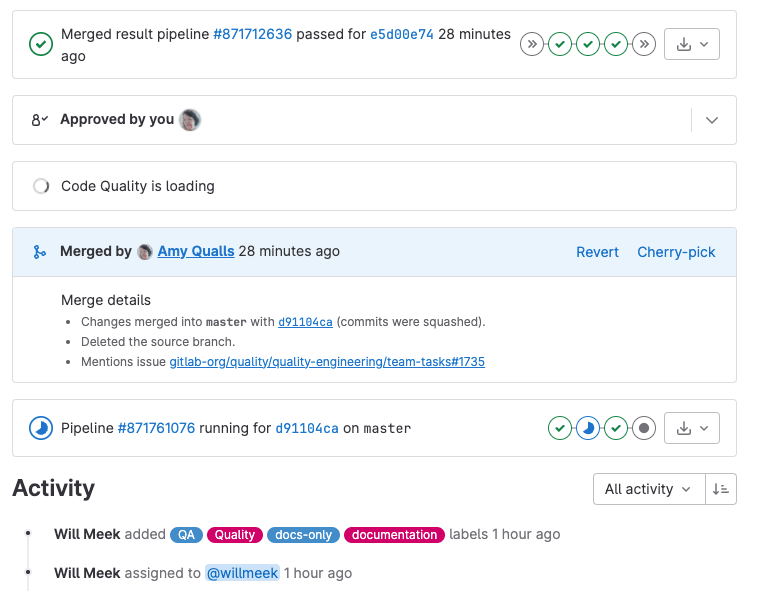
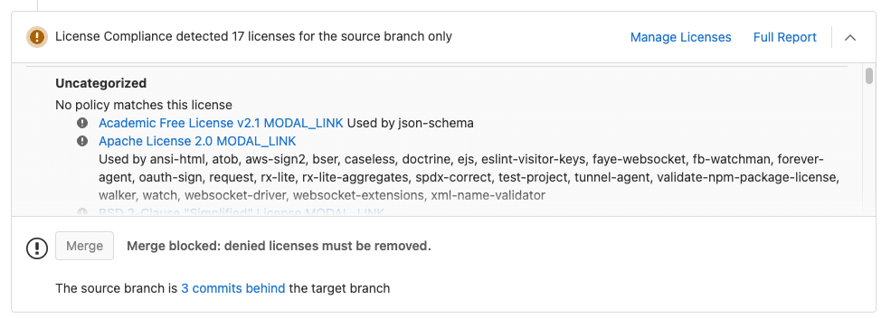



- Tier: 基础版，专业版，旗舰版
- Offering: JihuLab.com，私有化部署



合并请求的概览页面会显示对合并请求执行操作的服务所返回的状态更新。所有订阅级别都会显示一个小部件区域，但该区域的内容取决于你的订阅级别以及为项目配置的服务。

## 流水线信息

如果你在项目中设置了 [极狐GitLab CI/CD](../../../ci/_index.md)，[合并请求](_index.md) 的 **概览** 选项卡的小部件区域会显示流水线信息：

- 合并前和合并后的流水线，以及相关的环境信息（如果有）。
- 哪些部署正在进行中。

如果应用程序成功部署到某个 [环境](../../../ci/environments/_index.md)，则会同时显示已部署的环境以及 [评审应用](../../../ci/review_apps/_index.md) 的链接。

当合并请求中的流水线失败但仍可合并时，极狐GitLab 会以红色显示 **合并** 按钮。

## 合并后流水线状态

当你合并一个合并请求时，你可以看到该合并请求所合并到的分支的合并后流水线状态。例如，当一个合并请求合并到 [默认分支](../repository/branches/default.md)，然后触发到预发布环境的部署。

极狐GitLab 会显示正在进行的部署以及环境的状态（部署中或已部署）。如果是该分支的首次部署，链接在完成前会返回 `404` 错误。在部署过程中，极狐GitLab 会禁用停止按钮。如果流水线部署失败，极狐GitLab 会隐藏部署信息。

更多信息，请 [阅读有关流水线的信息](../../../ci/pipelines/_index.md)。

## 设置自动合并

可以设置一个看起来已准备好合并的合并请求，使其 [在 CI 流水线成功时自动合并](auto_merge.md)。

## 使用评审应用实时预览

为你的项目配置 [评审应用](../../../ci/review_apps/_index.md)，以便按分支预览通过合并请求提交到功能分支的更改。你无需检出分支、安装并在本地预览。所有更改都可以通过评审应用链接供任何人预览。

设置极狐GitLab [路由映射](../../../ci/review_apps/_index.md#route-maps) 后，合并请求小部件会直接将你带到更改的页面，从而更轻松、更快速地预览提议的修改。

更多信息，请参见 [评审应用](../../../ci/review_apps/_index.md)。

## 许可证合规



- Tier: 旗舰版
- Offering: JihuLab.com，私有化部署



要查看为项目依赖项检测到的许可证列表，请为你的项目配置 [许可证合规](../../compliance/license_scanning_of_cyclonedx_files/_index.md)。

## 安全策略



- Tier: 旗舰版
- Offering: JihuLab.com，私有化部署



要防止开发者合并漏洞和不支持的许可证，或在合并请求中强制要求审批，请配置 [安全策略](../../application_security/policies/merge_request_approval_policies.md)。你可以为项目、群组或实例配置安全策略。你也可以选择将安全策略设置为警告模式，以提高对发现结果的认识，同时不阻止开发者合并。

## 外部状态检查



- Tier: 旗舰版
- Offering: JihuLab.com，私有化部署



如果你配置了 [外部状态检查](status_checks.md)，则可以在合并请求中 [通过特定小部件](status_checks.md#status-checks-widget) 查看这些检查的状态。

## 应用安全扫描

如果你启用了任何应用安全扫描工具，极狐GitLab 会在安全扫描小部件中显示结果。更多信息，请参见 [安全扫描结果](../../application_security/detect/security_scanning_results.md)。

来自 [子流水线](../../../ci/pipelines/downstream_pipelines.md#view-child-pipeline-reports-in-merge-requests) 的安全报告会与父流水线的结果一起显示在安全扫描小部件中。