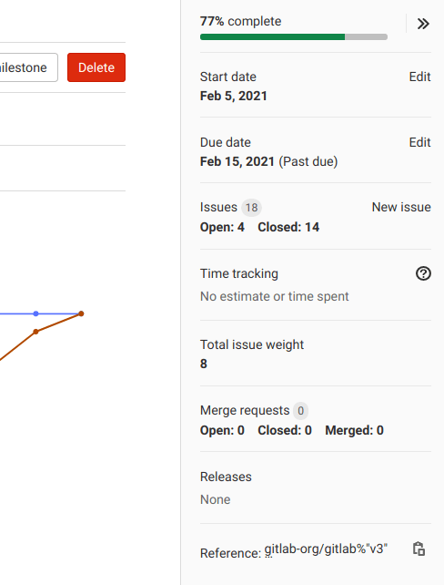
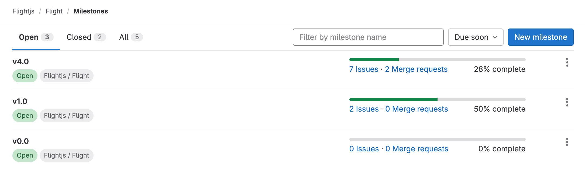



- Tier: 基础版，专业版，旗舰版
- Offering: JihuLab.com，私有化部署



里程碑有助于跟踪和组织极狐GitLab 中的工作。
里程碑：

- 将相关的议题、史诗和合并请求分组，以跟踪目标的进展。
- 支持基于时间的计划，可选择开始日期和截止日期。
- 与迭代一起使用，以跟踪并行的时间盒。
- 跟踪发布并生成发布凭据。
- 应用于项目和群组。

里程碑可以属于某个[项目](../_index.md)或[群组](../../group/_index.md)。
项目里程碑仅适用于该项目中的议题和合并请求。
群组里程碑适用于该群组项目中的任何议题、史诗或合并请求。

有关项目和群组里程碑 API 的信息，请参阅：

- [项目里程碑 API](../../../api/milestones.md)
- [群组里程碑 API](../../../api/group_milestones.md)

## 将里程碑用作发布

里程碑可用于跟踪发布。为此：

1. 将里程碑截止日期设置为代表您发布的发布日期。
   如果您的发布周期没有明确的开始日期，可以将里程碑开始日期留空。
1. 将里程碑标题设置为您发布的版本，例如 `Version 9.4`。
1. 通过从议题的右侧边栏选择里程碑，将议题添加到您的发布中。

此外，要在创建发布时自动生成发布凭据，请将里程碑与[发布功能](../releases/_index.md#associate-milestones-with-a-release)集成。

## 项目里程碑和群组里程碑

里程碑可以属于[项目](../_index.md)或[群组](../../group/_index.md)。

您可以将**项目里程碑**仅分配给该项目中的议题或合并请求。
您可以将**群组里程碑**分配给该群组中任何项目的任何议题、史诗或合并请求。

有关项目和群组里程碑 API 的信息，请参阅：

- [项目里程碑 API](../../../api/milestones.md)
- [群组里程碑 API](../../../api/group_milestones.md)

### 查看项目或群组里程碑

查看里程碑列表：

1. 在顶部栏中，选择 **搜索或跳转到** 并找到您的项目或群组。
1. 在左侧边栏中，选择 **计划** > **里程碑**。

在项目中，极狐GitLab 显示属于该项目的里程碑。
在群组中，极狐GitLab 显示属于该群组以及群组中所有项目和子群组的里程碑。

### 在关闭了议题跟踪的项目中查看里程碑

如果项目的议题跟踪[已关闭](../settings/_index.md#configure-project-features-and-permissions)，
要进入里程碑页面，可以输入其 URL。

为此：

1. 前往您的项目。
1. 在您的项目 URL 后添加：`/-/milestones`。
   例如 `https://jihulab.com/gitlab-cn/sample-data-templates/sample-gitlab-project/-/milestones`。

或者，该项目的议题会在群组的里程碑页面中可见。

### 查看所有里程碑

您可以查看在整个极狐GitLab 命名空间中您有权访问的所有里程碑。
您可能看不到某些里程碑，因为它们位于您不是其成员的项目或群组中。

为此：

1. 在顶部栏中，选择 **搜索或跳转到**。
1. 选择 **您的工作**。
1. 在左侧边栏中，选择 **里程碑**。

### 查看里程碑详情

要查看有关里程碑的更多信息，
在 **里程碑** 页面中，选择您要查看的里程碑的标题。

里程碑视图显示标题和描述。
标题和描述下方的选项卡显示以下内容：

- **工作项**：显示分配给该里程碑的所有工作项。工作项显示在三列中，分别命名为：
  - 未开始的议题（未关闭且未指派的）
  - 进行中的议题（未关闭且已指派的）
  - 已完成的议题（已关闭的）
- **合并请求**：显示分配给该里程碑的所有合并请求。合并请求显示在四列中，分别命名为：
  - 进行中（未关闭且未指派的）
  - 等待合并（未关闭且已指派的）
  - 已拒绝（已关闭的）
  - 已合并
- **参与者**：显示分配给该里程碑的议题的所有被指派人。
- **标签**：显示在分配给该里程碑的议题中使用的所有标签。

#### 燃尽图

里程碑视图包含一张[燃尽图和燃起图](burndown_and_burnup_charts.md)，
展示完成里程碑的进度。

#### 里程碑侧边栏

里程碑视图上的侧边栏显示以下内容：

- 完成百分比，计算方式为已关闭的工作项数量除以工作项总数。
- 开始日期和截止日期。
- 在分配给该里程碑的所有工作项和合并请求上花费的总时间。
- 分配给该里程碑的所有工作项的议题总权重。
- 合并请求的总数、未关闭、已关闭和已合并的数量。
- 关联发布的链接。
- 您可以复制到剪贴板的里程碑引用。

## 创建里程碑



- 在极狐GitLab 15.0 中，将最低用户角色从开发者更改为报告者。
- 在极狐GitLab 17.7 中，将最低用户角色从报告者更改为计划者。
- 在极狐GitLab 18.2 中，为史诗工作项引入了里程碑。



您可以在项目或群组中创建里程碑。

先决条件：

- 您必须具有里程碑所属项目或群组的计划者、报告者、开发者、维护者或所有者角色。

要创建里程碑：

1. 在顶部栏中，选择 **搜索或跳转到** 并找到您的项目或群组。
1. 在左侧边栏中，选择 **计划** > **里程碑**。
1. 选择 **新建里程碑**。
1. 输入标题。
1. （可选）输入描述、开始日期和截止日期。
1. 选择 **新建里程碑**。

### 里程碑标题规则

为避免群组层级结构内的混淆，不允许重复的里程碑标题。

- 对于**项目里程碑**，标题在项目祖先层级结构中必须在项目和里程碑标题中都是唯一的。
- 对于**群组里程碑**，标题在群组层级结构内必须是唯一的，包括祖先和子级，包括群组和项目里程碑。

## 编辑里程碑



- 在极狐GitLab 15.0 中，将最低用户角色从开发者更改为报告者。
- 在极狐GitLab 17.7 中，将最低用户角色从报告者更改为计划者。



先决条件：

- 您必须具有里程碑所属项目或群组的计划者、报告者、开发者、维护者或所有者角色。

要编辑里程碑：

1. 在顶部栏中，选择 **搜索或跳转到** 并找到您的项目或群组。
1. 在左侧边栏中，选择 **计划** > **里程碑**。
1. 选择一个里程碑的标题。
1. 在右上角，选择 **里程碑操作** ()，然后选择 **编辑**。
1. 编辑标题、开始日期、截止日期或描述。
1. 选择 **保存更改**。

## 关闭里程碑



- 在极狐GitLab 17.7 中，将最低用户角色从报告者更改为计划者。



里程碑在截止日期后会关闭。
您也可以手动关闭里程碑。

当里程碑关闭时，其未关闭的议题仍保持未关闭状态。

先决条件：

- 您必须具有里程碑所属项目或群组的计划者、报告者、开发者、维护者或所有者角色。

要关闭里程碑：

1. 在顶部栏中，选择 **搜索或跳转到** 并找到您的项目或群组。
1. 在左侧边栏中，选择 **计划** > **里程碑**。
1. 执行以下任一操作：
   - 在您要关闭的里程碑旁边，选择 **里程碑操作** () > **关闭**。
   - 选择里程碑标题，然后选择 **关闭**。

## 删除里程碑



- 在极狐GitLab 15.0 中，将最低用户角色从开发者更改为报告者。
- 在极狐GitLab 17.7 中，将最低用户角色从报告者更改为计划者。



先决条件：

- 您必须具有里程碑所属项目或群组的计划者、报告者、开发者、维护者或所有者角色。

要删除里程碑：

1. 在顶部栏中，选择 **搜索或跳转到** 并找到您的项目或群组。
1. 在左侧边栏中，选择 **计划** > **里程碑**。
1. 执行以下任一操作：
   - 在您要删除的里程碑旁边，选择 **里程碑操作** () > **删除**。
   - 选择里程碑标题，然后选择 **里程碑操作** () > **删除**。
1. 选择 **删除里程碑**。

## 将项目里程碑提升为群组里程碑



- 在极狐GitLab 17.7 中，将最低用户角色从报告者更改为计划者。



如果您正在扩展群组中的项目数量，您可能希望在群组的项目之间共享相同的里程碑。
您可以将项目里程碑提升到父群组，以使它们可用于同一群组中的其他项目。

提升里程碑会将此群组内所有项目中具有相同名称的所有项目里程碑合并为一个群组里程碑。
之前分配给这些项目里程碑之一的所有议题和合并请求都将分配给新的群组里程碑。

> [!warning]
> 此操作无法撤消，更改是永久的。

先决条件：

- 您必须具有群组的计划者、报告者、开发者、维护者或所有者角色。

要提升项目里程碑：

1. 在顶部栏中，选择 **搜索或跳转到** 并找到您的项目。
1. 在左侧边栏中，选择 **计划** > **里程碑**。
1. 执行以下任一操作：
   - 在您要提升的里程碑旁边，选择 **里程碑操作** () > **提升**。
   - 选择里程碑标题，然后选择 **里程碑操作** () > **提升**。
1. 选择 **提升里程碑**。

## 将里程碑分配给条目



- 为史诗分配里程碑的功能于极狐GitLab 18.2 引入。



每个议题、史诗或合并请求都可以分配一个里程碑。
这些里程碑在每个议题和合并请求页面的右侧边栏中可见。
它们在工作项板中也可见。

要分配或取消分配里程碑：

1. 查看一个议题、史诗或合并请求。
1. 在右侧边栏中，在 **里程碑** 旁边，选择 **编辑**。
1. 在 **分配里程碑** 列表中，通过输入名称搜索里程碑。
   您可以选择项目和群组里程碑。
1. 选择您要分配的里程碑。

您还可以通过以下方式分配或取消分配里程碑：

- 在评论或描述中使用 [`/milestone` 快速操作](../quick_actions.md#milestone)
- 在看板中将议题拖到[里程碑列表](../issue_board.md#milestone-lists)
- 从议题列表中[批量编辑议题](../issues/managing_issues.md#bulk-edit-issues)

## 按里程碑筛选议题和合并请求

### 列表页面中的筛选器

您可以从项目和群组的议题/合并请求列表页面，同时按群组和项目里程碑进行筛选。

### 议题板中的筛选器

在[项目议题板](../issue_board.md)中，您可以按群组里程碑和项目里程碑进行筛选，位置在：

- [搜索和筛选栏](../issue_board.md#filter-issues)
- [议题板配置](../issue_board.md#configurable-issue-boards)

在[群组议题板](../issue_board.md#group-issue-boards)中，您只能按群组里程碑进行筛选，位置在：

- [搜索和筛选栏](../issue_board.md#filter-issues)
- [议题板配置](../issue_board.md#configurable-issue-boards)

### 特殊里程碑筛选器



- 极狐GitLab 18.0 中更改了**已开始**和**即将到来**筛选器的逻辑。



按里程碑筛选时，除了选择特定的项目里程碑或群组里程碑外，您还可以选择特殊的里程碑筛选器。

- **无**：显示未分配里程碑的议题或合并请求。
- **任何**：显示已分配里程碑的议题或合并请求。
- **即将到来**：显示具有在未来开始的已分配且未关闭的里程碑的议题或合并请求。
- **已开始**：显示具有与当前日期重叠的已分配且未关闭的里程碑的议题或合并请求。该列表排除了没有定义开始日期和截止日期的里程碑。