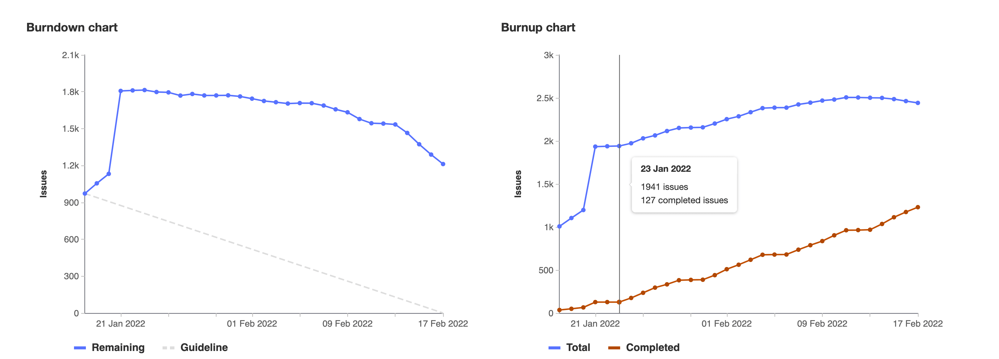
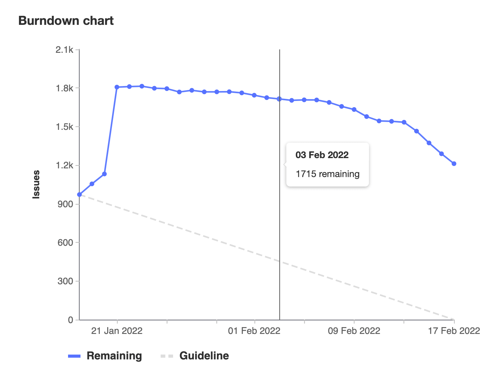
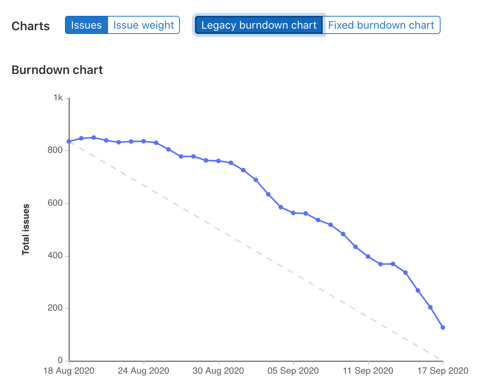
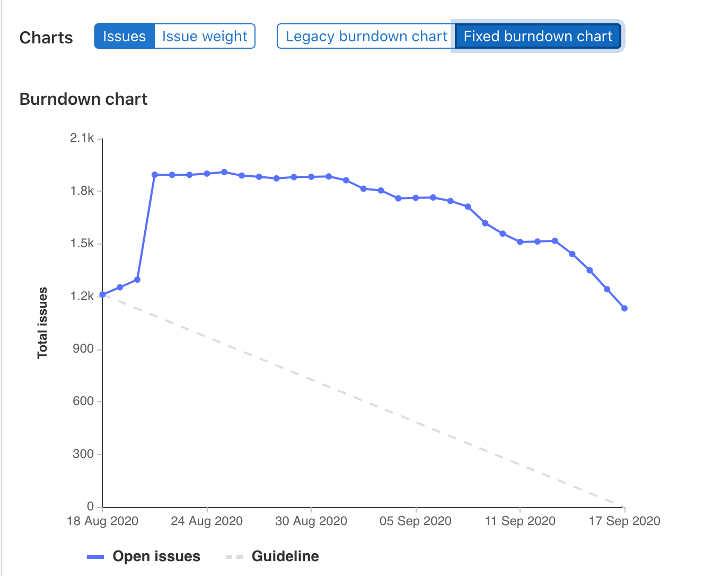
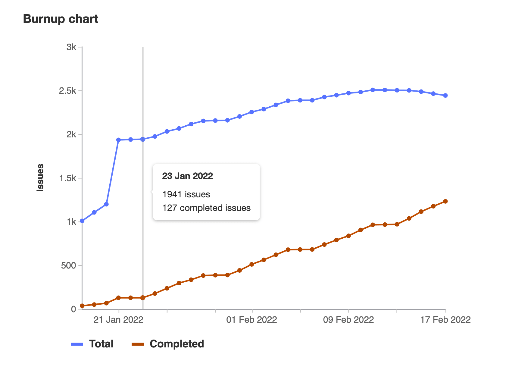



- Tier: 专业版，旗舰版
- Offering: JihuLab.com，私有化部署



[燃尽图](#burndown-charts)和[燃起图](#burnup-charts)显示完成里程碑的进度。
燃尽图显示项目[里程碑](_index.md)期间剩余的议题（燃尽）。
燃起图显示议题总数与已完成议题的对比。

## 相似之处与不同之处

燃尽图和燃起图具有一些共同的一般特性。
燃尽图和燃起图均：

- 显示当前里程碑每天的总议题数。
- 具有在里程碑每天的总议题数或议题总[权重](../../work_items/weight.md)之间切换的[开关](#switch-between-number-of-issues-and-issue-weight)。

燃尽图和燃起图之间的区别是：

- 燃起图包含一条单独的线，表示里程碑期间已完成的议题。
- 燃起图反映议题移至另一个里程碑（**总计**议题线下降）与议题关闭（**总计**议题线保持不变）之间的差异。
- 燃尽图衡量每天“总议题数减去已关闭议题数”，而燃起图将总议题数（未关闭和已关闭）与每天已解决的议题分开衡量。

## 在议题数和议题权重之间切换

要在这两种设置之间切换，请在图上方选择 **议题** 或 **议题权重**。

按权重排序时，请确保所有议题都已分配权重，因为未分配权重的议题不会计入剩余权重总计。

## 何时使用燃尽图和燃起图

在跟踪里程碑进度时，燃尽图和燃起图可提供有价值的见解。
其使用取决于您在[工作流程中如何构建里程碑](_index.md)。

这些图表可帮助团队：

- 在里程碑期间实时可视化进度。
- 通过将实际进度与理想进度进行比较，及早发现潜在延迟。
- 使用易于理解的视觉数据向利益相关者传达状态。
- 就资源分配和优先级做出数据驱动的决策。

使用燃尽图关注剩余工作。
使用燃起图跟踪随时间推移的已完成工作和范围变更。
燃起图通过显示图表中总议题数的峰值，特别有助于监控范围蔓延（对项目范围的不受控添加）。

## 燃尽图

燃尽图显示里程碑期间的议题数。

您一眼即可看到给定里程碑的完成状态。
如果没有这些图表，您将需要自行整理里程碑数据并绘制图表，才能获得同样的进度感。

极狐GitLab 会为您绘制图表，并以清晰美观的图表呈现。

要查看项目的燃尽图：

1. 在顶部栏中，选择 **搜索或跳转到** 并找到您的项目。
1. 在左侧边栏中，选择 **计划** > **里程碑**。
1. 从列表中选择一个里程碑。

要查看群组的燃尽图：

1. 在顶部栏中，选择 **搜索或跳转到** 并找到您的群组。
1. 在左侧边栏中，选择 **计划** > **里程碑**。
1. 从列表中选择一个里程碑。

### 燃尽图的工作原理

每个已分配**开始日期**和**截止日期**的项目或群组里程碑都提供燃尽图。

> [!note]
> 您可以将[项目里程碑升级为群组里程碑](_index.md#promote-a-project-milestone-to-a-group-milestone)，并仍可查看其**燃尽图**，但需遵守许可限制。

该图表显示项目在该里程碑期间（针对分配给它的议题）的进度。

具体来说，它显示在里程碑对应期间的某一天有多少议题曾处于或仍然处于未关闭状态。

您还可以切换燃尽图以显示某一天的[累计未关闭议题权重](#switch-between-number-of-issues-and-issue-weight)。

### 固定燃尽图

对于在极狐GitLab 13.6 之前创建的里程碑，燃尽图有一个额外的开关，可在“旧版”和“固定”视图之间切换。

| 旧版 | 固定 |
| ----- | ----- |
|  |  |

**固定燃尽图**跟踪里程碑活动的完整历史，从其创建到里程碑到期。里程碑截止日期过后，从里程碑中移除的议题不再影响图表。

**旧版燃尽图**跟踪议题的创建时间和最后关闭时间，而非其完整历史。对于每一天，旧版燃尽图取未关闭议题数和当天创建的议题数，并减去当天关闭的议题数。
在里程碑开始日期之前创建并分配了里程碑的议题（且在开始日期时仍处于未关闭状态）被视为在开始日期打开。
因此，当里程碑开始日期更改时，每天的未关闭议题数可能会发生变化。
重新打开的议题被视为在其最后关闭日期的次日打开。

## 燃起图

燃起图显示里程碑的已分配工作和已完成工作。

要查看项目的燃起图：

1. 在顶部栏中，选择 **搜索或跳转到** 并找到您的项目。
1. 在左侧边栏中，选择 **计划** > **里程碑**。
1. 从列表中选择一个里程碑。

要查看群组的燃起图：

1. 在顶部栏中，选择 **搜索或跳转到** 并找到您的群组。
1. 在左侧边栏中，选择 **计划** > **里程碑**。
1. 从列表中选择一个里程碑。

### 燃起图的工作原理

燃起图有单独的总工作和已完成工作线：

- **总计**线通过衡量分配给该里程碑的议题数来反映里程碑范围的变化。
- **已完成**线衡量该里程碑的已关闭议题数。

当未关闭议题移至另一个里程碑时，**总计**线会下降，但**已完成**线保持不变。
**已完成**线保持不变，因为它只跟踪已关闭的议题。

当议题关闭时，**总计**线保持不变，**已完成**线上升。

## 权重汇总



- Offering: 私有化部署



> [!flag]
> 在极狐GitLab 私有化部署上，此功能默认不可用。
> 此功能可用于测试，但尚未准备好用于生产环境。

借助[任务](../../tasks.md)，可以实现更细粒度的规划。
如果启用此功能，则具有任务的议题的权重将根据同一里程碑中的任务得出。
具有任务的议题不会在燃尽图或燃起图中单独计数。

图表中议题权重的计算方式：

- 如果议题的任务未分配权重，则使用该议题的权重。
- 如果议题有多个任务，且某些任务在之前的迭代中已完成，则仅显示并计算本次迭代中的任务。
- 如果任务直接分配给某个迭代，而未分配其父项，则该任务是顶级项，并贡献其自身权重。父议题不显示。

### 权重汇总示例

**示例 1**

- 议题权重为 5，并分配给里程碑 2。
- 任务 1 权重为 2，并分配给里程碑 1。
- 任务 2 权重为 2，并分配给里程碑 2。
- 任务 3 权重为 2，并分配给里程碑 2。

里程碑 1 的图表将显示任务 1 的权重为 2。

里程碑 2 的图表将显示议题的权重为 4。

**示例 2**

- 议题权重为 5，并分配给里程碑 2。
- 任务 1 分配给里程碑 1，未分配权重。
- 任务 2 分配给里程碑 2，未分配权重。
- 任务 3 分配给里程碑 2，未分配权重。

里程碑 1 的图表将显示任务 1 的权重为 0。

里程碑 2 的图表将显示议题的权重为 5。

**示例 3**

- 议题分配给里程碑 2，未分配权重。
- 任务 1 权重为 2，并分配给里程碑 1
- 任务 2 权重为 2，并分配给里程碑 2
- 任务 3 权重为 2，并分配给里程碑 2

里程碑 1 的图表将显示任务 1 的权重为 2。

里程碑 2 的图表将显示议题的权重为 4。

## 故障排查

### 燃尽图和燃起图未显示正确的议题状态

这些图表的一个限制是[日期使用 UTC 时区](https://gitlab.com/gitlab-org/gitlab/-/issues/267967)。

这可能导致图表在其他时区不准确。例如：

- 里程碑中的所有议题都被记录为在最后一天或之前关闭。
- 一个议题在最后一天下午 6 点（太平洋时间，UTC-7）关闭。
- 议题活动日志显示关闭时间为里程碑最后一天的下午 6 点。
- 图表使用 UTC 时间绘制，因此对于此议题，关闭时间为次日凌晨 1 点。
- 图表显示里程碑未完成，缺少一个已关闭的议题。
