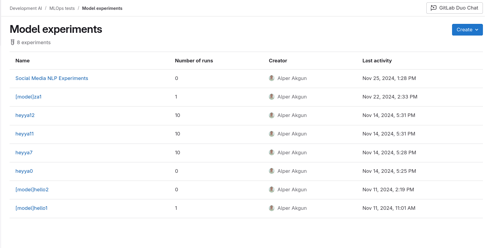
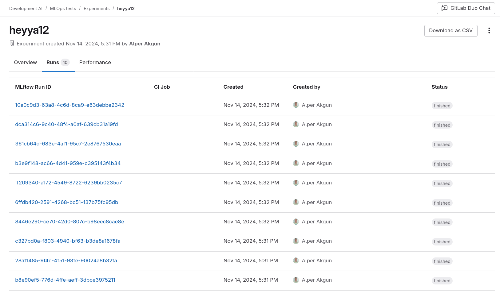
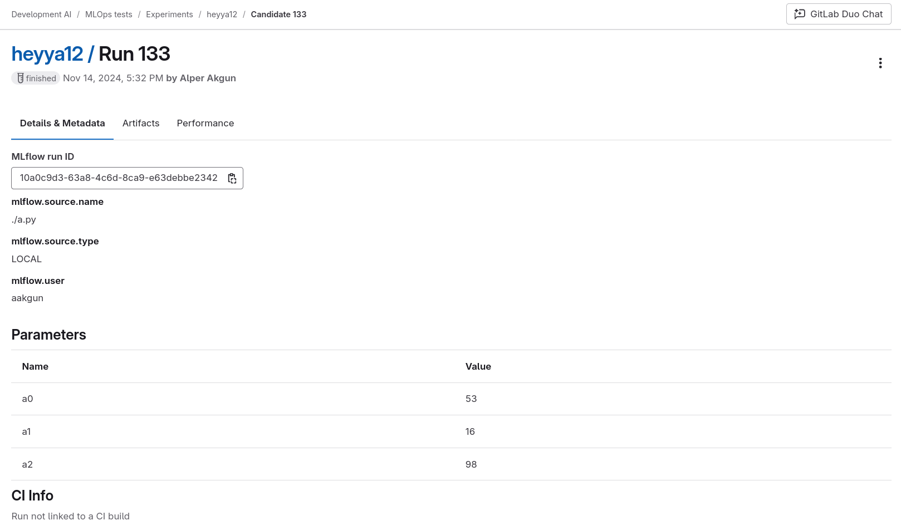
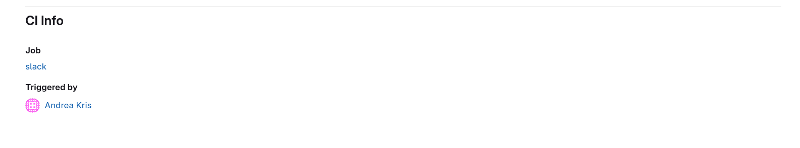
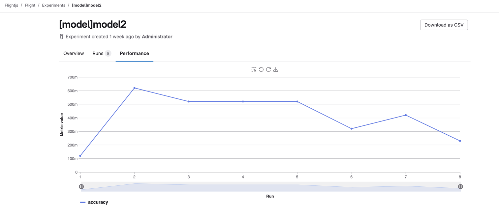



- Tier: 基础版，专业版，旗舰版
- Offering: JihuLab.com，私有化部署





- 在极狐GitLab 15.11 中引入。
- 在极狐GitLab 17.8 中 GA。



在创建机器学习模型时，你可能会通过尝试不同的参数、配置和特征工程来提升模型性能。为了后续能够复现实验，你需要有效地跟踪元数据和产物。使用极狐GitLab 模型实验，可以直接在极狐GitLab 中跟踪并记录参数、指标和产物。

## 什么是实验？

在项目中，实验是一组可比较的模型运行的集合。实验可以是长期存在的（例如，当它们代表一个用例时），也可以是短期的（例如由合并请求触发的超参数调优结果），但通常包含一组具有相似参数集并使用相同指标进行衡量的模型运行。

## 模型运行

模型运行是机器学习模型训练的一种变体，可以最终提升为模型的某个版本。

数据科学家的目标是找到参数值能带来最佳模型性能（由给定指标体现）的那次模型运行。

一些示例参数：

- 算法（例如线性回归或决策树）。
- 算法的超参数（学习率、树深度、迭代次数）。
- 包含的特征。

## 跟踪新实验和运行

实验和试验只能通过 [MLflow](https://www.mlflow.org/docs/latest/tracking.html) 客户端兼容性进行跟踪。有关如何将极狐GitLab 用作 MLflow 客户端后端的更多信息，请参见 [MLflow 客户端兼容性](mlflow_client.md)。

## 探索模型运行

要列出当前的活动实验：

1. 在顶部栏中，选择 **搜索或跳转到** 并找到你的项目。
1. 在左侧边栏中，选择 **分析** > **模型实验**。
1. 要显示所有已记录的运行及其指标、参数和元数据，请选择一个实验。
1. 要显示运行的详情，请选择 **详情**。

## 查看日志产物

试验产物保存为软件包。为某次运行记录产物后，该运行的所有产物都会列在软件包仓库中。某次运行的软件包名称为 `ml_experiment_<experiment_id>`，版本为运行 IID。可以通过 **实验运行** 列表或 **运行详情** 访问产物链接。

## 查看 CI 信息

你可以将运行与其创建时的 CI 作业关联起来，从而快速链接到合并请求、流水线以及触发流水线的用户：

## 查看记录的指标

当你运行实验时，极狐GitLab 会记录某些相关数据，包括其指标、参数和元数据。你可以在图表中查看这些指标以进行分析。

要查看记录的指标：

1. 在顶部栏中，选择 **搜索或跳转到** 并找到你的项目。
1. 在左侧边栏中，选择 **分析** > **模型实验**。
1. 选择你要查看的实验。
1. 选择 **性能** 标签页。

