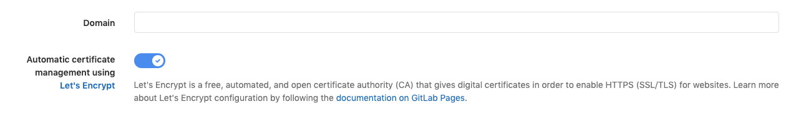



- Tier: 基础版，专业版，旗舰版
- Offering: JihuLab.com，私有化部署



GitLab Pages 与 Let's Encrypt (LE) 的集成允许您为使用自定义域名的 Pages 网站使用 LE 证书，而无需自行签发和更新证书。
极狐GitLab 会为您自动完成这些操作。

[Let's Encrypt](https://letsencrypt.org) 是一个免费、自动化且开源的证书颁发机构。

> [!warning]
> 此功能仅涵盖**自定义域名**的证书，不涵盖运行 [Pages 守护进程](../../../../administration/pages/_index.md) 所需的通配符证书（仅限极狐GitLab 私有化部署、基础版、专业版和旗舰版）。通配符证书的生成跟踪见[此议题](https://gitlab.com/gitlab-org/omnibus-gitlab/-/issues/3342)。

<a id="prerequisites"></a>

## 先决条件

在您能为域名启用 SSL 证书的自动预配之前，请确保您已具备：

- 在极狐GitLab 中创建了一个包含您网站源代码的[项目](../_index.md#getting-started)。
- 获取了一个域名（`example.com`），并添加了指向您 Pages 网站的 [DNS 记录](_index.md)。顶级域名（`.com`）必须是[公共后缀](https://publicsuffix.org/)。
- [已将您的域名添加到 Pages 项目](_index.md#step-1-add-a-custom-domain)并验证了所有权。
- 已验证您的网站已启动并运行，可通过您的自定义域名访问。

极狐GitLab 与 Let's Encrypt 的集成已在 JihuLab.com 上启用并可用。
对于 **极狐GitLab 私有化部署** 实例，请确保您的管理员已[启用它](../../../../administration/pages/_index.md#lets-encrypt-integration)。

<a id="enabling-lets-encrypt-integration-for-your-custom-domain"></a>

## 为您的自定义域名启用 Let's Encrypt 集成

满足要求后，启用 Let's Encrypt 集成：

1. 在顶部栏中，选择 **搜索或跳转到** 并找到您的项目。
1. 在左侧边栏中，选择 **部署** > **Pages**。
1. 在域名旁边，选择 **编辑** ()。
1. 打开 **使用 Let's Encrypt 自动管理证书** 开关。

   

1. 选择 **保存更改**。

启用后，极狐GitLab 会获取 LE 证书并将其添加到关联的 Pages 域名。极狐GitLab 也会自动续期该证书。

> [!note]
> 签发证书和更新 Pages 配置**可能需要长达一个小时**。
> 如果您在域名设置中已有 SSL 证书，在 Let's Encrypt 证书替换它之前，该证书会继续生效。

<a id="troubleshooting"></a>

## 故障排查

<a id="something-went-wrong-while-obtaining-the-lets-encrypt-certificate"></a>

### 获取 Let's Encrypt 证书时出现问题

您可能会收到一条错误信息，提示 **获取 Let's Encrypt 证书时出现问题**。

当 Let's Encrypt 无法访问或验证您的域名时，会出现此问题。

要解决此问题：

1. 在顶部栏中，选择 **搜索或跳转到** 并找到您的项目。
1. 在左侧边栏中，选择 **设置** > **通用**。
1. 展开 **可见性、项目功能、权限**。
1. 在 **Pages** 下，从下拉列表中选择 **所有具有访问权限的人**。
1. 选择 **部署** > **Pages** > **域名与设置**。
1. 在域名旁边，选择 **编辑** ()。
1. 在 **验证状态** 中，选择 **重试验证** ()。

如果您收到相同的错误，请检查以下内容：

- 确保您只为域名设置了一条 `CNAME` 或 `A` DNS 记录。
- 确保您的域名没有 `AAAA` DNS 记录。
- 如果您的域名或任何更高级别的域名有 `CAA` DNS 记录，请确保它包含 [`letsencrypt.org`](https://letsencrypt.org/docs/caa/)。
- 确保您的[域名已验证](_index.md#step-1-add-a-custom-domain)。
- 如果您使用[并行部署](../parallel_deployments.md)，请确保您的主部署具有空的 `path_prefix`。非空的 `path_prefix`（例如 `latest`）会阻止提供 `/.well-known/acme-challenge` 路径。

返回 **部署** > **Pages** 设置，然后重试验证。

<a id="obtaining-a-certificate-hangs-for-more-than-an-hour"></a>

### 获取证书超过一小时仍未完成

如果您已启用 Let's Encrypt 集成，但一小时后仍未获得证书，并且您看到以下消息：

```plaintext
GitLab is obtaining a Let's Encrypt SSL certificate for this domain.
This process can take some time. Please try again later.
```

请按照以下步骤，为 GitLab Pages 重新移除并添加域名：

1. 在顶部栏中，选择 **搜索或跳转到** 并找到您的项目。
1. 在左侧边栏中，选择 **部署** > **Pages**。
1. 在域名旁边，选择 **移除**。
1. [重新添加域名并验证](_index.md#step-1-add-a-custom-domain)。
1. [为您的域名启用 Let's Encrypt 集成](#enabling-lets-encrypt-integration-for-your-custom-domain)。
1. 如果您仍然收到相同的错误：
   1. 确保您只为域名正确设置了一条 `CNAME` 或 `A` DNS 记录。
   1. 确保您的域名**没有** `AAAA` DNS 记录。
   1. 如果您的域名或任何更高级别的域名有 `CAA` DNS 记录，请确保[它包含 `letsencrypt.org`](https://letsencrypt.org/docs/caa/)。
   1. 转到步骤 1。

<!-- Include any troubleshooting steps that you can foresee. If you know beforehand what issues
one might have when setting this up, or when something is changed, or on upgrading, it's
important to describe those, too. Think of things that may go wrong and include them here.
This is important to minimize requests for support, and to avoid doc comments with
questions that you know someone might ask.

Each scenario can be a third-level heading, for example, `### Getting error message X`.
If you have none to add when creating a doc, leave this section in place
but commented out to help encourage others to add to it in the future. -->
