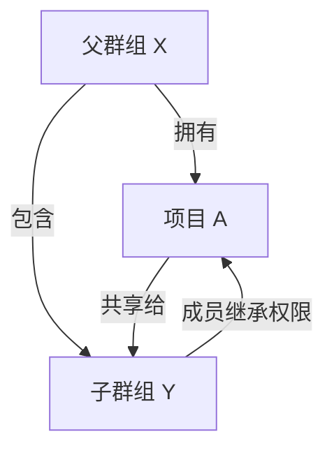
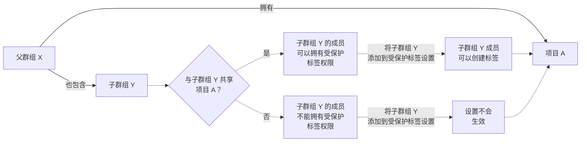



- Tier: 基础版，专业版，旗舰版
- Offering: JihuLab.com，私有化部署



受保护的[标签](repository/tags/_index.md)：

- 控制哪些用户有权创建标签。
- 防止创建后意外更新或删除。

每个规则允许你匹配以下任一：

- 单个标签名称。
- 通配符以一次控制多个标签。

该功能源自[受保护分支](repository/branches/protected.md)。

> [!note]
> 要创建或删除受保护的标签，你必须在该受保护标签的 **允许创建** 列表中。

<a id="configure-protected-tags"></a>

## 配置受保护的标签

先决条件：

- 你必须拥有项目的维护者或所有者角色。

1. 在顶部栏中，选择 **搜索或跳转到** 并查找你的项目。
1. 在左侧边栏中，选择 **设置** > **代码仓**。
1. 展开 **受保护的标签**。
1. 选择 **新增**。
1. 要保护单个标签，选择 **标签**，然后从下拉列表中选择你的标签。
1. 要保护名称与字符串匹配的所有标签：
   1. 选择 **标签**。
   1. 输入用于标签匹配的字符串。支持通配符（`*`）。
   1. 选择 **创建通配符**。
1. 在 **允许创建** 中，选择可以创建受保护标签的角色。

   > [!note]
   > 在极狐GitLab 专业版和旗舰版中，你还可以将群组或个人用户添加到 **允许创建** 中。

1. 选择 **保护**。

受保护的标签（或通配符）会显示在 **受保护的标签** 列表中。

<a id="add-a-group-to-protected-tags"></a>

### 将群组添加到受保护的标签

要将群组或子群组的成员设置为允许创建受保护的标签：

1. 在左侧边栏中，选择 **搜索或跳转到** 并查找你的项目。
1. 选择 **设置** > **代码仓**。
1. 展开 **受保护的标签**。
1. 将群组添加到以下字段：

   ```plaintext
   # 允许群组成员创建受保护的标签
   允许创建：@group-x
   ```

<a id="group-inheritance-and-eligibility"></a>

#### 群组继承和资格



在这个例子中：

- 父群组 X（`group-x`）拥有项目 A。
- 父群组 X 还包含一个子群组 Y（`group-x/subgroup-y`）。
- 项目 A 与子群组 Y 共享。

具备受保护标签权限的合格群组是：

- 项目 A：群组 X 和子群组 Y，因为项目 A 与子群组 Y 共享。

<a id="share-projects-with-groups"></a>

#### 与群组共享项目

你可以将项目与群组或子群组共享，以便其成员有资格拥有受保护标签权限。



要向子群组 Y 成员授予对项目 A 的访问权限，你必须与子群组共享该项目。直接在受保护标签设置中添加子群组是无效的，并且不适用于子群组成员。

> [!note]
> 要使群组拥有受保护标签权限，必须直接与该群组共享项目。从父群组继承的项目成员资格对于受保护标签权限是不够的。

<a id="wildcard-protected-tags"></a>

## 通配符受保护的标签

你可以指定一个通配符受保护的标签，它会保护所有与该通配符匹配的标签。例如：

| 通配符受保护的标签 | 匹配的标签                 |
|------------------------|-------------------------------|
| `v*`                   | `v1.0.0`、`version-9.1`       |
| `*-deploy`             | `march-deploy`、`1.0-deploy`  |
| `*gitlab*`             | `gitlab`、`gitlab/v1`         |
| `*`                    | `v1.0.1rc2`、`accidental-tag` |

两个不同的通配符有可能匹配到同一个标签。例如，`*-stable` 和 `production-*` 都会匹配到一个 `production-stable` 标签。在这种情况下，如果 _任何_ 这些受保护标签具有类似 **允许创建** 的设置，那么 `production-stable` 也会继承此设置。

如果你选择一个受保护标签的名称，极狐GitLab 会显示所有匹配标签的列表。

<a id="allow-deploy-keys-to-create-protected-tags"></a>

## 允许部署密钥创建受保护的标签

你可以允许[部署密钥](deploy_keys/_index.md)创建受保护的标签。

先决条件：

- 必须为你的项目启用部署密钥。项目部署密钥在创建时默认启用。但是，必须向公共部署密钥[授予](deploy_keys/_index.md#grant-project-access-to-a-public-deploy-key)项目访问权限。
- 部署密钥必须对你项目代码仓具有[写入权限](deploy_keys/_index.md#permissions)。
- 部署密钥的所有者必须至少对项目具有读取权限。
- 部署密钥的所有者还必须是项目的成员。

要允许部署密钥创建受保护的标签：

1. 在顶部栏中，选择 **搜索或跳转到** 并查找你的项目。
1. 在左侧边栏中，选择 **设置** > **代码仓**。
1. 展开 **受保护的标签**。
1. 从 **标签** 下拉列表中，选择你要保护的标签。
1. 从 **允许创建** 列表中，选择部署密钥。
1. 选择 **保护**。

<a id="prevent-tag-creation-with-branch-names"></a>

## 防止使用分支名称创建标签

具有相同名称的标签和分支可能包含不同的提交。如果你的标签和分支使用相同的名称，运行 `git checkout` 命令的用户可能会检出 _标签_ `qa`，而他们本意是要检出 _分支_ `qa`。作为额外的安全措施，请避免创建与分支同名的标签。混淆两者可能导致潜在的安全或操作问题。

要防止此问题：

1. 找出你不希望用作标签的分支名称。
1. 按照[配置受保护的标签](#configure-protected-tags)中所述创建受保护的标签：

   - 对于 **名称**，提供一个名称，例如 `stable`。你还可以创建一个通配符，如 `stable-*`，以匹配多个名称，如 `stable-v1` 和 `stable-v2`。
   - 对于 **允许创建**，选择 **无人**。
   - 选择 **保护**。

用户仍然可以使用受保护的名称创建分支，但不能创建标签。

<a id="run-pipelines-on-protected-tags"></a>

## 在受保护的标签上运行流水线

创建受保护标签的权限决定了用户是否可以：

- 触发和运行 CI/CD 流水线。
- 执行与这些标签关联的作业的操作。

这些权限确保只有授权用户才能触发和管理受保护标签的 CI/CD 流程。

<a id="unprotect-a-tag"></a>

## 取消保护标签

你可以通过移除保护规则来取消保护标签。此操作会移除保护配置，而不是标签本身。标签会保留在代码仓中，但不再受保护。

先决条件：

- 你必须拥有维护者或所有者角色。

要取消保护标签：

1. 在顶部栏中，选择 **搜索或跳转到** 并查找你的项目。
1. 在左侧边栏中，选择 **设置** > **代码仓**。
1. 展开 **受保护的标签**。
1. 在你要移除的受保护标签规则旁边，选择 **取消保护**。

> [!warning]
> 取消保护标签模式后，任何具有开发者、维护者或所有者角色的用户都可以删除与该模式匹配的标签。

<a id="delete-a-protected-tag"></a>

## 删除受保护的标签

你可以删除已应用保护规则的标签。这会从代码仓中删除标签，而不是删除保护规则本身。如果你希望在不删除标签的情况下移除保护规则，请参阅[取消保护标签](#unprotect-a-tag)。

先决条件：

- 位于该标签的 **允许创建** 角色或用户列表中。
- 项目中具有维护者或所有者角色。

要删除受保护的标签：

1. 在顶部栏中，选择 **搜索或跳转到** 并查找你的项目。
1. 在左侧边栏中，选择 **代码** > **标签**。
1. 在你要删除的标签旁边，选择 **删除**（）。
1. 在确认对话框中，输入标签名称并选择 **是，删除受保护的标签**。

受保护的标签只能通过极狐GitLab 的 UI 或 API 删除。这些保护措施防止你通过本地 Git 命令或第三方 Git 客户端意外删除标签。