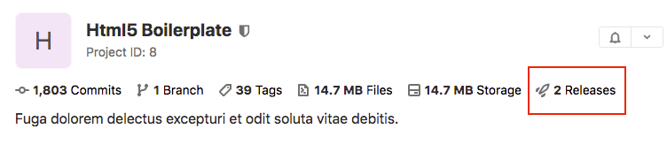
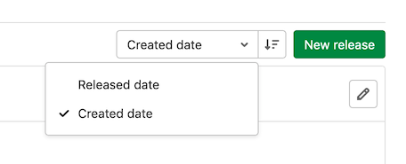
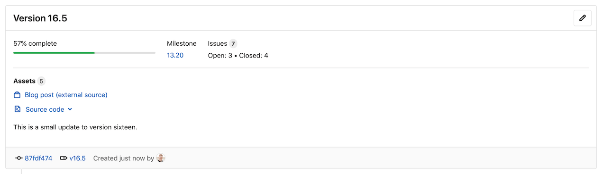
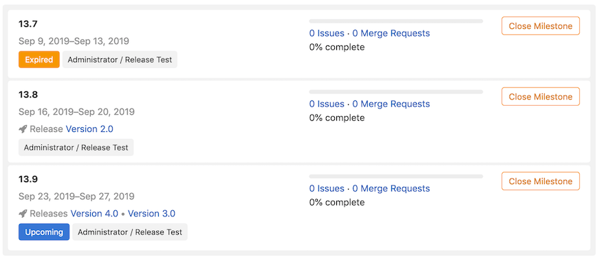
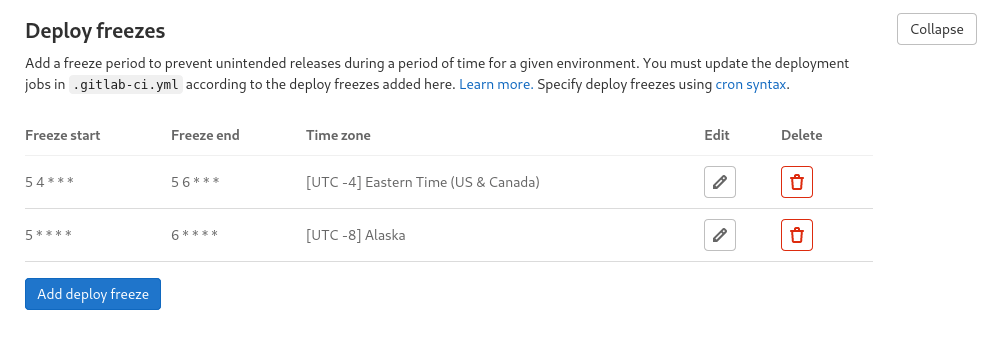



- Tier: 基础版，专业版，旗舰版
- Offering: JihuLab.com，私有化部署



创建一个发布，在关键里程碑处打包您的项目。发布将代码、二进制文件、文档和发布说明组合成项目的完整快照。创建发布时，极狐GitLab 会自动为您的代码打标签、归档快照并生成审计就绪的证据。这将创建满足合规要求的永久记录，并增强用户对开发流程的信心。

您的用户将受益于：

- 轻松获取最新稳定版和安装包
- 清晰的新功能和修复文档
- 下载特定版本及其相应资产的能力
- 轻松跟踪项目随时间演变的简单方式

> [!warning]
> 删除与发布关联的 Git 标签也会删除该发布。

创建发布时或之后，您可以：

- 添加发布说明。
- 为与发布关联的 Git 标签添加消息。
- [将里程碑与之关联](#associate-milestones-with-a-release)。
- 附加[发布资产](release_fields.md#release-assets)，例如运行手册或软件包。

<a id="view-releases"></a>

## 查看发布

查看发布列表：

- 在左侧边栏，选择 **部署** > **发布**，或
- 在项目概览页面上，如果至少存在一个发布，选择发布数量。

  

  - 在公开项目中，该数字对所有用户可见。
  - 在私有项目中，该数字对至少具有报告者[角色](../../permissions.md#project-permissions)的用户可见。

<a id="sort-releases"></a>

### 排序发布

要按**发布日期**或**创建日期**对发布进行排序，从排序顺序下拉列表中选择。要在升序和降序之间切换，选择 **排序顺序**。



<a id="permanent-link-to-latest-release"></a>

### 指向最新发布的永久链接

您可以通过永久链接访问最新的发布页面。极狐GitLab 始终将永久链接 URL 重定向到最新发布页面的地址。

URL 的格式为：

```plaintext
https://gitlab.example.com/namespace/project/-/releases/permalink/latest
```

您还可以在永久链接 URL 后添加后缀。例如，如果最新发布是 `gitlab-cn` 命名空间和 `gitlab-runner` 项目中的 `v17.7.0#release`，则可读链接将是：

```plaintext
https://jihulab.com/gitlab-cn/gitlab-runner/-/releases/v17.7.0#release
```

您可以使用以下永久链接访问最新发布 URL：

```plaintext
https://jihulab.com/gitlab-cn/gitlab-runner/-/releases/permalink/latest#release
```

要了解如何为发布资产添加永久链接，请参阅[指向最新发布资产的永久链接](release_fields.md#permanent-links-to-latest-release-assets)。

<a id="sorting-preferences"></a>

#### 排序首选项

默认情况下，极狐GitLab 使用 `released_at` 时间获取发布。查询参数 `?order_by=released_at` 是可选的，对 `?order_by=semver` 的支持正在[此议题](https://jihulab.com/gitlab-cn/gitlab/-/issues/352945)中跟踪。

<a id="track-releases-with-an-rss-feed"></a>

### 使用 RSS 订阅跟踪发布

极狐GitLab 以 Atom 格式提供项目发布的 RSS 订阅。要查看该订阅：

1. 对于您是成员的项目：
   1. 在顶部栏，选择 **搜索或跳转到** 并找到您的项目。
   1. 选择 **部署** > **发布**。
1. 对于所有项目：
   1. 前往 **项目概览** 页面。
   1. 在右侧边栏，选择 **发布** ()。
1. 在右上角，选择订阅符号 ()。

<a id="create-a-release"></a>

## 创建发布

您可以创建发布：

- [通过 CI/CD 流水线中的作业](#creating-a-release-by-using-a-cicd-job)
- [在发布页面中](#create-a-release-in-the-releases-page)
- 使用 [Releases API](../../../api/releases/_index.md#create-a-release)

<a id="create-a-release-in-the-releases-page"></a>

### 在发布页面创建发布

先决条件：

- 您必须具有项目的开发者、维护者或所有者角色。更多信息，请参阅[发布权限](#release-permissions)。

要在发布页面创建发布：

1. 在顶部栏，选择 **搜索或跳转到** 并找到您的项目。
1. 在左侧边栏，选择 **部署** > **发布**，然后选择 **新发布**。
1. 从[**标签名称**](release_fields.md#tag-name)下拉列表中，可以：
   - 选择现有 Git 标签。选择已与发布关联的现有标签会导致验证错误。
   - 输入新的 Git 标签名称。
     1. 从 **创建标签** 弹出框中，选择创建新标签时使用的分支或提交 SHA。
     1. 可选。在 **设置标签消息** 文本框中，输入消息以创建[注释标签](https://git-scm.com/book/en/v2/Git-Basics-Tagging#_annotated_tags)。
     1. 选择 **保存**。
1. 可选。输入有关发布的其他信息，包括：
   - [标题](release_fields.md#title)
   - [里程碑](#associate-milestones-with-a-release)
   - [发布说明](release_fields.md#release-notes-description)
   - 是否包含[标签消息](../repository/tags/_index.md)
   - [资产链接](release_fields.md#links)
1. 选择 **创建发布**。

<a id="creating-a-release-by-using-a-cicd-job"></a>

### 通过使用 CI/CD 作业创建发布

您可以通过在作业定义中使用 [`release` 关键词](../../../ci/yaml/_index.md#release)，直接在极狐GitLab CI/CD 流水线中创建发布。您应可能将发布作为 CI/CD 流水线中的最后步骤之一创建。只有在作业处理无错误时，才会创建发布。如果 API 在创建发布期间返回错误，则发布作业失败。

以下链接显示了使用 CI/CD 作业创建发布的典型示例配置：

- [创建 Git 标签时创建发布](release_cicd_examples.md#create-a-release-when-a-git-tag-is-created)
- [提交合并到默认分支时创建发布](release_cicd_examples.md#create-a-release-when-a-commit-is-merged-to-the-default-branch)
- [在自定义脚本中创建发布元数据](release_cicd_examples.md#create-release-metadata-in-a-custom-script)

<a id="use-a-custom-ssl-ca-certificate-authority"></a>

### 使用自定义 SSL CA 证书颁发机构

您可以使用 `ADDITIONAL_CA_CERT_BUNDLE` CI/CD 变量配置自定义 SSL CA 证书颁发机构，该证书颁发机构用于在 `glab` CLI 通过 API 使用自定义证书的 HTTPS 创建发布时验证对等方。`ADDITIONAL_CA_CERT_BUNDLE` 值应包含 [X.509 PEM 公钥证书的文本表示](https://www.rfc-editor.org/rfc/rfc7468#section-5.1) 或包含证书颁发机构的 `path/to/file`。例如，要在 `.gitlab-ci.yml` 文件中配置此值，请使用以下内容：

```yaml
release:
  variables:
    ADDITIONAL_CA_CERT_BUNDLE: |
        -----BEGIN CERTIFICATE-----
        MIIGqTCCBJGgAwIBAgIQI7AVxxVwg2kch4d56XNdDjANBgkqhkiG9w0BAQsFADCB
        ...
        jWgmPqF3vUbZE0EyScetPJquRFRKIesyJuBFMAs=
        -----END CERTIFICATE-----
  script:
    - echo "创建发布"
  release:
    name: '我的超赞发布'
    tag_name: '$CI_COMMIT_TAG'
```

`ADDITIONAL_CA_CERT_BUNDLE` 值也可以配置为[用户界面中的自定义变量](../../../ci/variables/_index.md#for-a-project)，可以是需要证书路径的 `file`，也可以是需要证书文本表示的变量。

<a id="create-multiple-releases-in-a-single-pipeline"></a>

### 在单个流水线中创建多个发布

一个流水线可以有多个 `release` 作业，例如：

```yaml
ios-release:
  script:
    - echo "iOS 发布作业"
  release:
    tag_name: v1.0.0-ios
    description: 'iOS 发布 v1.0.0'

android-release:
  script:
    - echo "Android 发布作业"
  release:
    tag_name: v1.0.0-android
    description: 'Android 发布 v1.0.0'
```

<a id="release-assets-as-generic-packages"></a>

### 将发布资产作为通用软件包

您可以使用[通用软件包](../../packages/generic_packages/_index.md)来托管发布资产。

要创建包含打包资产的发布：

1. 从 CI/CD 流水线构建您的软件包文件。
1. 使用 `glab` CLI 作业创建发布：

   ```yaml
   Create Release:
     stage: release
     image: registry.jihulab.com/gitlab-cn/cli:latest
     rules:
       - if: $CI_COMMIT_TAG
     script:
       - |
         glab release create "$CI_COMMIT_TAG" \
         --name "发布 ${VERSION}" \
         --notes "在此处填写您的发布说明" \
         path/to/your/release-asset-file \
         --use-package-registry
   ```

   对于每个要包含的资产，添加一个额外的 `--assets-link` 链接。

<a id="upcoming-releases"></a>

## 即将发布的版本

您可以使用 [Releases API](../../../api/releases/_index.md#upcoming-releases) 提前创建发布。当您设置未来的 `released_at` 日期时，**即将发布** 徽章会显示在发布标签旁边。当 `released_at` 日期和时间过去后，该徽章将自动移除。


<a id="historical-releases"></a>

## 历史发布



- 在 GitLab 15.2 中引入。



您可以使用 [Releases API](../../../api/releases/_index.md#historical-releases) 或用户界面创建过去的发布。当您设置过去的 `released_at` 日期时，**历史发布** 徽章会显示在发布标签旁边。由于发布日期是过去的，[发布证据](release_evidence.md)不可用。

<a id="edit-a-release"></a>

## 编辑发布

要在创建后编辑发布的详细信息，您可以使用[更新发布 API](../../../api/releases/_index.md#update-a-release) 或用户界面。

先决条件：

- 您必须具有开发者、维护者或所有者角色。

在用户界面中：

1. 在左侧边栏，选择 **部署** > **发布**。
1. 在要修改的发布右上角，选择 **编辑此发布**（铅笔图标）。
1. 在 **编辑发布** 页面上，更改发布的详细信息。
1. 选择 **保存更改**。

<a id="delete-a-release"></a>

## 删除发布



- 在 GitLab 15.2 中引入



删除发布时，其资产也会被删除。但是，关联的 Git 标签不会被删除。删除与发布关联的 Git 标签也会删除该发布。

先决条件：

- 您必须具有开发者、维护者或所有者角色。更多信息，请参阅[发布权限](#release-permissions)。

要删除发布，请使用[删除发布 API](../../../api/releases/_index.md#delete-a-release) 或用户界面。

在用户界面中：

1. 在顶部栏，选择 **搜索或跳转到** 并找到您的项目。
1. 在左侧边栏，选择 **部署** > **发布**。
1. 在要删除的发布右上角，选择 **编辑此发布** ()。
1. 在 **编辑发布** 页面上，选择 **删除**。
1. 选择 **删除发布**。

<a id="associate-milestones-with-a-release"></a>

## 将里程碑与发布关联

您可以将发布与一个或多个[项目里程碑](../milestones/_index.md#project-milestones-and-group-milestones)关联。[极狐GitLab 专业版](https://gitlab.cn/pricing/) 客户可以指定[群组里程碑](../milestones/_index.md#project-milestones-and-group-milestones)与发布关联。

在用户界面中，要将里程碑关联到发布：

1. 在左侧边栏，选择 **部署** > **发布**。
1. 在要修改的发布右上角，选择 **编辑此发布**（铅笔图标）。
1. 从 **里程碑** 列表中，选择每个您要关联的里程碑。您可以选择多个里程碑。
1. 选择 **保存更改**。

在 **部署** > **发布** 页面上，**里程碑** 列在顶部，同时还会包含有关里程碑内议题的统计信息。



发布也会显示在 **计划** > **里程碑** 页面上，以及当您在此页面选择一个里程碑时。

以下是没有发布、一个发布和两个发布的里程碑示例。



> [!note]
> 子群组的项目发布无法与父群组的里程碑关联。要了解更多，请阅读议题 #328054，[发布无法与父群组里程碑关联]。

<a id="get-notified-when-a-release-is-created"></a>

## 创建发布时接收通知

您可以在项目新发布创建时收到电子邮件通知。

要订阅发布通知：

1. 在左侧边栏，选择 **项目概览**。
1. 选择 **通知设置**（铃铛图标）。
1. 在列表中，选择 **自定义**。
1. 选中 **新发布** 复选框。
1. 关闭对话框保存。

<a id="prevent-unintentional-releases-by-setting-a-deploy-freeze"></a>

## 通过设置部署冻结来防止意外发布

通过设置[*部署冻结*期](../../../ci/environments/deployment_safety.md)，在您指定的时间段内防止意外的生产发布。部署冻结有助于减少自动化部署时的不确定性和风险。

维护者可以在用户界面中设置部署冻结窗口，或使用[冻结期 API](../../../api/freeze_periods.md) 设置 `freeze_start` 和 `freeze_end`，这些定义为 [crontab](https://crontab.guru/) 条目。

如果正在执行的作业处于冻结期，极狐GitLab CI/CD 会创建一个名为 `$CI_DEPLOY_FREEZE` 的环境变量。

为防止部署作业在群组中的多个项目中执行，请在群组共享的文件中定义 `.freezedeployment` 作业。使用 [`includes`](../../../ci/yaml/includes.md) 关键字将模板合并到项目的 `.gitlab-ci.yml` 文件中：

```yaml
.freezedeployment:
  stage: deploy
  before_script:
    - '[[ ! -z "$CI_DEPLOY_FREEZE" ]] && echo "基础设施中断窗口" && exit 1; '
  rules:
    - if: '$CI_DEPLOY_FREEZE'
      when: manual
      allow_failure: true
    - when: on_success
```

要阻止部署作业执行，请使用 `.gitlab-ci.yml` 文件的 `deploy_to_production` 作业中的 [`extends`](../../../ci/yaml/_index.md#extends) 关键字，以从 `.freezedeployment` 模板作业继承配置：

```yaml
deploy_to_production:
  extends: .freezedeployment
  script: deploy_to_prod.sh
  environment: production
```

此配置有条件地阻止部署作业，并保持流水线连续性。定义冻结期后，作业失败，流水线可以在不部署的情况下继续。冻结期之后可以进行手动部署。

此方法在关键维护期间提供部署控制，并确保 CI/CD 流水线不中断。

要在用户界面中设置部署冻结窗口，请完成以下步骤：

1. 以具有维护者角色的用户身份登录极狐GitLab。
1. 在顶部栏，选择 **搜索或跳转到** 并找到您的项目。
1. 在左侧边栏，选择 **设置** > **CI/CD**。
1. 滚动到 **部署冻结**。
1. 选择 **展开** 以查看部署冻结表。
1. 选择 **添加部署冻结** 以打开部署冻结模态框。
1. 输入所需部署冻结期的开始时间、结束时间和时区。
1. 在模态框中选择 **添加部署冻结**。
1. 保存部署冻结后，您可以通过选择编辑按钮 () 进行编辑，并通过选择删除按钮 () 将其移除。
   

如果项目包含多个冻结期，所有时期都会应用。如果它们重叠，冻结将覆盖整个重叠期。

更多信息，请参阅[部署安全](../../../ci/environments/deployment_safety.md)。

<a id="release-permissions"></a>

## 发布权限

<a id="view-a-release-and-download-assets"></a>

### 查看发布和下载资产

- 具有报告者、开发者、维护者或所有者角色的用户拥有项目发布的读取和下载权限。
- 具有访客角色的用户拥有项目发布的读取和下载权限。
  这包括关联的 Git 标签名称、发布描述、发布作者信息。
  但是，其他与仓库相关的信息，如[源代码](release_fields.md#source-code)和[发布证据](release_evidence.md)会被屏蔽。

<a id="publish-releases-without-giving-access-to-source-code"></a>

### 不提供源代码访问权限即可发布



- 在 GitLab 15.6 中引入。



您可以让发布对非项目成员可访问，同时保持仓库相关信息（如[源代码](release_fields.md#source-code)和[发布证据](release_evidence.md)）仅对项目成员可用。这些设置非常适合那些使用发布提供新版本软件访问权限但不想公开源代码的项目。

要公开提供发布，请设置以下[项目设置](../settings/_index.md#configure-project-features-and-permissions)：

- **项目可见性** 设置为 **公开**
- **仓库** 已启用并设置为 **仅项目成员**
- **发布** 已启用并设置为 **所有有访问权限的人**

<a id="create-update-and-delete-a-release-and-its-assets"></a>

### 创建、更新和删除发布及其资产

- 具有开发者、维护者或所有者角色的用户拥有项目发布和资产的写入权限。
- 如果发布与[受保护标签](../protected_tags.md)关联，用户还必须[被允许创建受保护标签](../protected_tags.md#configure-protected-tags)。

作为发布权限控制的示例，您可以通过使用通配符 (`*`) 保护标签并在 **允许创建** 列中设置 **维护者**，仅允许具有维护者或所有者角色的用户创建、更新和删除发布。

<a id="release-metrics"></a>

## 发布度量



- Tier: 旗舰版
- Offering: JihuLab.com，私有化部署





- 在 GitLab 专业版 13.9 中引入。



群组级别的发布度量可通过导航到 **群组** > **分析** > **CI/CD** 获取。这些度量包括：

- 群组中的发布总数
- 群组中至少有一个发布的项目的百分比

<a id="working-example-project"></a>

## 工作示例项目

引导式探索项目 [使用 GitVersion 实现完全自动化的软件和工件版本控制](https://gitlab.com/guided-explorations/devops-patterns/utterly-automated-versioning) 演示了：

- 使用极狐GitLab 发布。
- 使用[极狐GitLab CLI](../../../editor_extensions/gitlab_cli/_index.md)。
- 创建通用软件包。
- 将软件包链接到发布。
- 使用名为 [GitVersion](https://gitversion.net/) 的工具自动确定和递增复杂仓库的版本。

您可以将该示例项目复制到您自己的群组或实例中进行测试。更多关于演示的其他极狐GitLab CI 模式的详细信息，请参见项目页面。

<a id="troubleshooting"></a>

## 故障排除

<a id="errors-when-creating-updating-or-deleting-releases-and-their-assets"></a>

### 创建、更新或删除发布及其资产时的错误

如果发布与[受保护标签](../protected_tags.md)关联，UI/API 请求可能会导致授权失败，例如：

- `403 禁止`
- `创建新发布时出错`

确保用户或服务/机器人帐户也被允许[创建受保护标签](../protected_tags.md#configure-protected-tags)。更多信息请参见[发布权限](#release-permissions)。

<a id="note-about-storage"></a>

### 关于存储的说明

此功能基于 Git 标签构建，因此除了创建发布本身外，几乎不需要额外的数据。其他资产和自动生成的发布证据会消耗存储。

<a id="gitlab-cli-version-requirement"></a>

### GitLab CLI 版本要求

使用 [`release` 关键词](../../../ci/yaml/_index.md#release) 的方式计划更改。`release-cli` 工具正[被替换](https://jihulab.com/groups/gitlab-cn/-/epics/15437)为 [GitLab CLI 工具](https://jihulab.com/gitlab-cn/cli/)。

您必须使用 GitLab CLI 工具 `v1.58.0` 或更高版本，否则您可能会收到以下错误消息或警告之一：

- `错误：找不到 glab 命令。请安装 glab v1.58.0 或更高版本。`
- `错误：请使用 glab v1.58.0 或更高版本。`
- `警告：release-cli 在 20.0 之后将不再受支持。请使用 glab 版本 >= 1.58.0。`

有两种方式获取 GitLab CLI 工具：

- 如果您使用 `registry.jihulab.com/gitlab-cn/release-cli:<version>` 容器镜像，您可以开始使用 `registry.jihulab.com/gitlab-cn/cli:v1.58.0` 或 `registry.jihulab.com/gitlab-cn/release-cli:v0.24.0`，其中包含 `glab` `v1.58.0`。
- 如果您在 runner 上手动安装了 release-cli 或 GitLab CLI 工具，请确保 GitLab CLI 版本至少为 `v1.58.0`。