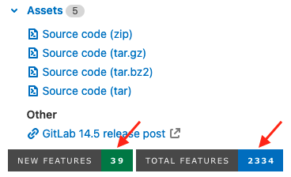

当你创建或编辑发布时，以下字段可用。

<a id="title"></a>

## 标题

你可以通过创建或编辑发布时使用 **发布标题** 字段来自定义发布标题。如果未提供标题，将使用发布的标签名称。

<a id="tag-name"></a>

## 标签名称

发布标签名称应包含发布版本。极狐GitLab 使用 [语义化版本](https://semver.org/) 进行发布，你也可以这样做。使用 `(主版本).(次版本).(补丁版本)` 格式，详情参见 [极狐GitLab 版本控制策略](../../../policy/maintenance.md#versioning)。

例如，对于极狐GitLab 版本 `16.10.1`：

- `16` 代表主版本号。主版本发布为 `16.0.0`，但通常称为 `16.0`。
- `10` 代表次版本号。次版本发布为 `16.10.0`，但通常称为 `16.10`。
- `1` 代表补丁编号。

版本号的任何部分都可以有多位数字，例如 `16.10.11`。

<a id="release-notes-description"></a>

## 发布说明描述

每个发布都有一个描述。你可以添加任何你喜欢的文本，但建议包含一个变更日志来描述发布内容。这有助于用户快速了解你发布的每个版本之间的差异。

通过在发布说明中选择 **在发布说明中包含标签消息**，可以将 [Git 中的标记消息](https://git-scm.com/book/en/v2/Git-Basics-Tagging) 包含进来。

描述支持 [Markdown](../../markdown.md)。

<a id="release-assets"></a>

## 发布资产

一个发布包含以下类型的资产：

- [源代码](#source-code)
- [相关材料链接](#links)

<a id="source-code"></a>

### 源代码

极狐GitLab 自动从给定的 Git 标签生成 `zip`、`tar.gz`、`tar.bz2` 和 `tar` 归档源代码。这些资产是只读的，[并且可以下载](../repository/_index.md#download-repository-source-code)。

<a id="links"></a>

### 链接

链接是一个 URL，可以指向任何你需要的内容：文档、构建的二进制文件或其他相关材料。这些可以是极狐GitLab 实例的内部或外部链接。
URL 必须使用 `http`、`https` 或 `ftp` 方案之一。
每个链接作为一种资产，具有以下属性：

| 属性   | 必需 | 描述 |
|-------------|----------|-------------|
| `name`      | 是     | 链接的名称。 |
| `url`       | 是     | 用于下载文件的 URL。 |
| `filepath`  | 否     | 指向 `url` 的重定向链接。必须以斜杠 (`/`) 开头。详情请参阅 [本节](#permanent-links-to-release-assets)。 |
| `link_type` | 否     | 用户使用 `url` 可以下载的内容类型。详情请参阅 [本节](#link-types)。 |

<a id="permanent-links-to-release-assets"></a>

#### 发布资产的永久链接



- 在极狐GitLab 15.9 中引入，私有发布的链接可以使用个人访问令牌访问。



与发布关联的资产可通过永久 URL 访问。
极狐GitLab 始终将此 URL 重定向到实际的资产位置，因此即使资产移动到不同的位置，你仍可以继续使用相同的 URL。这一行为通过在 [创建链接](../../../api/releases/links.md#create-a-release-link) 或 [更新链接](../../../api/releases/links.md#update-a-release-link) 时使用 `filepath` API 属性定义。

URL 格式如下：

```plaintext
https://host/namespace/project/-/releases/:release/downloads:filepath
```

例如，如果你在 `gitlab.com` 上 `gitlab-org` 命名空间和 `gitlab-runner` 项目中，为 `v16.9.0-rc2` 发布拥有一个资产：

```json
{
  "name": "linux amd64",
  "filepath": "/binaries/gitlab-runner-linux-amd64",
  "url": "https://gitlab-runner-downloads.s3.amazonaws.com/v16.9.0-rc2/binaries/gitlab-runner-linux-amd64",
  "link_type": "other"
}
```

此资产有一个直接链接：

```plaintext
https://jihulab.com/gitlab-cn/gitlab-runner/-/releases/v16.9.0-rc2/downloads/binaries/gitlab-runner-linux-amd64
```

资产的物理位置可以随时更改，而直接链接保持不变。

如果发布是私有的，你需要在发起请求时，通过 `private_token` 查询参数或 `HTTP_PRIVATE_TOKEN` 标头提供一个具有 `api` 或 `read_api` 范围的个人访问令牌。例如：

```shell
curl --location --output filename "https://gitlab.example.com/my-group/my-project/-/releases/myrelease/downloads/<path-to-file>?private_token=<your_access_token>"
curl --location --output filename --header "PRIVATE-TOKEN: <your_access_token>" "https://gitlab.example.com/my-group/my-project/-/releases/myrelease/downloads/<path-to-file>"
```

<a id="permanent-links-to-latest-release-assets"></a>

#### 最新发布资产的永久链接

你可以将 [发布资产的永久链接](#permanent-links-to-release-assets) 中的 `filepath` 与 [指向最新发布的永久链接](_index.md#permanent-link-to-latest-release) 结合使用。`filepath` 必须以斜杠 (`/`) 开头。

URL 格式如下：

```plaintext
https://host/namespace/project/-/releases/permalink/latest/downloads:filepath
```

你可以使用此格式为最新发布中的资产提供一个永久链接。

例如，如果你在 `gitlab.com` 上 `gitlab-org` 命名空间和 `gitlab-runner` 项目中，为 `v16.9.0-rc2` 最新发布拥有一个带有 [`filepath`](../../../api/releases/links.md#create-a-release-link) 的资产：

```json
{
  "name": "linux amd64",
  "filepath": "/binaries/gitlab-runner-linux-amd64",
  "url": "https://gitlab-runner-downloads.s3.amazonaws.com/v16.9.0-rc2/binaries/gitlab-runner-linux-amd64",
  "link_type": "other"
}
```

此资产有一个直接链接：

```plaintext
https://jihulab.com/gitlab-cn/gitlab-runner/-/releases/permalink/latest/downloads/binaries/gitlab-runner-linux-amd64
```

<a id="link-types"></a>

#### 链接类型

四种链接类型分别是 "手册"、"软件包"、"镜像" 和 "其他"。
`link_type` 参数接受以下四个值之一：

- `runbook`
- `package`
- `image`
- `other` (默认)

此字段对 URL 没有影响，仅用于你项目的发布页面上的展示目的。

<a id="use-a-generic-package-for-attaching-binaries"></a>

#### 使用通用软件包附加二进制文件

你可以使用 [通用软件包](../../packages/generic_packages/_index.md) 来存储发布或标签流水线中的任何产物，这些产物也可用于为单个发布条目附加二进制文件。你基本上需要：

1. [将产物推送到通用软件包仓库](../../packages/generic_packages/_index.md#publish-a-package)。
1. [将软件包链接附加到发布](#links)。

以下示例生成发布资产，将其作为通用软件包发布，然后创建一个发布：

```yaml
stages:
  - build
  - upload
  - release

variables:
  # 软件包版本只能包含数字（0-9）和点（.）。
  # 格式必须为 X.Y.Z，并匹配正则表达式 /\A\d+\.\d+\.\d+\z/。
  # 请参阅 https://gitlab.cn/docs/user/packages/generic_packages/#publish-a-package
  PACKAGE_VERSION: "1.2.3"
  DARWIN_AMD64_BINARY: "myawesomerelease-darwin-amd64-${PACKAGE_VERSION}"
  LINUX_AMD64_BINARY: "myawesomerelease-linux-amd64-${PACKAGE_VERSION}"
  PACKAGE_REGISTRY_URL: "${CI_API_V4_URL}/projects/${CI_PROJECT_ID}/packages/generic/myawesomerelease/${PACKAGE_VERSION}"

build:
  stage: build
  image: alpine:latest
  rules:
    - if: $CI_COMMIT_TAG
  script:
    - mkdir bin
    - echo "Mock binary for ${DARWIN_AMD64_BINARY}" > bin/${DARWIN_AMD64_BINARY}
    - echo "Mock binary for ${LINUX_AMD64_BINARY}" > bin/${LINUX_AMD64_BINARY}
  artifacts:
    paths:
      - bin/

upload:
  stage: upload
  image: curlimages/curl:latest
  rules:
    - if: $CI_COMMIT_TAG
  script:
    - |
      curl --header "JOB-TOKEN: ${CI_JOB_TOKEN}" --upload-file bin/${DARWIN_AMD64_BINARY} "${PACKAGE_REGISTRY_URL}/${DARWIN_AMD64_BINARY}"
    - |
      curl --header "JOB-TOKEN: ${CI_JOB_TOKEN}" --upload-file bin/${LINUX_AMD64_BINARY} "${PACKAGE_REGISTRY_URL}/${LINUX_AMD64_BINARY}"

release:
  # 警告，截至 2021-02-02，这些资产链接需要登录，请参阅：
  # https://jihulab.com/gitlab-cn/gitlab/-/issues/299384
  stage: release
  image: registry.jihulab.com/gitlab-cn/cli:latest
  rules:
    - if: $CI_COMMIT_TAG
  script:
    - |
      glab release create "$CI_COMMIT_TAG" --name "Release $CI_COMMIT_TAG" \
        --assets-links="[{\"name\":\"${DARWIN_AMD64_BINARY}\",\"url\":\"${PACKAGE_REGISTRY_URL}/${DARWIN_AMD64_BINARY}\"},{\"name\":\"${LINUX_AMD64_BINARY}\",\"url\":\"${PACKAGE_REGISTRY_URL}/${LINUX_AMD64_BINARY}\"}]"
```

对于 PowerShell 用户，可能需要使用反引号 `` ` `` 对 `--assets-link` 中 JSON 字符串内的双引号 `"` 进行转义，并在传递给 `release-cli` 之前使用 `ConvertTo-Json`。例如：

```yaml
release:
  script:
    - $env:assets = "[{`"name`":`"MyFooAsset`",`"url`":`"https://jihulab.com/upack/artifacts/download/$env:UPACK_GROUP/$env:UPACK_NAME/$($env:GitVersion_SemVer)?contentOnly=zip`"}]"
    - $env:assetsjson = $env:assets | ConvertTo-Json
    - glab release create $env:CI_COMMIT_TAG --name "Release $env:CI_COMMIT_TAG" --notes "Release $env:CI_COMMIT_TAG" --ref $env:CI_COMMIT_TAG --assets-links=$env:assetsjson
```

> [!note]
> 不建议直接将 [作业产物](../../../ci/jobs/job_artifacts.md) 链接附加到发布，因为产物是短暂的，用于在同一流水线中传递数据。这意味着它们可能过期，或者有人可能手动删除它们。

<a id="number-of-new-and-total-features"></a>

### 新功能和总功能数



- Tier: 基础版，专业版，旗舰版
- Offering: JihuLab.com



在 [JihuLab.com](https://jihulab.com/gitlab-cn/gitlab/-/releases) 上，你可以查看项目中的新功能和总功能数。



这些总数显示在 [shields](https://shields.io/) 上，并由 [`www-gitlab-com` 仓库](https://jihulab.com/gitlab-com/www-gitlab-com/-/blob/master/lib/tasks/update_gitlab_project_releases_page.rake) 中的一个 Rake 任务为每次发布生成。

| 项目             | 公式                                                                                       |
|------------------|-------------------------------------------------------------------------------------------|
| `新功能`         | 项目中单个发布的所有授权级别的发布帖子总数。                                                 |
| `总功能`         | 项目中所有发布的反向顺序发布帖子总数。                                                      |

计数也按授权级别显示。

| 项目             | 公式                                                                                                   |
|------------------|--------------------------------------------------------------------------------------------------------|
| `新功能`         | 项目中单个发布在单一授权级别的发布帖子总数。                                                             |
| `总功能`         | 项目中所有发布在单一授权级别的反向顺序发布帖子总数。                                                     |