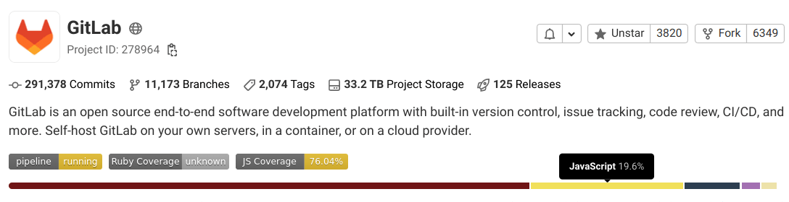
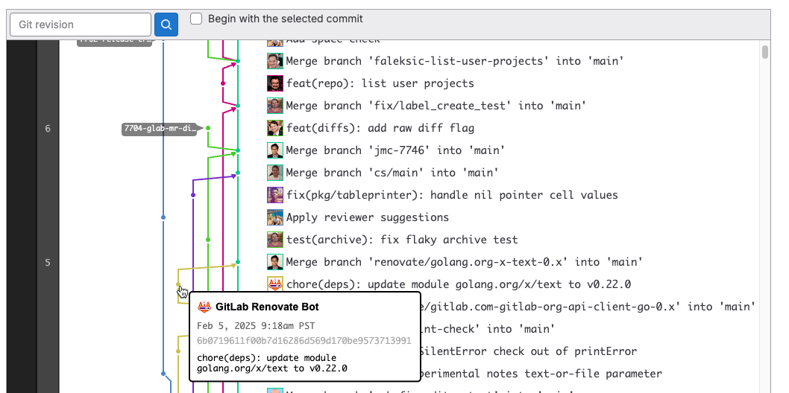



- Tier: 基础版，专业版，旗舰版
- Offering: JihuLab.com，私有化部署



您的 [代码仓](https://git-scm.com/book/en/v2/Git-Basics-Getting-a-Git-Repository) 是 极狐 GitLab 项目的一个组件。您将代码存储在代码仓中，并使用版本控制跟踪其更改。

每个代码仓都是 [极狐 GitLab 项目](../_index.md) 的一部分，且不能在没有 极狐 GitLab 项目的情况下存在。您的项目为代码仓提供配置选项。

<a id="create-a-repository"></a>

## 创建代码仓

要创建代码仓：

- [创建项目](../_index.md) 或
- [派生现有项目](forking_workflow.md)。

<a id="add-files-to-a-repository"></a>

## 向代码仓添加文件

您可以向代码仓添加文件：

- 当您 [创建项目](../_index.md) 时，或
- 创建项目后，使用以下选项：
  - [Web 编辑器](web_editor.md#upload-a-file)。
  - [用户界面 (UI)](#add-a-file-from-the-ui)。
  - [命令行](../../../topics/git/add_files.md)。

<a id="add-a-file-from-the-ui"></a>

### 从 UI 添加文件

要从 极狐 GitLab UI 添加或上传文件：

<!-- Original source for this list: doc/user/project/repository/web_editor.md#upload-a-file -->
<!-- For why we duplicated the info, see <https://jihulab.com/gitlab-cn/gitlab/-/merge_requests/111072#note_1267429478> -->

1. 在顶部栏中，选择 **搜索或跳转到** 并查找您的项目。
1. 前往您要上传文件的目录。
1. 在目录名称旁边，选择加号图标 () > **上传文件**。
1. 拖放或上传您的文件。
1. 输入提交消息。
1. 可选。要使用您的更改创建合并请求，在 **目标分支** 中，输入一个不是代码仓 [默认分支](branches/default.md) 的分支名称。
1. 选择 **上传文件**。

<a id="commit-changes-to-a-repository"></a>

## 提交更改到代码仓

您可以将更改提交到代码仓中的分支。当您使用命令行时，使用 [`git commit`](../../../topics/git/commands.md#git-commit)。

有关如何使用提交来改进沟通和协作、触发或跳过流水线以及还原更改的信息，请参阅 [提交](../merge_requests/commits.md)。

<a id="clone-a-repository"></a>

## 克隆代码仓

您可以使用以下方式克隆代码仓：

- 命令行：
  - [使用 SSH 克隆](../../../topics/git/clone.md#clone-with-ssh)
  - [使用 HTTPS 克隆](../../../topics/git/clone.md#clone-with-https)

<a id="download-repository-source-code"></a>

## 下载代码仓源代码

要将代码仓的源代码下载为压缩文件：

1. 在顶部栏中，选择 **搜索或跳转到** 并查找您的项目。
1. 在文件列表上方，选择 **代码**。
1. 从选项中，选择您想要下载的文件：

   - **源代码**：

     下载您正在查看的当前分支的源代码。
     可用扩展名：`zip`、`tar`、`tar.gz` 和 `tar.bz2`。

   - **目录**：

     下载特定目录。仅在查看子目录时可见。
     可用扩展名：`zip`、`tar`、`tar.gz` 和 `tar.bz2`。

   - **产物**：

     下载最新 CI/CD 作业的产物。

即使代码仓本身未更改，生成的归档的校验和也可能更改。例如，如果 极狐 GitLab 使用的 Git 或第三方库发生更改，就会发生这种情况。

<a id="view-repository-by-git-revision"></a>

## 按 Git 修订版本查看代码仓

要查看特定 Git 修订版本（例如提交 SHA、分支名称或标签）下的所有代码仓文件和文件夹：

1. 在顶部栏中，选择 **搜索或跳转到** 并查找您的项目。
1. 在顶部，选择打开 **选择 Git 修订版本** 下拉列表。
1. 选择或搜索 Git 修订版本。

您也可以从 [提交](commits/_index.md) 页面查看和浏览特定 Git 修订版本下的文件。

<a id="repository-languages"></a>

## 代码仓语言

极狐 GitLab 检测默认分支中使用的编程语言。
此信息显示在 **项目概览** 页面上。



添加新文件时，此信息最多可能需要五分钟才能更新。

<a id="add-repository-languages"></a>

### 添加代码仓语言

并非所有文件都会被检测并列出在 **项目概览** 页面上。文档、供应商代码和 [大多数标记语言](files/_index.md#supported-markup-languages) 被排除在外。
要查看支持的文件和语言列表，请参阅 [支持的数据类型](https://github.com/github/linguist/blob/master/lib/linguist/languages.yml)。

要更改此行为并在默认设置中包含额外文件类型：

1. 在代码仓的根目录中，创建一个名为 `.gitattributes` 的文件。
1. 添加一行告诉 极狐 GitLab 包含特定文件类型。例如，
   要启用 `.proto` 文件，添加以下内容：

   ```plaintext
   *.proto linguist-detectable=true
   ```

此功能可能使用过多 CPU。如果您遇到问题，请参阅
[过多 CPU 使用](files/_index.md#repository-languages-excessive-cpu-use) 故障排查部分。

<a id="repository-contributor-analytics"></a>

## 代码仓贡献者分析

您可以查看一个折线图，显示随时间推移选定项目分支的提交数量，
以及显示每个项目成员提交数量的折线图。
更多信息，请参阅 [贡献者分析](../../analytics/contributor_analytics.md)。

<a id="repository-history-graph"></a>

## 代码仓历史图表

代码仓图表显示代码仓网络的可视化历史，包括分支和合并。
此图表帮助您查看代码仓中的更改流。

要查看代码仓历史图表，前往项目的 **代码** > **代码仓图表**。



<a id="repository-path-changes"></a>

## 代码仓路径更改

当代码仓路径更改时，极狐 GitLab 通过重定向处理从旧位置到新位置的过渡。

当您 [重命名用户](../../profile/_index.md#change-your-username)、
[更改群组路径](../../group/manage.md#change-a-groups-path) 或 [重命名代码仓](../working_with_projects.md#rename-a-repository) 时：

- 命名空间及其下所有内容（如项目）的 URL 将
  重定向到新 URL。
- 命名空间下项目的 Git 远程 URL 将
  重定向到新远程 URL。当您推送或拉取到已更改位置的
  代码仓时，会显示一条警告消息以更新您的远程。自动化脚本或 Git 客户端在重命名后继续
  工作。
- 只要原始路径未被其他群组、用户或项目占用，重定向即可用。
- [API 重定向](../../../api/rest/_index.md#redirects) 可能需要显式跟随。

更改路径后，您必须在以下资源中更新现有 URL：

- [Include 语句](../../../ci/yaml/includes.md) 除了 [`include:component`](../../../ci/components/_index.md)，
  否则流水线会因语法错误而失败。CI/CD 组件引用可以跟随重定向。
- 使用 [编码路径](../../../api/rest/_index.md#namespaced-paths) 而不是数字命名空间和项目 ID 的命名空间 API 调用。
- [Docker 镜像引用](../../../ci/yaml/_index.md#image)。
- 指定项目或命名空间的变量。
- [`CODEOWNERS` 文件](../codeowners/_index.md#codeowners-file)。

<a id="troubleshooting"></a>

## 故障排查

<a id="search-sequence-of-pushes-to-a-repository"></a>

### 搜索推送到代码仓的序列

如果似乎提交已“丢失”，请搜索推送到代码仓的序列。
此 [Stack Overflow 帖子](https://stackoverflow.com/questions/13468027/the-mystery-of-the-missing-commit-across-merges)
描述了如何在没有强制推送的情况下最终处于此状态。另一个原因可能是配置错误的
[服务器钩子](../../../administration/server_hooks.md) 在 `git reset` 操作中更改了 HEAD ref。

如果您查看下方示例代码的目标分支输出，
当您逐步查看输出时，会看到 from/to 提交中存在不连续。
每次新推送的 `commit_from` 应等于上一次推送的 `commit_to`。
该序列的中断表示一个或多个提交已从代码仓历史中“丢失”。

使用 [Rails 控制台](../../../administration/operations/rails_console.md#starting-a-rails-console-session)，
以下示例检查最近 100 次推送并打印 `commit_from` 和 `commit_to` 条目：

```ruby
p = Project.find_by_full_path('project/path')
p.events.pushed_action.last(100).each do |e|
  printf "%-20.20s %8s...%8s (%s)", e.push_event_payload[:ref], e.push_event_payload[:commit_from], e.push_event_payload[:commit_to], e.author.try(:username)
end ; nil
```

示例输出显示第 4 行序列中断：

```plaintext
master f21b07713251e04575908149bdc8ac1f105aabc3...6bc56c1f46244792222f6c85b11606933af171de root
master 6bc56c1f46244792222f6c85b11606933af171de...132da6064f5d3453d445fd7cb452b148705bdc1b root
master 132da6064f5d3453d445fd7cb452b148705bdc1b...a62e1e693150a2e46ace0ce696cd4a52856dfa65 root
master 58b07b719a4b0039fec810efa52f479ba1b84756...f05321a5b5728bd8a89b7bf530aa44043c951dce root
master f05321a5b5728bd8a89b7bf530aa44043c951dce...7d02e575fd790e76a3284ee435368279a5eb3773 root
```