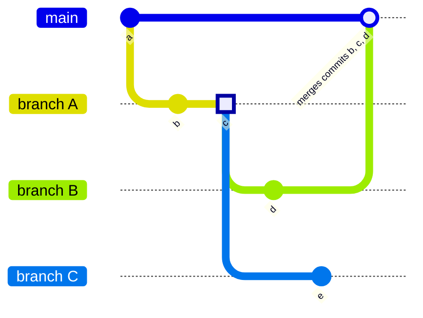



- Tier: 基础版，专业版，旗舰版
- Offering: JihuLab.com，私有化部署



分支让你的团队开发工作保持有序和隔离。当多人同时处理不同功能时，分支可以防止变更相互冲突。每个分支都充当一个隔离的工作区，你可以在其中实现新功能、修复 Bug 或试验想法。

通过分支，你的团队可以：

- 在不影响主代码库的情况下开发单独的功能。
- 在建议的变更影响项目其他部分之前进行审查。
- 在不影响其他工作的情况下回滚有问题的变更。
- 以可控、可预测的方式将变更部署到生产环境。

分支的开发工作流如下：

1. [创建分支](#create-a-branch)并向其添加提交。为了简化此过程，你应该遵循[分支命名模式](#prefix-branch-names-with-a-number)。
1. 当工作准备好接受审查时，创建一个[合并请求](../../merge_requests/_index.md)以提议合并分支中的变更。
1. 使用[审查应用](../../../../ci/review_apps/_index.md)预览变更。
1. [请求审查](../../merge_requests/reviews/_index.md#request-a-review)。
1. 在你的合并请求获得批准后，将你的分支合并到源分支。[合并方法](../../merge_requests/methods/_index.md)决定了项目中如何处理合并请求。
1. 当你的分支内容被合并后，[删除已合并的分支](#delete-merged-branches)。

<a id="view-all-branches"></a>

## 查看所有分支

要在极狐GitLab 用户界面中查看和管理你的分支：

1. 在顶栏中，选择 **搜索或跳转到** 并找到你的项目。
1. 在左侧边栏中，选择 **代码** > **分支**。

在此页面上，你可以：

- 查看所有分支，或进行筛选以仅查看活跃或停滞分支。

  如果分支在过去三个月内有提交，则该分支被视为活跃分支。否则视为停滞分支。

- [创建新分支](#create-a-branch)。
- [删除已合并的分支](#delete-merged-branches)。
- 查看指向默认分支的合并请求链接。

  对于合并请求未指向默认分支的分支，会显示  **新建** 合并请求按钮。

- [查看分支规则](branch_rules.md#view-branch-rules)。
- 查看分支上的最新流水线状态。

<a id="create-a-branch"></a>

## 创建分支

先决条件：

- 你必须具有项目的开发者、维护者或所有者角色。

要从极狐GitLab UI 创建新分支：

1. 在顶栏中，选择 **搜索或跳转到** 并找到你的项目。
1. 在左侧边栏中，选择 **代码** > **分支**。
1. 在右上角，选择 **新建分支**。
1. 输入 **分支名称**。
1. 在 **创建自** 中，选择分支的基：一个现有分支、一个现有标签或一个提交 SHA。
1. 选择 **创建分支**。

<a id="in-a-blank-project"></a>

### 在空白项目中

一个[空白项目](../../_index.md#create-a-blank-project)不包含任何分支，但你可以添加一个。

先决条件：

- 你必须具有项目的开发者、维护者或所有者角色。
- 如果你没有维护者或所有者角色，则必须将[默认分支保护](../../../group/manage.md#change-the-default-branch-protection-of-a-group)设置为 `部分保护` 或 `未保护`，才能将提交推送到默认分支。

要向空白项目添加[默认分支](default.md)：

1. 在顶栏中，选择 **搜索或跳转到** 并找到你的项目。
1. 滚动到 **此项目的代码仓为空**，然后选择你要添加的文件类型。
1. 在 Web IDE 中，对此文件进行任何所需的更改，然后选择 **创建提交**。
1. 输入提交消息，然后选择 **提交**。

极狐GitLab 会创建一个默认分支并将你的文件添加到其中。

<a id="from-an-issue"></a>

### 从议题

查看议题时，你可以直接在该页面上创建关联的分支。
以此方式创建的分支使用[从议题创建分支的默认命名模式](#configure-default-pattern-for-branch-names-from-issues)，包括变量。

先决条件：

- 你必须具有项目的开发者、维护者或所有者角色。

要从议题创建分支：

1. 在顶栏中，选择 **搜索或跳转到** 并找到你的项目。
1. 在左侧边栏中，选择 **计划** > **工作项**，然后按 **类型** = **议题** 进行筛选并选择你的议题。
1. 在议题描述下方，选择 **创建合并请求**  以显示下拉列表。
1. 选择 **创建分支**。
1. 在对话框中，从 **源（分支或标签）** 下拉列表中选择一个源分支或标签。
1. 查看建议的分支名称。它基于你的项目的[默认分支名称模式](#configure-default-pattern-for-branch-names-from-issues)。
1. 可选。如果你需要使用不同的分支名称，请在 **分支名称** 文本框中输入。
1. 选择 **创建分支**。

有关在空代码仓中创建分支的信息，请参阅[空代码仓行为](#empty-repository-behavior)。

如果创建的分支名称[以议题编号作为前缀](#prefix-branch-names-with-a-number)，极狐GitLab 会在议题和相关的合并请求之间建立交叉链接。

<a id="from-a-task"></a>

### 从任务

先决条件：

- 你必须具有项目的开发者、维护者或所有者角色。

要直接从任务创建分支：

1. 在顶栏中，选择 **搜索或跳转到** 并找到你的项目。
1. 在左侧边栏中，选择 **计划** > **工作项**，然后按 **类型** = **任务** 进行筛选并选择你的任务。
1. 在任务描述下方，选择 **创建合并请求**  以显示下拉列表。
1. 选择 **创建分支**。
1. 在对话框中，从 **源分支或标签** 下拉列表中选择一个源分支或标签。
1. 查看建议的分支名称。它基于你的项目的[默认分支名称模式](#configure-default-pattern-for-branch-names-from-issues)。
1. 可选。如果你需要使用不同的分支名称，请在 **分支名称** 文本框中输入。
1. 选择 **创建分支**。

有关在空代码仓中创建分支的信息，请参阅[空代码仓行为](#empty-repository-behavior)。

如果创建的分支名称[以任务编号作为前缀](#prefix-branch-names-with-a-number)，极狐GitLab 会在议题和相关的合并请求之间建立交叉链接。

<a id="empty-repository-behavior"></a>

### 空代码仓行为

如果你的 Git 代码仓为空，极狐GitLab 会：

- 创建一个默认分支。
- 向其提交一个空白的 `README.md` 文件。
- 创建并重定向你到一个基于议题标题的新分支。
- 如果你的项目[配置了部署服务](../../integrations/_index.md)，如 Kubernetes，极狐GitLab 会提示你通过帮助你创建 `.gitlab-ci.yml` 文件来设置[自动部署](../../../../topics/autodevops/stages.md#auto-deploy)。

<a id="name-your-branch"></a>

## 命名你的分支

Git 强制实施[分支名称规则](https://git-scm.com/docs/git-check-ref-format)以帮助确保分支名称与其他工具保持兼容。极狐GitLab 为分支名称添加了额外要求，并为结构良好的分支名称提供了便利。

极狐GitLab 对所有分支强制执行以下附加规则：

- 分支名称中不允许有空格。
- 禁止使用 40 个十六进制字符作为分支名称，因为它们类似于 Git 提交哈希。
- 分支名称区分大小写。

具有特定格式的分支名称可提供：

- 当你[以议题编号作为分支名称前缀](#prefix-branch-names-with-a-number)时，可以简化合并请求工作流。
- 基于分支名称的自动化[分支保护](protected.md)。
- [推送规则](../push_rules.md)用于在分支推送到极狐GitLab 之前测试分支名称。
- 控制哪些 [CI/CD 作业](../../../../ci/jobs/_index.md)在合并请求上运行。

<a id="software-packages"></a>

### 软件包

常见的软件包（如 Docker）可能会强制执行[额外的分支命名限制](../../../../administration/packages/container_registry_troubleshooting.md#docker-connection-error)。

为了与其他软件包实现最佳兼容性，请仅使用：

- 数字
- 连字符 (`-`)
- 下划线 (`_`)
- ASCII 标准表中的小写字母

<a id="characters-to-avoid-in-branch-names"></a>

### 分支名称中应避免的字符

尽管 Git 在技术上允许在分支名称中使用许多字符，但某些字符可能会导致极狐GitLab Runner 和其他工具出现问题，因此不建议使用：

- 空格和空白字符
- 特殊路径或通配符字符：`~`、`^`、`:`、`?`、`*`、`[`、`\`、`'`、`"`
- 双点号：`..`
- 特殊的 Git 语法：`@{`
- 连续斜杠：`//`
- emoji
- 尾部带有 `.` 或 `.lock` 后缀
- 以 `-` 或 `.` 开头
- ASCII 控制字符（包括 Delete）

为了与极狐GitLab Runner 和其他工具实现最大兼容性，请仅使用字母数字字符、连字符和下划线。

<a id="configure-default-pattern-for-branch-names-from-issues"></a>

### 配置从议题创建分支的默认命名模式

默认情况下，从议题创建分支时，极狐GitLab 使用模式 `%{id}-%{title}`，但你可以更改此模式。

先决条件：

- 你必须具有项目的维护者或所有者角色。

要更改从议题创建分支的默认模式：

1. 在顶栏中，选择 **搜索或跳转到** 并找到你的项目。
1. 在左侧边栏中，选择 **设置** > **代码仓**。
1. 展开 **分支默认设定**。
1. 滚动到 **分支名称模板** 并输入一个值。该字段支持以下变量：
   - `%{id}`：议题的数字 ID。
   - `%{title}`：议题的标题，经过修改以仅使用 Git 分支名称中可接受的字符。
1. 选择 **保存更改**。

<a id="prefix-branch-names-with-a-number"></a>

### 以数字作为分支名称的前缀

为了简化合并请求的创建，请以议题或任务编号开头，后跟一个连字符，来命名你的 Git 分支。例如，要将分支链接到议题 `#123`，请以 `123-` 作为分支名称的开头。

该分支必须与议题或任务位于同一项目中。

极狐GitLab 使用此编号将数据导入合并请求：

- 该事项被标记为与合并请求相关，并且它们会显示指向彼此的链接。
- 该分支与议题或任务相关联。
- 如果你的项目配置了[默认关闭模式](../../issues/managing_issues.md#default-closing-pattern)，合并该合并请求还会[自动关闭](../../issues/managing_issues.md#closing-issues-automatically)相关议题。
- 如果合并请求在同一项目中且不是派生（fork），议题的里程碑和标签会复制到合并请求中。

<a id="manage-and-protect-branches"></a>

## 管理和保护分支

极狐GitLab 提供了多种方法来保护单个分支。这些方法确保你的分支从创建到删除都能得到适当的监督和质量检查。要查看和编辑分支保护，请参阅[分支规则](branch_rules.md)。

<a id="download-branch-comparisons"></a>

### 下载分支比较



- 在极狐GitLab 18.3 中引入。



你可以将分支之间的比较以 diff 或补丁文件形式下载，以便在极狐GitLab 之外使用。

<a id="as-a-diff"></a>

#### 作为 diff

要将分支比较以 diff 形式下载，请在比较 URL 中添加 `format=diff`：

- 如果 URL 没有查询参数，请附加 `?format=diff`：

  ```plaintext
  https://gitlab.example.com/my-group/my-project/-/compare/main...feature-branch?format=diff
  ```

- 如果 URL 已有查询参数，请附加 `&format=diff`：

  ```plaintext
  https://gitlab.example.com/my-group/my-project/-/compare/main...feature-branch?from_project_id=2&format=diff
  ```

要下载并应用 diff：

```shell
curl "https://gitlab.example.com/my-group/my-project/-/compare/main...feature-branch?format=diff" | git apply
```

<a id="as-a-patch-file"></a>

#### 作为补丁文件

要将分支比较以补丁文件形式下载，请在比较 URL 中添加 `format=patch`：

- 如果 URL 没有查询参数，请附加 `?format=patch`：

  ```plaintext
  https://gitlab.example.com/my-group/my-project/-/compare/main...feature-branch?format=patch
  ```

- 如果 URL 已有查询参数，请附加 `&format=patch`：

  ```plaintext
  https://gitlab.example.com/my-group/my-project/-/compare/main...feature-branch?from_project_id=2&format=patch
  ```

要使用 [`git am`](https://git-scm.com/docs/git-am) 下载并应用补丁：

```shell
# 下载并预览补丁
curl "https://gitlab.example.com/my-group/my-project/-/compare/main...feature-branch?format=patch" > changes.patch
git apply --check changes.patch

# 应用补丁
git am changes.patch
```

你也可以在单个命令中下载并应用补丁：

```shell
curl "https://gitlab.example.com/my-group/my-project/-/compare/main...feature-branch?format=patch" | git am
```

<a id="delete-merged-branches"></a>

## 删除已合并的分支

如果已合并的分支满足以下所有条件，则可以批量删除：

- 它们不是[受保护分支](protected.md)。
- 它们已合并到项目的默认分支中。

先决条件：

- 你必须具有项目的开发者、维护者或所有者角色。

具体操作：

1. 在顶栏中，选择 **搜索或跳转到** 并找到你的项目。
1. 在左侧边栏中，选择 **代码** > **分支**。
1. 在页面右上角，选择 **更多** 。
1. 选择 **删除已合并分支**。
1. 在对话框中，输入单词 `delete` 进行确认，然后选择 **删除已合并分支**。

> [!note]
> 删除分支并不会完全清除所有相关数据。
> 一些信息会保留下来，以维护项目历史记录并支持恢复流程。
> 有关详细信息，请参阅[处理敏感信息](../../../../topics/git/undo.md#handle-sensitive-information)。

<a id="configure-workflows-for-target-branches"></a>

## 配置目标分支工作流



- Tier: 专业版，旗舰版
- Offering: JihuLab.com，私有化部署





- 在极狐GitLab 16.4 中引入，附带一个名为 `target_branch_rules_flag` 的功能标志，默认启用。
- 功能标志在极狐GitLab 16.7 中移除。



某些项目使用多个长期分支进行开发，例如 `develop` 和 `qa`。在这些项目中，你可能希望将 `main` 保留为默认分支，但期望合并请求以 `develop` 或 `qa` 为目标。目标分支工作流有助于确保合并请求以适合你项目的开发分支为目标。

当你创建合并请求时，该工作流会检查分支的名称。如果分支名称与工作流匹配，则合并请求将以你指定的分支为目标。如果分支名称不匹配，则合并请求将以项目的默认分支为目标。

规则按“首次匹配”原则处理——如果两条规则与同一分支名称匹配，则应用最顶部的规则。

先决条件：

- 你必须具有维护者或所有者角色。

要创建目标分支工作流：

1. 在顶栏中，选择 **搜索或跳转到** 并找到你的项目。
1. 在左侧边栏中，选择 **设置** > **合并请求**。
1. 向下滚动到 **合并请求分支工作流**。
1. 选择 **添加分支目标**。
1. 对于 **分支名称模式**，提供一个字符串或通配符来与分支名称进行比较。
1. 选择当分支名称与 **分支名称模式** 匹配时要使用的 **目标分支**。
1. 选择 **保存**。

<a id="target-branch-workflow-example"></a>

### 目标分支工作流示例

你可以将项目配置为具有以下目标分支工作流：

| 分支名称模式   | 目标分支 |
|-------------|---------------|
| `feature/*` | `develop`     |
| `bug/*`     | `develop`     |
| `release/*` | `main`        |

这些目标分支简化了为以下项目创建合并请求的过程：

- 使用 `main` 来表示应用程序的已部署状态。
- 在另一个长期运行的分支（如 `develop`）中跟踪当前未发布的开发工作。

如果你的工作流初始将新功能放在 `develop` 而非 `main` 中，这些目标分支可确保所有匹配 `feature/*` 或 `bug/*` 的分支不会错误地以 `main` 为目标。

当你准备发布到 `main` 时，创建一个名为 `release/*` 的分支，并确保此分支以 `main` 为目标。

<a id="delete-a-target-branch-workflow"></a>

### 删除目标分支工作流

当你移除目标分支工作流时，现有的合并请求保持不变。

先决条件：

- 你必须具有维护者或所有者角色。

具体操作：

1. 在顶栏中，选择 **搜索或跳转到** 并找到你的项目。
1. 在左侧边栏中，选择 **设置** > **合并请求**。
1. 在你想要删除的分支目标上选择 **删除**。

<a id="troubleshooting"></a>

## 故障排除

<a id="multiple-branches-containing-the-same-commit"></a>

### 多分支包含相同的提交

在更深的技​​术层面上，Git 分支并不是独立的实体，而是附加到一组提交 SHA 上的标签。当极狐GitLab 确定分支是否已合并时，它会检查目标分支中是否存在这些提交 SHA。当两个合并请求包含相同的提交时，这种行为可能会导致意外结果。在此示例中，分支 `B` 和 `C` 都从分支 `A` 上的相同提交 (`3`) 开始：



如果你合并分支 `B`，分支 `A` 也会显示为已合并（无需你执行任何操作），因为分支 `A` 的所有提交现在都出现在目标分支 `main` 中。分支 `C` 保持未合并状态，因为提交 `5` 不属于分支 `A` 或 `B`。

合并请求 `A` 保持已合并状态，即使你尝试向其分支推送新提交也是如此。如果合并请求 `A` 中有任何变更未被合并（因为它们不属于合并请求 `A`），请为它们创建一个新的合并请求。

<a id="error-ambiguous-head-branch-exists"></a>

### 错误：存在模糊的 `HEAD` 分支

在早于 2.16.0 的 Git 版本中，你可以创建一个名为 `HEAD` 的分支。这个名为 `HEAD` 的分支会与 Git 用来描述活动（检出）分支的内部引用（也称为 `HEAD`）发生冲突。这种命名冲突可能会阻止你更新代码仓的默认分支：

```plaintext
Error: Could not set the default branch. Do you have a branch named 'HEAD' in your repository?
```

要解决此问题：

1. 在顶栏中，选择 **搜索或跳转到** 并找到你的项目。
1. 在左侧边栏中，选择 **代码** > **分支**。
1. 搜索名为 `HEAD` 的分支。
1. 确保该分支没有未提交的更改。
1. 选择 **删除分支**，然后选择 **是，删除分支**。

Git 版本 [2.16.0 及更高版本](https://github.com/git/git/commit/a625b092cc59940521789fe8a3ff69c8d6b14eb2)会阻止你创建具有此名称的分支。

<a id="find-all-branches-youve-authored"></a>

### 查找你创作的所有分支

要查找项目中你创作的所有分支，请在 Git 代码仓中运行以下命令：

```shell
git for-each-ref --format='%(authoremail) %(refname:short)' | grep $(git config --get user.email)
```

要按作者排序获取项目中所有分支的总数，请在 Git 代码仓中运行此命令：

```shell
git for-each-ref --format='%(authoremail)'  | sort | uniq -c | sort -g
```

<a id="error-failed-to-create-branch-4deadline-exceeded"></a>

### 错误：`Failed to create branch 4:Deadline Exceeded`

此错误是由 Gitaly 中的超时引起的。当创建分支所需的时间超过配置的超时期限时，会发生此错误。

要解决此问题，请选择以下方法之一：

- 禁用耗时的[服务器钩子](../../../../administration/server_hooks.md)。
- 增加 [Gitaly 超时](../../../../administration/settings/gitaly_timeouts.md)设置。

