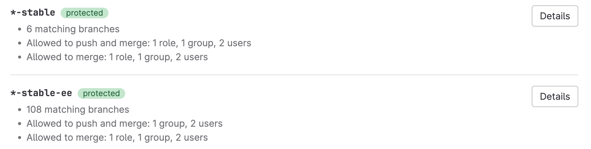



- Tier: 基础版，专业版，旗舰版
- Offering: JihuLab.com，私有化部署



极狐GitLab 提供了多种方法来保护单个分支。这些方法确保您的分支在从创建到删除的过程中受到监督和质量检查：

- 为项目[默认分支](default.md)应用增强的安全性和保护。
- 配置[受保护分支](protected.md)以：
  - 限制谁可以推送和合并到分支。
  - 管理用户是否可以对分支进行强制推送。
  - 管理是否可以将 `CODEOWNERS` 文件中列出的文件的更改直接推送到分支。
- 配置[审批规则](../../merge_requests/approvals/rules.md#approvals-for-protected-branches)以管理审查要求并实施[安全相关审批](../../merge_requests/approvals/rules.md#security-approvals)。
- 集成第三方[状态检查](../../merge_requests/status_checks.md)以确保您的分支内容符合您定义的质量标准。

您可以通过以下方式管理您的分支：

- 使用极狐GitLab 用户界面。
- 使用命令行上的 Git。
- 使用 [分支 API](../../../../api/branches.md)。

## 查看分支规则



- 在极狐GitLab 16.1 中 GA。功能标志 `branch_rules` 已移除。



分支规则概览页面显示所有配置了任何保护的分支，以及它们的保护方法：

前提条件：

- 您必须对项目具有维护者或所有者角色。

要查看分支规则概览列表：

1. 在顶部栏，选择 **搜索或跳转到** 并查找您的项目。
1. 在左侧边栏，选择 **设置** > **代码仓**。
1. 展开 **分支规则** 以查看所有带有保护的分支。

### 查看分支规则详情

要查看单个分支的分支规则和保护：

1. 在顶部栏，选择 **搜索或跳转到** 并查找您的项目。
1. 在左侧边栏，选择 **设置** > **代码仓**。
1. 展开 **分支规则** 以查看所有带有保护的分支。
1. 确定要查看的分支并选择 **查看详情**。

## 创建分支规则



- 于极狐GitLab 16.8 引入，带有一个名为 `add_branch_rules` 的功能标志。默认禁用。
- 功能标志 `add_branch_rules` 于极狐GitLab 16.11 重命名为 `edit_branch_rules`。默认禁用。
- **所有分支** 和 **所有受保护分支** 选项于极狐GitLab 17.0 引入。
- 于极狐GitLab 17.4 在 JihuLab.com 上启用。
- 于极狐GitLab 17.5 在私有化部署实例上启用。
- 于极狐GitLab 18.9 GA。功能标志 `edit_branch_rules` 已移除。



前提条件：

- 您必须对项目具有维护者或所有者角色。

要创建分支规则：

1. 在顶部栏，选择 **搜索或跳转到** 并查找您的项目。
1. 在左侧边栏，选择 **设置** > **代码仓**。
1. 展开 **分支规则**。
1. 选择 **添加分支规则**。
1. 选择以下选项之一：
   - 要输入特定的分支名称或模式：
     1. 选择 **分支名称或模式**。
     1. 从 **创建分支规则** 下拉列表中，选择一个分支名称或使用 `*` 创建[通配符](protected.md#use-wildcard-rules)。
   - 要保护项目中的所有分支：
     1. 选择 **所有分支**。
     1. 在规则详情页的 **合并请求审批** 下，输入该规则所需的审批数。
   - 要保护项目中已指定为受保护的所有分支：
     1. 选择 **所有受保护分支**。
     1. 在规则详情页的 **合并请求审批** 下，输入该规则所需的审批数。

### 添加分支规则保护

> [!note]
> 不适用于 `all branches`。

要向新分支添加保护：

1. 在顶部栏，选择 **搜索或跳转到** 并查找您的项目。
1. 在左侧边栏，选择 **设置** > **代码仓**。
1. 展开 **分支规则**。
1. 选择 **添加分支规则**。
1. 选择 **所有受保护分支** 或 **分支名称或模式**。
1. 选择 **创建分支规则**。

### 添加审批规则



- Tier: 专业版，旗舰版
- Offering: JihuLab.com，私有化部署



> [!note]
> 不适用于 `all branches`。

前提条件：

- 您必须对项目具有维护者或所有者角色。

要添加合并请求审批规则：

1. 从[分支规则详情](#view-branch-rule-details)页面，转到 **合并请求审批** 部分。
1. 在 **审批规则** 部分，选择 **添加审批规则**。
1. 在右侧边栏，填写字段：
   - 输入 **规则名称**。
   - 在 **所需审批数** 中，输入一个值（`0`-`100`）。

     值为 `0` 会使[规则变为可选](../../merge_requests/approvals/rules.md#configure-optional-approval-rules)，任何大于 `0` 的数字则创建必需规则。
     所需审批的最大数量为 `100`。
   - 选择[有审批资格](../../merge_requests/approvals/rules.md#eligible-approvers)的用户或群组。

     极狐GitLab 根据合并请求更改的文件的先前作者建议审批人。
1. 选择 **保存更改**。

有关更多信息，请参见[审批规则](../../merge_requests/approvals/rules.md#approvals-for-protected-branches)。

### 编辑压缩提交选项



- Tier: 专业版，旗舰版
- Offering: JihuLab.com，私有化部署





- 于极狐GitLab 17.9 引入，带有一个名为 `branch_rule_squash_settings` 的功能标志。默认禁用。
- 于极狐GitLab 17.10 在 JihuLab.com 和私有化部署实例上启用。
- 于极狐GitLab 17.11 GA。功能标志 `branch_rule_squash_settings` 已移除。



前提条件：

- 您必须对项目具有维护者或所有者角色。
- 在 极狐GitLab 基础版中，仅当分支规则目标为 **所有分支** 时，此功能才可用。
- 在 极狐GitLab 专业版 和 极狐GitLab 旗舰版中，此功能适用于所有分支规则。

要编辑压缩选项：

1. 从[分支规则详情](#view-branch-rule-details)页面，转到 **合并时压缩提交** 部分。
1. 选择 **编辑**。
1. 选择以下选项之一：

   - **默认**：移除分支级别的压缩设置，并继承项目的默认设置。
     此选项不适用于 **所有分支** 规则，该规则定义了项目的默认设置。
   - **不允许**：从不允许压缩，复选框隐藏。
   - **允许**：复选框可见且默认未选中。
   - **鼓励**：复选框可见且默认选中。
   - **要求**：始终执行压缩。复选框可见且选中，用户无法更改。

1. 选择 **保存更改**。

### 添加状态检查服务



- Tier: 旗舰版
- Offering: JihuLab.com，私有化部署





- 于极狐GitLab 17.4 引入，[带有一个功能标志](../../../../administration/feature_flags/_index.md) 命名为 `edit_branch_rules`。默认禁用。
- 于极狐GitLab 17.4 在 JihuLab.com 上启用。
- 于极狐GitLab 17.5 在私有化部署实例上启用。
- 于极狐GitLab 18.9 GA。功能标志 `edit_branch_rules` 已移除。



> [!note]
> 不适用于 `all protected branches`。

要添加状态检查服务：

1. 从[分支规则详情](#view-branch-rule-details)页面，转到 **状态检查** 部分。
1. 选择 **添加状态检查**。
1. 输入 **服务名称**。
1. 在 **要检查的 API** 字段中，输入 URL。

   您应使用 HTTPS URL 来保护传输中的合并请求数据。

有关更多信息，请参见[外部状态检查](../../merge_requests/status_checks.md)。

## 编辑分支规则目标



- 于极狐GitLab 16.8 引入，带有一个名为 `add_branch_rules` 的功能标志。默认禁用。
- 功能标志 `add_branch_rules` 于极狐GitLab 16.11 重命名为 `edit_branch_rules`。默认禁用。
- 于极狐GitLab 17.4 在 JihuLab.com 上启用。
- 于极狐GitLab 17.5 在私有化部署实例上启用。
- 于极狐GitLab 18.9 GA。功能标志 `edit_branch_rules` 已移除。



前提条件：

- 您必须对项目具有维护者或所有者角色。

要编辑分支规则目标：

1. 在顶部栏，选择 **搜索或跳转到** 并查找您的项目。
1. 在左侧边栏，选择 **设置** > **代码仓**。
1. 展开 **分支规则** 以查看所有带有保护的分支。
1. 确定要编辑的分支并选择 **查看详情**。
1. 在 **规则目标** 部分，选择 **编辑**。
1. 根据需要编辑信息。
1. 选择 **更新**。

### 编辑分支规则保护

有关分支保护控制的信息，请参见[受保护分支](protected.md)。

> [!note]
> 不适用于 `all branches`。

## 删除分支规则



- 于极狐GitLab 16.8 引入，带有一个名为 `add_branch_rules` 的功能标志。默认禁用。
- 功能标志 `add_branch_rules` 于极狐GitLab 16.11 重命名为 `edit_branch_rules`。默认禁用。
- 于极狐GitLab 17.4 在 JihuLab.com 上启用。
- 于极狐GitLab 17.5 在私有化部署实例上启用。
- 于极狐GitLab 18.9 GA。功能标志 `edit_branch_rules` 已移除。



前提条件：

- 您必须对项目具有维护者或所有者角色。

要删除分支规则：

1. 在顶部栏，选择 **搜索或跳转到** 并查找您的项目。
1. 在左侧边栏，选择 **设置** > **代码仓**。
1. 展开 **分支规则**。
1. 在要删除的规则旁边，选择 **查看详情**。
1. 在右上角，选择 **删除规则**。
1. 在确认对话框中，选择 **删除分支规则**。

> [!note]
> 删除分支规则不适用于目标为 `all branches` 的规则。