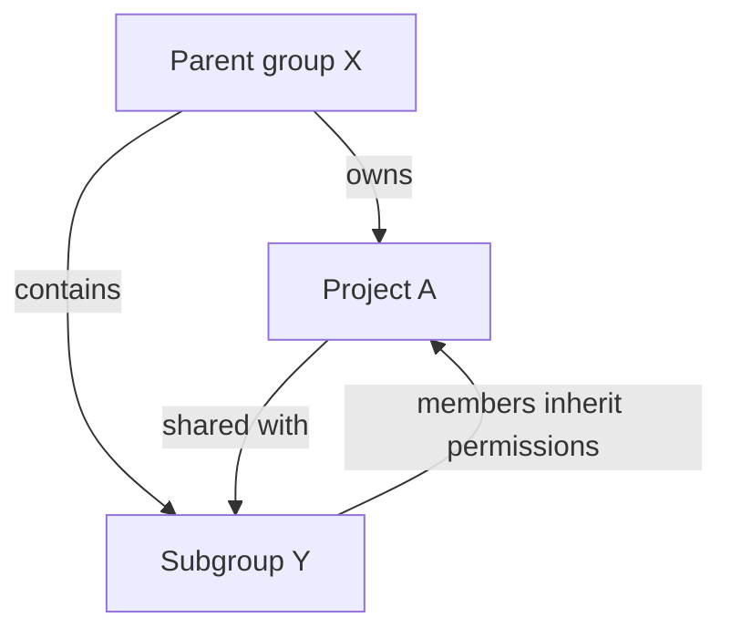
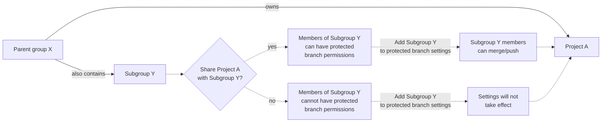



- Tier: 基础版、专业版、旗舰版
- Offering: JihuLab.com、私有化部署



> [!note]
> 项目的 **受保护分支** 设置将被移除。请通过 **设置** > **代码仓** > **分支规则** 来配置受保护分支。

受保护分支在极狐GitLab 中强制实施特定权限，以确保代码稳定性和质量。受保护分支：

- 控制哪些用户可以合并和推送代码更改。
- 防止意外删除关键分支。
- 强制执行代码审查和审批流程。
- 管理代码所有者批准要求。
- 调节强制推送权限以维护提交历史。
- 通过用户界面和受保护分支 API 控制访问。

> [!note]
> 你的代码仓的默认分支默认受保护。
> 有关默认分支设置的更多信息，请参见[默认分支](default.md)。

有关分支匹配多个规则或具有复杂权限要求时保护规则的行为，请参见[保护规则](protection_rules.md)。

<a id="protect-a-branch"></a>

## 保护分支

为单个项目或群组中的所有项目配置受保护分支。

> [!note]
> 群组规则无法在项目中修改，但项目维护者可以为相同分支名称创建单独的规则。当两条规则都适用于同一分支时，极狐GitLab 会一起评估所有匹配的规则，并为大多数设置应用最宽松的结果。
> 更多信息，请参见[跨群组和项目的规则](protection_rules.md#rules-across-groups-and-projects)。

<a id="in-a-project"></a>

### 在项目中

先决条件：

- 您必须具有维护者或所有者角色。
- 当在受保护分支上授予群组 **允许合并** 或 **允许推送和合并** 权限时，项目必须可访问且已与该群组共享。有关更多信息，请参见[共享项目](../../members/sharing_projects_groups.md)。

保护一个分支：

1. 在顶部栏中，选择 **搜索或跳转到** 并找到您的项目。
1. 在左侧边栏中，选择 **设置** > **代码仓**。
1. 展开 **分支规则**。
1. 选择 **添加分支规则** > **分支名称或模式**。
1. 从下拉列表中，搜索并选择您要保护的分支。
1. 要查看 **分支规则详情** 页面，选择 **创建分支规则**。
1. 从 **保护分支** 部分，选择以下选项之一：
   - 在 **允许合并** 中，选择 **编辑**。
     1. 选择可以合并到此分支的角色。
     1. 选择 **保存更改**。
   - 在 **允许推送和合并** 中，选择 **编辑**。
     1. 选择可以推送到此分支的角色。
     1. 可选。搜索并选择 **部署密钥**。
     1. 选择 **保存更改**。

> [!note]
> 在极狐GitLab 专业版和旗舰版中，您还可以将群组或个人用户添加到 **允许合并** 和 **允许推送和合并**。

<a id="in-a-group"></a>

### 在群组中



- Tier: 专业版、旗舰版
- Offering: JihuLab.com、私有化部署





- 在极狐GitLab 17.6 中 GA。功能标志 `group_protected_branches` 已移除。



群组所有者可以为群组创建受保护分支。这些设置应用于群组中的所有项目，并且无法在项目中修改。

先决条件：

- 您必须具有群组的所有者角色。
- 群组必须是顶级群组。不支持子群组。

为群组中的所有项目保护分支：

1. 在顶部栏中，选择 **搜索或跳转到** 并找到您的群组。
1. 在左侧边栏中，选择 **设置** > **代码仓**。
1. 展开 **受保护分支**。
1. 选择 **添加受保护分支**。
1. 在 **分支** 文本框中，输入分支名称或 [通配符](#use-wildcard-rules) (`*`)。
   分支名称和通配符区分大小写。
1. 从 **允许合并** 列表中，选择一个可以合并到此分支的角色。
1. 从 **允许推送和合并** 列表中，选择一个可以推送到此分支的角色。
1. 选择 **允许强制推送** 和 **需要代码所有者批准** 的首选项。
1. 选择 **保护**。

<a id="push-and-merge-permissions"></a>

## 推送和合并权限

**允许合并** 和 **允许推送和合并** 设置控制分支保护的不同方面：

| 设置                         | 目的                                                                                                      | 默认行为（未配置时）                                                                 |
|-------------------------------|----------------------------------------------------------------------------------------------------------------|---------------------------------------------------------------------------------------------------|
| **允许合并**                 | 控制谁可以通过合并请求合并更改，并通过 UI 和 API 创建新的受保护分支                               | 无人可以合并（除非他们具有 **允许推送和合并** 权限）。 |
| **允许推送和合并**           | 控制谁可以直接推送到现有受保护分支并通过合并请求合并                                             | 无人可以推送。                                                                             |

> [!note]
> **允许推送和合并** 授予推送和合并能力。
> 具有此权限的用户即使没有 **允许合并** 权限，也可以通过合并请求合并。

当您为 **允许合并** 或 **允许推送和合并** 选择 **无人** 时，UI 会清除其他角色选择。
此行为与 API 不同，在 API 中可以同时设置多个访问级别。
有关 API 行为的更多信息，请参见[受保护分支 API](../../../../api/protected_branches.md)。

<a id="protection-strategies-by-branch-types"></a>

### 按分支类型的保护策略

不同分支类型需要根据其用途和安全要求设置不同的保护级别。

对于部署到生产环境的分支：

- 将 **允许合并** 设置为仅 **维护者**。
- 将 **允许推送和合并** 设置为 **无人**（非空）。
- 启用 **需要代码所有者批准**。
- 考虑要求多次批准。

使用此配置，所有更改都需要通过合并请求并经过维护者批准。

对于活跃开发分支：

- 将 **允许合并** 设置为 **开发者 + 维护者**。
- 将 **允许推送和合并** 设置为 **无人**（非空）。

使用此配置，开发者可以合并已批准的合并请求，同时要求所有更改通过代码审查。

> [!note]
> 当未配置 **允许推送和合并** 时，它不会限制推送访问。要阻止直接推送，必须将 **允许推送和合并** 显式设置为 **无人**。

<a id="permission-combinations-for-developer-role"></a>

### 开发者角色的权限组合

以下示例展示了具有开发者角色的用户在不同保护配置下可以执行的操作：

| 允许合并               | 允许推送和合并          | 直接推送         | 通过 MR 合并      |
|--------------------------|---------------------------|-------------|------------------|
| 无人                     | 开发者 + 维护者         |  |       |
| 未配置                   | 开发者 + 维护者         |  |       |
| 开发者 + 维护者          | 未配置                   |   |       |
| 未配置                   | 未配置                   |   |        |
| 维护者                   | 未配置                   |   |        |
| 维护者                   | 维护者                   |   |        |
| 开发者 + 维护者          | 维护者                   |   |       |

<a id="default-branch-protection-settings"></a>

## 默认分支保护设置

管理员可以在 **管理员** 区域中[设置默认分支保护级别](default.md#for-all-projects-in-an-instance)。

<a id="use-wildcard-rules"></a>

## 使用通配符规则

使用通配符时，多条规则可应用于单个分支。
如果多条规则适用于某个分支，则最宽松的规则控制该分支的行为。
为使合并控制正常工作，请将 **允许推送和合并** 设置为比 **允许合并** 更广泛的用户集。

先决条件：
- 您必须具有维护者或所有者角色。

同时保护多个分支：

1. 在顶部栏中，选择 **搜索或跳转到** 并找到您的项目。
1. 在左侧边栏中，选择 **设置** > **代码仓**。
1. 展开 **分支规则**。
1. 选择 **添加分支规则** > **分支名称或模式**。
1. 从下拉列表中，键入分支名称和通配符 (`*`)。
   分支名称和通配符区分大小写。例如：

   | 通配符保护分支 | 匹配的分支                                      |
   |---------------------------|--------------------------------------------------------|
   | `*-stable`                | `production-stable`、`staging-stable`                  |
   | `production/*`            | `production/app-server`、`production/load-balancer`    |
   | `*gitlab*`                | `gitlab`、`gitlab/staging`、`master/gitlab/production` |

1. 选择 **创建通配符**。
1. 选择 **创建分支规则**。您将被导向 **分支规则详情** 页面。
1. 从 **保护分支** 部分，选择以下选项之一：
   - 在 **允许合并** 中，选择 **编辑**。
     1. 选择可以合并到此分支的角色。
     1. 选择 **保存更改**。
   - 在 **允许推送和合并** 中，选择 **编辑**。
     1. 选择可以合并到此分支的角色。
     1. 如果需要，可以搜索添加 **部署密钥**。
     1. 选择 **保存更改**。

<a id="configure-protection-options"></a>

## 配置保护选项

您可以设置各种保护选项来保护您的分支。

<a id="require-merge-requests"></a>

### 要求合并请求

您可以强制所有人提交合并请求，而不是允许他们直接检入受保护分支：

1. 在顶部栏中，选择 **搜索或跳转到** 并找到您的项目。
1. 在左侧边栏中，选择 **设置** > **代码仓**。
1. 展开 **分支规则**。
1. 在您的分支旁边，选择 **查看详情**。
1. 从 **允许合并** 部分，选择 **编辑**
1. 选择 **开发者 + 维护者**。
1. 选择 **保存更改**。
1. 从 **允许推送和合并** 部分，选择 **无人**。
1. 选择 **保存更改**。

<a id="allow-direct-push"></a>

### 允许直接推送

您可以允许所有具有写入权限的用户直接推送到受保护分支。

1. 在顶部栏中，选择 **搜索或跳转到** 并找到您的项目。
1. 在左侧边栏中，选择 **设置** > **代码仓**。
1. 展开 **分支规则**。
1. 在您的分支旁边，选择 **查看详情**。
1. 从 **允许推送和合并** 部分，选择 **开发者 + 维护者**。
1. 选择 **保存更改**。

<a id="with-group-permissions"></a>

### 使用群组权限



- Tier: 专业版、旗舰版
- Offering: JihuLab.com、私有化部署



要将群组或子群组的成员设置为对受保护分支的 **允许合并** 或 **允许推送和合并**：

1. 在顶部栏中，选择 **搜索或跳转到** 并找到您的项目。
1. 在左侧边栏中，选择 **设置** > **代码仓**。
1. 展开 **分支规则**。
1. 在您的分支旁边，选择 **查看详情**。
1. 在 **允许合并** 或 **允许推送和合并** 部分，选择 **编辑**。
1. 在 **群组** 下，搜索以添加群组。例如：

   ```plaintext
   # 允许群组成员合并到此分支
   允许合并: @group-x

   # 允许群组成员推送和合并到此分支
   允许推送和合并: @group-x/subgroup-y
   ```

1. 选择 **保存更改**。

> [!note]
> 将群组分配到受保护分支时，仅包括该群组的直接成员。
> 父群组的成员不会自动获得受保护分支的权限。

<a id="group-inheritance-requirements"></a>

#### 群组继承要求



在此示例中：

- 父群组 X (`group-x`) 拥有项目 A。
- 父群组 X 还包含一个子群组，子群组 Y。 (`group-x/subgroup-y`)
- 项目 A 与子群组 Y 共享。

有资格获得受保护分支权限的群组是：

- 项目 A：群组 X 和子群组 Y 均可，因为项目 A 与子群组 Y 共享。

<a id="share-projects-with-groups"></a>

#### 与群组共享项目

您可以与群组或子群组共享项目，使其成员有资格获得受保护分支权限。



要向项目 A 的子群组 Y 成员授予访问权限，您必须与子群组共享此项目。直接向受保护分支设置添加子群组无效，且不适用于子群组成员。

> [!note]
> 要使群组具有受保护分支权限，项目必须直接与该群组共享。
> 从父群组继承的项目成员身份不足以获得受保护分支权限。

<a id="enable-deploy-key-access"></a>

### 启用部署密钥访问

您可以使用[部署密钥](../../deploy_keys/_index.md)推送到受保护分支。

先决条件：

- 部署密钥必须为您的项目启用。项目部署密钥在创建时默认启用，但公共部署密钥必须被授予对项目的访问权限。
- 部署密钥必须具有对项目代码仓的写入权限。
- 部署密钥的所有者必须至少具有对项目的读取权限。
- 部署密钥的所有者还必须是项目的成员。

允许部署密钥推送到受保护分支：

1. 在顶部栏中，选择 **搜索或跳转到** 并找到您的项目。
1. 在左侧边栏中，选择 **设置** > **代码仓**。
1. 展开 **分支规则**。
1. 在您的分支旁边，选择 **查看详情**。
1. 从 **允许推送和合并** 部分，选择 **编辑**。
1. 在 **部署密钥** 中，搜索以添加部署密钥。
1. 选择 **保存更改**。

部署密钥在 **允许合并** 下拉列表中不可用。

<a id="allow-force-push"></a>

### 允许强制推送

您可以允许对受保护分支进行[强制推送](../../../../topics/git/git_rebase.md#force-push-to-a-remote-branch)。

要保护分支并启用强制推送：

1. 在顶部栏中，选择 **搜索或跳转到** 并找到您的项目。
1. 在左侧边栏中，选择 **设置** > **代码仓**。
1. 展开 **分支规则**。
1. 选择 **添加分支规则** > **分支名称或模式**。
1. 从下拉列表中，搜索并选择您要保护并启用强制推送的分支。
1. 选择 **创建分支规则**。您将被导向 **分支规则详情** 页面。
1. 从 **允许推送和合并** 和 **允许合并** 部分，选择您想要的设置。
1. 选择 **保存更改**。
1. 要允许所有具有推送权限的用户强制推送，请打开 **允许强制推送** 切换开关。

要在已受保护的分支上启用强制推送：

1. 在顶部栏中，选择 **搜索或跳转到** 并找到您的项目。
1. 在左侧边栏中，选择 **设置** > **代码仓**。
1. 展开 **分支规则**。
1. 在您的分支旁边，选择 **查看详情**。
1. 打开 **允许强制推送** 切换开关。

<a id="require-code-owner-approval"></a>

### 要求代码所有者批准



- Tier: 专业版、旗舰版
- Offering: JihuLab.com、私有化部署



对于受保护分支，您可以要求至少一位 [代码所有者](../../codeowners/_index.md) 的批准。
如果分支受多条规则保护，并且 **需要代码所有者批准** 已启用，则需要代码所有者批准。

要保护新分支并启用代码所有者批准：

1. 在顶部栏中，选择 **搜索或跳转到** 并找到您的项目。
1. 在左侧边栏中，选择 **设置** > **代码仓**。
1. 展开 **分支规则**。
1. 选择 **添加分支规则** > **分支名称或模式**。
1. 从下拉列表中，搜索并选择您要保护并启用强制推送的分支。
1. 选择 **创建分支规则**。您将被导向 **分支规则详情** 页面。
1. 从 **允许推送和合并** 和 **允许合并** 部分，选择您想要的设置。
1. 选择 **保存更改**。
1. 打开 **需要代码所有者批准** 切换开关。

要在已受保护的分支上启用代码所有者批准：

1. 在顶部栏中，选择 **搜索或跳转到** 并找到您的项目。
1. 在左侧边栏中，选择 **设置** > **代码仓**。
1. 展开 **分支规则**。
1. 在您的分支旁边，选择 **查看详情**。
1. 打开 **代码所有者批准** 切换开关。

启用后，这些分支的所有合并请求都需要由匹配规则中的代码所有者批准后才能合并。
此外，如果规则匹配，将拒绝直接推送到受保护分支。

任何未在 `CODEOWNERS` 文件中指定的用户不能推送对指定文件或路径的更改，除非他们被特别允许。您不必限制开发者直接推送到受保护分支。相反，您可以限制推送到某些需要代码所有者审查的文件中。

允许推送到受保护分支的用户和群组无需合并请求即可合并其功能分支。因此，他们可以跳过合并请求审批规则，包括代码所有者。

<a id="control-who-can-unprotect-branches"></a>

### 控制谁可以取消保护分支



- Tier: 专业版、旗舰版
- Offering: JihuLab.com、私有化部署



当您保护一个分支时，还可以控制以后谁可以取消保护它。
默认情况下，具有维护者或所有者角色的用户可以取消保护受保护分支。

对于有监管或合规要求的组织，您可以将这些权限限制为特定的用户、群组或访问级别。

> [!note]
> 为避免永久锁定分支的保护设置，请确保始终至少有一个用户或群组保留对该分支的取消保护权限。
>
> 除非用户自己能够取消保护该分支，否则他们无法创建、修改或删除受保护分支设置。此安全机制旨在防止配置错误。

您只能通过 API 配置这些权限。此功能可用于：

- 合规监管：确保只有授权人员才能修改分支保护。
- 大型组织：防止意外删除多个代码仓的保护设置。
- 自动化治理：启用脚本以创建开发团队无法覆盖的仅限管理员的保护。

有关取消保护权限的有效访问级别和约束的信息，请参见[有效访问级别](../../../../api/protected_branches.md#valid-access-levels)。

#### 取消保护权限

下表显示了根据您的配置，谁可以取消保护分支：

| 配置                             | 谁可以取消保护 |
|-----------------------------------|-------------------|
| 默认行为                          | 具有维护者或所有者角色的用户 |
| 配置了特定用户                    | 仅指定的用户 |
| 配置了特定群组                    | 仅指定群组的成员 |
| 配置了多个访问级别                | 来自配置访问级别的任何用户、群组或角色 |

<a id="cicd-on-protected-branches"></a>

## 受保护分支上的 CI/CD

合并或推送到受保护分支的权限决定了用户是否能够运行 CI/CD 流水线并对作业执行操作。

合并请求流水线在源分支或基于源分支的合并请求引用上运行。如果用户没有合并或推送到源分支的权限，则不会创建流水线。

当合并请求发生在受保护分支之间时，如果用户有权限更新源分支和目标分支，则受保护变量和 Runner 可用于流水线。
有关更多信息，请参见[控制对受保护变量和 Runner 的访问](../../../../ci/pipelines/merge_request_pipelines.md#control-access-to-protected-variables-and-runners)。

<a id="create-protected-branches"></a>

## 创建受保护分支

先决条件：

- 您必须具有开发者、维护者或所有者角色。
- 要创建受保护分支，必须将分支保护配置为 [要求每个人提交合并请求以保护分支](#require-merge-requests)。

要创建带有保护的新分支：

1. 在顶部栏中，选择 **搜索或跳转到** 并找到您的项目。
1. 在左侧边栏中，选择 **代码** > **分支**。
1. 选择 **新分支**。
1. 填写分支名称，并选择一个现有分支、标签或提交作为新分支的基础。如果您要求每个人为受保护分支提交合并请求，则仅接受已存在的受保护分支和已在受保护分支中的提交。

您还可以使用分支 API 创建带有保护的分支。

如果分支保护配置为[允许每个人直接推送到受保护分支](#allow-direct-push)，则也可以从命令行或 Git 客户端应用程序创建带有保护的分支。

<a id="delete-protected-branches"></a>

## 删除受保护分支

具有维护者或所有者角色的用户可以通过极狐GitLab Web 界面手动删除受保护分支：

1. 在顶部栏中，选择 **搜索或跳转到** 并找到您的项目。
1. 在左侧边栏中，选择 **代码** > **分支**。
1. 在您要删除的分支旁边，选择 **更多操作** ()。
1. 选择 **删除受保护分支**。
1. 在确认对话框中，输入分支名称并选择 **是，删除受保护分支**。
   分支名称区分大小写。

您只能通过极狐GitLab UI 或 API 删除受保护分支。
不能使用本地 Git 命令或第三方 Git 客户端删除受保护分支。

<a id="policy-enforcement"></a>

## 策略强制执行

出于安全与合规考虑，您可以实施[合并请求审批策略](../../../application_security/policies/merge_request_approval_policies.md#approval_settings)，该策略可能影响实例、群组或项目中定义的其他设置。策略可能会影响用户取消保护或删除分支、推送或强制推送的能力。

<a id="related-topics"></a>

## 相关主题

- [保护规则和权限](protection_rules.md)
- [受保护分支 API](../../../../api/protected_branches.md)
- [分支](_index.md)
- [分支 API](../../../../api/branches.md)
- [提交 API](../../../../api/commits.md)
- [代码所有者](../../codeowners/_index.md#code-owners-and-protected-branches)

<a id="troubleshooting"></a>

## 故障排除

<a id="branch-names-are-case-sensitive"></a>

### 分支名称区分大小写

`git` 中的分支名称区分大小写。在配置受保护分支或 [目标分支工作流](_index.md#configure-workflows-for-target-branches) 时，`dev` 不同于 `DEV` 或 `Dev`。