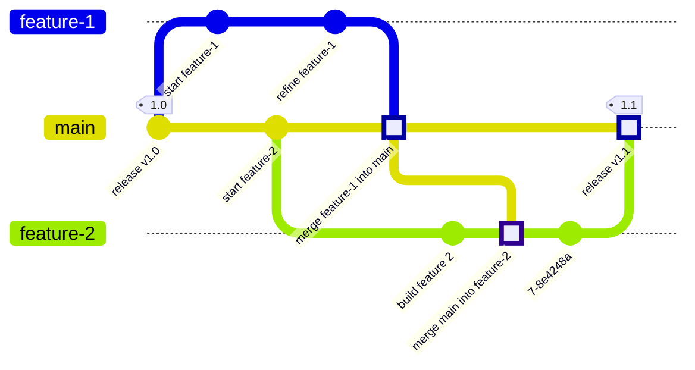
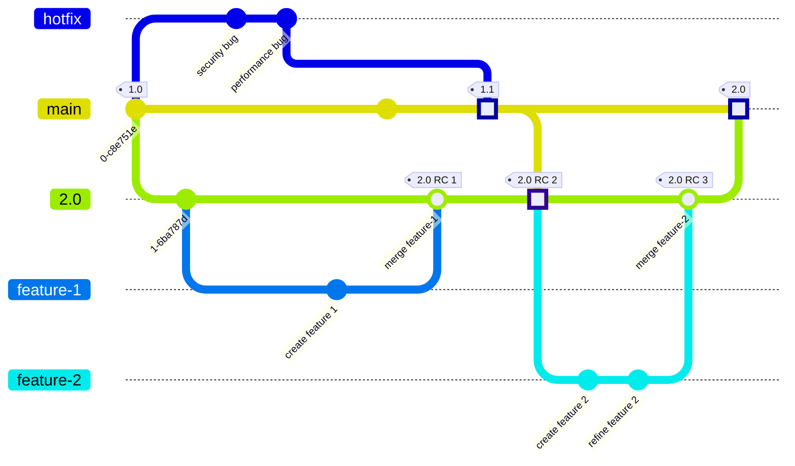
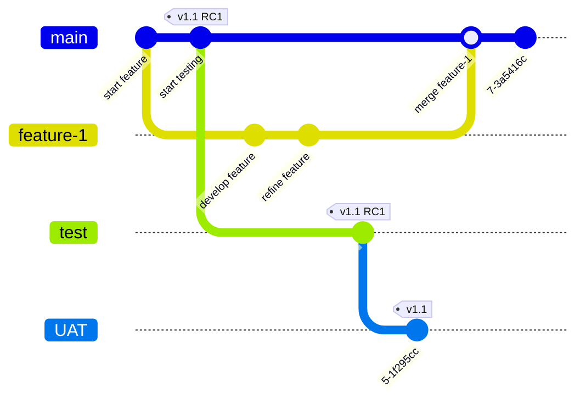

组织和合并 Git 分支的方式被称为分支策略。
对于许多团队而言，最简单的方法既合理又有效：

1. 在功能分支中进行更改。
1. 将功能分支直接合并到 `main`。

但是，如果你的团队有复杂的需求（例如测试和合规性要求），
你可能需要考虑不同的分支策略。

以下部分介绍了一些常见的策略。并非
每个团队都配备 Git（或版本控制）专家。如果你的团队在使用 Git 技能时感到力不从心，以下信息会有所帮助。

当你使用极狐GitLab 替换多个不同的工具时，关于 Git 分支策略的决策至关重要。通过仔细规划，你可以在以下方面建立清晰的关联：

- 你收到的初始错误报告。
- 团队为修复这些错误所做的提交。
- 将这些修复向后移植到其他版本或客户的过程。
- 使修复程序对用户可用的部署。

谨慎的选择有助于你充分利用极狐GitLab 中的单一数据存储。

## 我是否需要更复杂的 Git 分支策略？

如果你遇到以下情况，可能意味着你当前的分支策略已经不能满足需求：

- 你使用持续交付。
- 你有大量自动化测试。
- 你必须为某个客户修复关键错误，而不影响其他客户。
- 你维护产品的多个历史版本。
- 你的产品没有单一的生产分支，因为它支持多个操作系统或平台。
- 每个版本有不同的部署或认证要求。

不要实施比产品需求更复杂的策略。

### 何时将项目拆分为多个仓库

应该维护一个具有复杂分支结构的 Git 仓库，还是将项目拆分到多个仓库？没有唯一的正确答案。这取决于你拥有的人员和专业知识支持。

极狐GitLab 提供的自动化假设你的仓库是针对单个产品的，尽管该产品可能包含多个版本。要确定是应该使用多个仓库还是单个复杂仓库，请思考以下问题：

- 它是同一个产品吗？
- 所有元素是否使用相同的构建过程？
- 底层代码相似或相同吗？

无论你选择哪种方式（复杂的单一仓库还是一组较小的仓库），你都应该预计需要花费工程时间进行维护。确定你准备做哪种类型的工程工作：

- 如果你在单个仓库中维护多个产品的代码，后续需要规划自定义工作以使用极狐GitLab 的所有功能。
- 跨多个仓库合并工作比在同一仓库中跨分支合并更复杂。需要规划工程时间来构建自定义发布流程并管理跨仓库的代码流。

> [!note]
> 如果你的组织使用大型单一仓库或超大仓库，极狐GitLab 的[专业服务](https://gitlab.cn/services/)团队可以帮助你构建满足你需求的自定义分支解决方案。

## 分支策略的主要类型

分支和代码管理策略取决于产品的需求。
没有任何一种预先存在的策略可以覆盖所有情况，但主要类别包括：

- [Web 服务](#web-services)
- [长期存在的发布分支](#long-lived-release-branches)
- [每个环境一个分支](#branch-per-environment)

### Web 服务

此策略遵循标准的 Git 实践。`main` 分支是生产分支，非常适合单个 Web 服务：只有一个规范的生产版本，并且不支持以前的修订版本。

对于这种配置，[`git-flow`](https://nvie.com/posts/a-successful-git-branching-model/) 可能很适合你。它是标准化的，你无需维护任何东西。

在此示例中，`feature-1` 直接从 `main` 分支出来。完成后，`feature-1` 又直接合并回 `main`。此合并提交以方形高亮显示。像 `feature-2` 这样存在时间较长的分支，可能会在开发过程中定期合并来自 `main` 的最新更新。完成后，`feature-2` 合并到 `main`，并发布 `1.1` 版本：

### 长期存在的发布分支

如果产品有必须在很长一段时间内与 `main` 保持分离的分支，这种分支策略是合适的。一些示例包括：

- 同一软件包的多个生产版本。例如：一个当前版本和一些旧版本。当前版本接收功能更新和 hotfix，而以前的版本仅接收 hotfix 和安全发布。
- 一个当前生产版本，和一个长期存在的测试版。当主要的软件依赖项（例如软件开发工具包，或 SDK）引入破坏性更改时，你可能需要这种方法。当前生产版本接收功能更新和 hotfix。测试版接收这些功能更新和 hotfix，同时你的团队也在构建对即将到来的 SDK 更改的支持。

如果你打算锁定一个长期存在的分支，至关重要的是定义你的 hotfix 流程并强制执行。如果没有定义和执行，每次更改都会变成 hotfix。

在此示例中，`2.0` 分支从 `main` 上的 `1.0` 发布提交创建。
功能分支从 `2.0` 分支分出来，然后合并回 `2.0`。同时，任何 hotfix 分支都基于 `main` 的最新发布版本（`1.0`），并合并回 `main` 作为 `1.1` 发布。然后，`2.0` 分支拉取来自 `1.1` 发布的更改，并将其作为 `2.0` 开发的一部分纳入。在添加另一个功能（`feature-2`）之后，`2.0` 分支已准备好投入生产。它合并到 `main`，并发布 `2.0`：

#### 从 SVN 分支策略迁移

从 SVN 迁移到 Git 的遗留项目应审查其分支方法。
在 Git 中，一些以 SVN 为中心的分支方法可能会妨碍你从极狐GitLab 中获得最大收益。需要重新审视的一些工作流：

- 你从 `main` 创建一个长期存在的分支（如 `1.0`），然后锁定 `1.0` 分支以阻止任何未经预批准的 hotfix 更改。
  - Git 处理合并冲突的能力比 SVN 更好。
  - 除非你有合同义务使用长期存在的分支，否则应避免创建它们。虽然 Git 能很好地处理冲突，但长期存在的分支需要你花费时间将修复合并到多个分支。
- 你使用分支是因为你的产品不支持功能标志。

### 每个环境一个分支

这种分支策略常见于拥有多个相互依赖的服务且由不同团队构建的组织。通常与瀑布式或 V 模型开发流程一起使用。

在此示例中，标记为 `v1.1 RC1` 的提交被确定为版本 `1.1` 的候选发布版本。功能继续从 `main` 分支出来并合并回去，而候选发布提交则在 `test` 和 `UAT` 环境中进行测试。对于每个考虑发布的提交，都会重复此过程：

## 相关主题

- [受保护分支](../protected.md)
- [合并请求审批](../../../merge_requests/approvals/_index.md)
- [测试合并结果](../../../../../ci/pipelines/merged_results_pipelines.md)