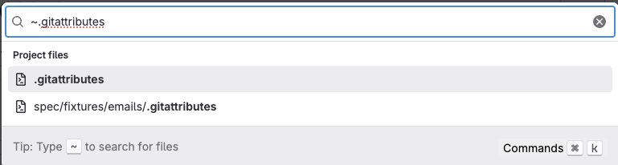



- Tier: 基础版，专业版，旗舰版
- Offering: JihuLab.com，私有化部署



极狐GitLab UI 扩展了 Git 的历史记录和跟踪功能，并在您的浏览器中提供用户友好的功能。您可以：

- 搜索文件。
- 更改文件处理方式。
- 浏览整个文件或单行的历史记录。

<a id="understand-how-file-types-render-in-the-ui"></a>

## 了解文件类型在 UI 中的呈现方式

当您向项目添加以下类型的文件时，极狐GitLab 会渲染其输出以提高可读性：

- [GeoJSON](geojson.md) 文件显示为地图。
- [Jupyter Notebook](jupyter_notebooks/_index.md) 文件显示为渲染后的 HTML。
- 许多标记语言的文件都会被渲染显示。

<a id="supported-markup-languages"></a>

### 支持的标记语言

如果您的文件具有以下文件扩展名之一，极狐GitLab 会在 UI 中渲染该文件的[标记语言](https://en.wikipedia.org/wiki/Lightweight_markup_language)内容。

| 标记语言                                              | 扩展名 |
|--------------------------------------------------------------|------------|
| 纯文本                                                   | `txt`      |
| [Markdown](../../../markdown.md)                             | `mdown`, `mkd`, `mkdn`, `md`, `markdown`, `rmd` |
| [reStructuredText](https://docutils.sourceforge.io/rst.html) | `rst`      |
| [AsciiDoc](../../../asciidoc.md)                             | `adoc`, `ad`, `asciidoc` |
| [Textile](https://textile-lang.com/)                         | `textile`  |
| [Rdoc](https://rdoc.sourceforge.net/doc/index.html)          | `rdoc`     |
| [Org mode](../../../org_mode.md)                             | `org`      |
| [creole](http://www.wikicreole.org/)                         | `creole`   |
| [MediaWiki](https://www.mediawiki.org/wiki/MediaWiki)        | `wiki`, `mediawiki` |

<a id="supported-diagram-formats"></a>

### 支持的图表格式

如果您的文件具有以下文件扩展名之一，极狐GitLab 会在 UI 中将该文件的内容渲染为图表：

| 图表格式                                  | 扩展名                                                              | 可用性 |
|-------------------------------------------------|-------------------------------------------------------------------------|--------------|
| [Mermaid](https://mermaid.js.org/) <sup>1</sup> | `mermaid`                                                               | 始终可用。 |
| [PlantUML](https://plantuml.com/) <sup>2</sup>  | `plantuml`, `pu`, `puml`, `iuml`                                        | 需要管理员[启用 PlantUML 集成](../../../../administration/integration/plantuml.md)。 |
| [Kroki](https://kroki.io/) <sup>2</sup>         | `d2`, `dot`, `gv`, `noml`, `plantuml`, `pu`, `puml`, `iuml`, `vg`, `vl` | 需要管理员[启用 Kroki 集成](../../../../administration/integration/kroki.md)。 |

**脚注**：

1. 对于 Mermaid 图表，仅渲染 `mermaid` 扩展名。不支持 `mmd` 扩展名。
1. 如果同时启用了 PlantUML 和 Kroki 集成，极狐GitLab 会使用 PlantUML 渲染具有
   `plantuml`、`pu`、`puml` 和 `iuml` 扩展名的文件。

有关图表语法的信息，请参阅 [Markdown 中的图表](../../../markdown.md#diagrams-and-flowcharts) 和
[AsciiDoc 中的图表](../../../asciidoc.md#diagrams-and-flowcharts)。

<a id="readme-and-index-files"></a>

### README 和 index 文件

当代码仓库中存在 `README`、`index` 或 `_index` 文件时，极狐GitLab 会渲染其内容。
这些文件可以是纯文本，也可以具有受支持的标记语言的扩展名。

自动渲染的优先级顺序为：

- 可预览文件：`README.md`、`index.md`、`_index.md` 等。
- 纯文本文件：`README`、`index`、`_index` 等。

每个类别中（按字母顺序）找到的第一个文件会被选中，可预览文件优先于纯文本文件。例如，如果
有多个 README 可用，极狐GitLab 会按以下顺序渲染它们：

1. `README.adoc`
1. `README.md`
1. `README.rst`
1. `README`

<a id="render-openapi-files"></a>

### 渲染 OpenAPI 文件

如果文件名包含 `openapi` 或 `swagger`，且扩展名为 `yaml`、`yml` 或 `json`，极狐GitLab 会渲染 OpenAPI 规范文件。以下示例都是正确的：

- `openapi.yml`、`openapi.yaml`、`openapi.json`
- `swagger.yml`、`swagger.yaml`、`swagger.json`
- `OpenAPI.YML`、`openapi.Yaml`、`openapi.JSON`
- `openapi_gitlab.yml`、`openapi.gitlab.yml`
- `gitlab_swagger.yml`
- `gitlab.openapi.yml`

要渲染 OpenAPI 文件：

1. 在代码仓库中[搜索](#search-for-a-file) OpenAPI 文件。
1. 选择 **显示渲染后的文件**。
1. 要在操作列表中显示 `operationId`，请在查询字符串中添加 `displayOperationId=true`。

> [!note]
> 当查询字符串中存在 `displayOperationId` 且具有任何值时，其计算结果为
> `true`。此行为与 Swagger 的默认行为一致。

<a id="print-a-markdown-file-as-pdf"></a>

## 将 Markdown 文件打印为 PDF

> [!flag]
> 此功能的可用性由功能标志控制。

将 Markdown 文件打印为 PDF，以保存其渲染后的内容供分享或存档。
当您查看 Markdown 文件时，**下载** 操作是一个下拉列表，包含两个选项：
**下载为 Markdown** 和 **打印为 PDF**。

要将 Markdown 文件打印为 PDF：

1. 在顶部栏中，选择 **搜索或跳转到** 并找到您的项目。
1. 转到要打印的 Markdown 文件。
1. 在右上角，选择 **下载** () > **打印为 PDF**。
1. 在浏览器的打印对话框中，将文件保存为 PDF。

<a id="view-git-records-for-a-file"></a>

## 查看文件的 Git 记录

极狐GitLab UI 中提供有关代码仓库中文件的历史信息：

- [Git 文件历史](git_history.md)：显示整个文件的提交历史。
- [Git blame](git_blame.md)：显示基于文本的文件的每一行，以及最近更改该行的提交。

<a id="create-permalinks"></a>

## 创建永久链接

永久链接是指向代码仓库中特定文件、目录或代码片段的永久 URL。即使代码仓库发生变化，它们仍然有效，非常适合在文档、议题或合并请求中分享和引用代码。

要创建永久链接：

1. 在顶部栏中，选择 **搜索或跳转到** 并找到您的项目。
1. 转到要链接到的文件或目录。
1. 可选。对于特定代码选择：
   - **单行**：选择行号。
   - **多行**：选择第一个行号，然后按住 <kbd>Shift</kbd> 并选择最后一个行号。
   - **Markdown 锚点**：将鼠标悬停在标题上以显示锚点链接 ()，然后选择它。
1. 选择 **操作** ()，然后选择 **复制永久链接**。
   或者，按 <kbd>y</kbd>。有关更多快捷键，请参阅[键盘快捷键](../../../shortcuts.md)。

当您在评论或描述中粘贴指向文件行的永久链接时，极狐GitLab 可以[嵌入代码](../../../markdown.md#embed-code-from-a-repository)而不是链接。

<a id="view-open-merge-requests-for-a-file"></a>

## 查看文件的未结合并请求

> [!flag]
> 此功能的可用性由功能标志控制。

查看代码仓库文件时，极狐GitLab 会显示一个徽章，其中包含针对当前分支并修改该文件的未结合并请求数量。这有助于您识别有未决更改的文件。

要查看文件的未结合并请求：

1. 在顶部栏中，选择 **搜索或跳转到** 并找到您的项目。
1. 转到要查看的文件。
1. 在屏幕的右上角，文件名旁边，查找带有  **未结** 合并请求数量的绿色徽章。
1. 选择该徽章以查看过去 30 天内创建的未结合并请求列表。
1. 选择列表中的任何合并请求以转到该合并请求。

<a id="search-for-a-file"></a>

## 搜索文件

使用文件查找器直接从极狐GitLab UI 搜索代码仓库中的文件。
文件查找器使用模糊搜索，并在您输入时高亮显示结果。

要搜索文件，请在项目中的任意位置按 <kbd>t</kbd>，或者：

1. 在顶部栏中，选择 **搜索或跳转到** 并找到您的项目。
1. 在左侧边栏中，选择 **代码** > **代码仓库**。
1. 在右上角，选择 **查找文件**。
1. 在对话框中，开始输入文件名：

   

1. 可选。要缩小搜索选项，请按 <kbd>Command</kbd>+<kbd>K</kbd> 或
   在对话框右下角选择 **命令**：
   - 对于 **页面或操作**，输入 <kbd>></kbd>。
   - 对于 **用户**，输入 <kbd>@</kbd>。
   - 对于 **项目**，输入 <kbd>:</kbd>。
   - 对于 **文件**，输入 <kbd>~</kbd>。
1. 从下拉列表中，选择文件以在代码仓库中查看它。

要返回 **文件** 页面，请按 <kbd>Esc</kbd>。

此功能使用 [`fuzzaldrin-plus`](https://github.com/jeancroy/fuzz-aldrin-plus) 库。

<a id="change-how-git-handles-a-file"></a>

## 更改 Git 处理文件的方式

要更改文件或文件类型的默认处理方式，请创建
[`.gitattributes` 文件](git_attributes.md)。使用 `.gitattributes` 文件可以：

- 配置差异中的文件显示，例如[语法高亮](highlighting.md)
  或[折叠生成的文件](../../merge_requests/changes.md#collapse-generated-files)。
- 控制文件存储和保护，例如[使文件只读](../../file_lock.md)，
  或[使用 Git LFS](../../../../topics/git/lfs/_index.md) 存储大文件。

<a id="troubleshooting"></a>

## 故障排查

<a id="repository-languages-excessive-cpu-use"></a>

### 代码仓库语言：CPU 使用率过高

为确定代码仓库文件中的语言，极狐GitLab 使用一个 Ruby gem。
当该 gem 解析文件以确定其文件类型时，[该过程可能消耗过多 CPU](https://gitlab.com/gitlab-org/gitaly/-/issues/1565)。
该 gem 包含一个[启发式配置文件](https://github.com/github-linguist/linguist/blob/main/lib/linguist/heuristics.yml)，
用于定义要解析的文件扩展名。以下文件类型可能消耗过多 CPU：

- 具有 `.txt` 扩展名的文件。
- 扩展名未由该 gem 定义的 XML 文件。

要解决此问题，请编辑您的 `.gitattributes` 文件并为特定文件扩展名指定语言。您也可以使用此方法修复被错误识别的文件类型：

1. 确定要指定的语言。该 gem 包含一个
   [已知数据类型配置文件](https://github.com/github-linguist/linguist/blob/main/lib/linguist/languages.yml)。

1. 例如，要为文本文件添加条目：

   ```yaml
   Text:
     type: prose
     wrap: true
     aliases:
     - fundamental
     - plain text
     extensions:
     - ".txt"
   ```

1. 在代码仓库的根目录中添加或编辑 `.gitattributes`：

   ```plaintext
   *.txt linguist-language=Text
   ```

   `*.txt` 文件在启发式文件中有一个条目。此示例可防止解析这些文件。
