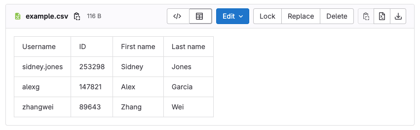



- Tier: 基础版，专业版，旗舰版
- Offering: JihuLab.com，私有化部署



逗号分隔值（CSV）文件是一种使用逗号分隔值的分隔文本文件。
文件的每一行都是一条数据记录。每条记录包含一个或多个字段，字段之间用逗号分隔。
使用逗号作为字段分隔符正是这种文件格式名称的由来。
CSV 文件通常以纯文本形式存储表格数据（数字和文本），在这种情况下，每一行
都有相同数量的字段。

CSV 文件格式并未完全标准化。可以使用其他字符作为列分隔符。
字段可能被包围以转义特殊字符，也可能不包围。

当添加到仓库后，扩展名为 `.csv` 的文件在极狐GitLab 中查看时会渲染为表格：



<a id="csv-parsing-considerations"></a>

## CSV 解析注意事项

极狐GitLab 使用 [Papa Parse](https://github.com/mholt/PapaParse/) 库来解析 CSV 文件。
该库遵循 [RFC4180](https://datatracker.ietf.org/doc/html/rfc4180)，并具有严格的格式要求，这可能导致某些 CSV 格式解析出现问题。

例如：

- 逗号（`,`）分隔符和双引号（`"`）周围的空格可能导致解析错误。
- 同时包含逗号和双引号的字段可能导致解析器错误识别字段边界。

以下格式会导致解析错误：

```plaintext
"字段1", "字段2", "字段3"
```

以下格式可以成功解析：

```plaintext
"字段1","字段2","字段3"
```

如果您的 CSV 文件在极狐GitLab 中未正确显示：

- 如果字段用双引号（`"`）括起来，请确保双引号和逗号（`,`）分隔符紧邻，中间没有空格。
- 将所有包含特殊字符的字段用双引号（`"`）括起来。
- 在进行更改后测试 CSV 文件在极狐GitLab 中的显示效果。

这些解析要求只影响 CSV 文件的视觉渲染，并不会影响仓库中存储的实际文件内容。