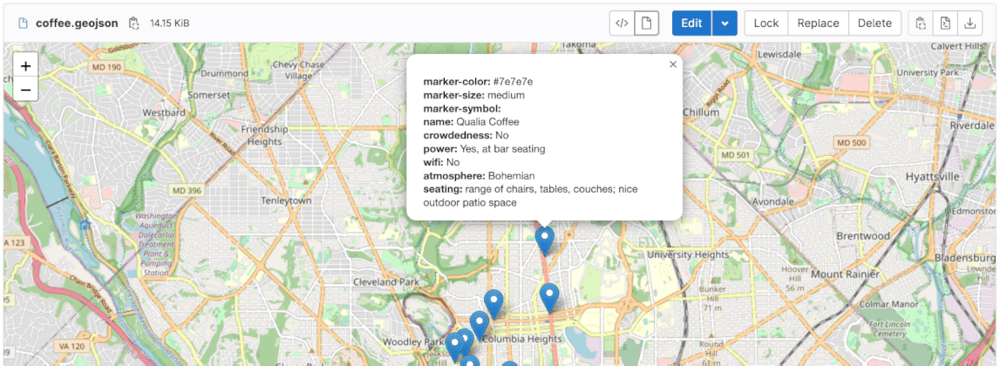



- Tier: 基础版，专业版，旗舰版
- Offering: JihuLab.com，私有化部署





- [已引入](https://gitlab.com/gitlab-org/gitlab/-/issues/14134) 于极狐GitLab 16.1。



GeoJSON 文件是一种使用 JavaScript 对象表示法 (JSON) 编码地理数据结构的格式。
它通常用于表示地理特征，如点、线和多边形及其关联属性。

当添加到代码仓时，扩展名为 `.geojson` 的文件在极狐GitLab 中查看时会呈现为包含 GeoJSON 数据的地图。

地图数据源自遵循 [开放数据库许可证](https://www.openstreetmap.org/copyright) 的 [OpenStreetMap](https://www.openstreetmap.org/)。

