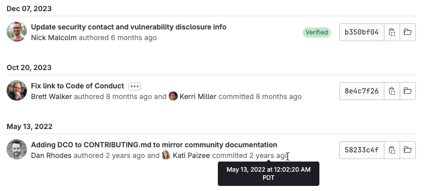



- Tier: 基础版，专业版，旗舰版
- Offering: JihuLab.com，私有化部署



Git 文件历史提供了与文件关联的提交历史信息：



每个提交显示：

- 提交日期。极狐GitLab 将所有在同一天进行的提交分组在一起。
- 用户头像。
- 用户名称。将鼠标悬停在名称上可查看用户的职位、地点、本地时间及当前状态消息。
- 以相对时间格式显示的提交日期。要查看提交的精确日期和时间，请将鼠标悬停在日期上。
- 如果[提交已签名](../signed_commits/_index.md)，则会显示 **已验证** 徽章。
- 提交的 SHA。极狐GitLab 显示前 8 个字符。
  选择 **复制提交 SHA**（）以复制完整的 SHA。
- 一个链接，用于浏览（）提交时文件的当时状态。

当用户创建提交时，极狐GitLab 会从贡献者的 [Git 配置](https://git-scm.com/book/en/v2/Customizing-Git-Git-Configuration)中获取用户名和电子邮件信息。

<a id="view-a-file's-git-history"></a>

## 查看文件的 Git 历史

要在 UI 中查看文件的 Git 历史：

1. 在顶部栏，选择 **搜索或跳转到** 并找到您的项目。
1. 在左侧边栏，选择 **代码** > **代码仓**。
1. 转到仓库中您想要查看的文件。
1. 在最后一个提交块中，选择 **历史**。

<a id="limit-history-range-of-results"></a>

## 限制历史结果范围



- 引入于极狐GitLab 16.9。



在查看旧文件或具有大量提交的文件的历史时，您可以按日期限制搜索结果。限制提交的日期范围有助于解决超大型仓库中的提交历史请求超时问题。

在极狐GitLab UI 中编辑 URL。以 `YYYY-MM-DD` 格式包含以下参数（日期以 UTC 时间解释）：

- `committed_before`
- `committed_after`

在查询字符串中使用 & 符号 (`&`) 分隔每个键值对，如下所示：

```plaintext
?ref_type=heads&committed_after=2023-05-15&committed_before=2023-11-22
```

完整的提交范围 URL 如下所示：

```plaintext
https://jihulab.com/gitlab-org/gitlab/-/commits/master/CONTRIBUTING.md?ref_type=heads&committed_after=2023-05-15&committed_before=2023-11-22
```

<a id="related-topics"></a>

## 相关主题

- [Git 追溯](git_blame.md)
- [常用 Git 命令](../../../../topics/git/commands.md)
- [使用 Git 管理文件](../../../../topics/git/file_management.md)
- [文件树浏览器](file_tree_browser.md)