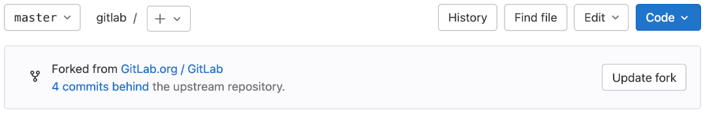



- Tier: 基础版，专业版，旗舰版
- Offering: JihuLab.com，私有化部署



派生是另一个项目的个人副本，创建于你所选的命名空间中。
你的派生包含上游项目的代码仓库副本和一些项目设置，
但不包含议题、合并请求或 Wiki 页面等项目内容。
你可以创建从派生指向上游项目的合并请求。
单个提交也可以从你的派生中[拣选](../merge_requests/cherry_pick_changes.md)到上游项目。

如果你对原始项目拥有写入权限，则不需要派生。
此时，可以使用分支来管理你的工作。
如果你对希望贡献的项目没有写入权限，则派生该项目。
在派生中进行更改，然后通过合并请求将它们提交到上游项目。

若要创建[保密合并请求](../merge_requests/confidential.md)，请使用公开项目的个人派生。

> [!note]
> 如果上游项目被归档，派生关系会自动移除。
> 因派生关系中断而关闭的合并请求，即使随后派生关系恢复，也不会自动重新打开。
>
> 更多信息，请参见[归档项目](../working_with_projects.md#archive-a-project)。

<a id="create-a-fork"></a>

## 创建派生



- 引入于极狐GitLab 16.6。



要在极狐GitLab 中派生现有项目：

1. 在项目首页的右上角，选择 **派生** ()。
1. 可选。编辑**项目名称**。
1. 对于**项目 URL**，选择你的派生应归属的[命名空间](../../namespace/_index.md)。
1. 添加**项目 slug**。此值将成为你的派生 URL 的一部分。
   它在命名空间中必须唯一。
1. 可选。添加**项目描述**。
1. 选择**要包含的分支**选项之一：
   - **所有分支**（默认）。
   - **仅默认分支**。使用 `--single-branch` 和 `--no-tags`
     [Git 选项](https://git-scm.com/docs/git-clone)。
1. 为你的派生选择**可见性级别**。有关可见性级别的更多信息，
   请参见[项目和群组可见性](../../public_access.md)。
1. 选择**派生项目**。

极狐GitLab 会创建你的派生，将你重定向到新派生的页面，并在[审计日志](../../compliance/audit_event_types.md)中记录派生的创建。

如果你计划频繁地上游贡献更改，请考虑为你的派生设置一个[默认目标](../merge_requests/creating_merge_requests.md#set-the-default-target-project)。

<a id="update-your-fork"></a>

## 更新你的派生

派生可能会与它的上游项目不同步，并需要更新：

- **领先**：你的派生包含上游仓库中没有的新提交。
  要同步你的派生，请创建一个合并请求，将你的更改推送到上游仓库。
- **落后**：上游仓库包含你的派生中没有的新提交。
  要同步你的派生，请将新提交拉取到你的派生中。
- **领先且落后**：上游仓库和你的派生都包含对方没有的新提交。
  要完全同步你的派生，请创建一个合并请求将你的更改推送上去，并将上游仓库的新更改拉取到你的派生中。

要同步你的派生与它的上游项目，可以从极狐GitLab UI 或命令行进行更新。极狐GitLab 专业版和旗舰版
还可以通过[将派生配置为上游项目的拉取镜像](#with-repository-mirroring)来自动化更新。

<a id="from-the-ui"></a>

### 从 UI 更新



- 在极狐GitLab 16.0 中 GA，功能标志 `synchronize_fork` 已移除。



当您从 UI 更新派生时，派生上的以下仓库保护设置将被绕过：

- 为派生配置的推送规则。
- 应用于派生中文件的文件锁定。

此行为可防止上游项目和派生具有不同保护配置时同步失败。同步过程会从上游仓库拉取更改，并将其直接应用到派生。

前提条件：

- 你必须从上流项目的[非保护分支](branches/protected.md)创建派生。

要从极狐GitLab UI 更新你的派生：

1. 在顶部栏中，选择**搜索或跳转到**。
1. 选择**查看我的所有项目**。
1. 选择你想更新的派生。
1. 在分支名称的下拉列表下方，找到**派生自** () 信息框，确定你的派生是领先、落后，还是两者兼有。在本例中，
   该派生落后于上游项目：

   

1. 如果你的派生**领先**于上游项目，选择
   **创建合并请求**来提议将派生的更改添加到上游项目。
1. 如果你的派生**落后**于上游项目，选择**更新派生**
   来从上游仓库拉取更改。
1. 如果你的派生**领先且落后**于上游项目，仅当极狐GitLab 未检测到合并冲突时，你才能从 UI 更新：
   - 如果你的派生不包含合并冲突，你可以选择**创建合并请求**
     来提议将更改推送到上游项目，**更新派生**
     来将更改拉取到你的派生，或两者都选。派生中的更改类型
     决定了哪些操作是合适的。
   - 如果您的派生包含合并冲突，极狐GitLab 会显示逐步指南，指导您从命令行更新派生。

<a id="from-the-command-line"></a>

### 从命令行更新

你也可以从命令行更新你的派生。

前提条件：

- 你必须在本地机器上[下载并安装 Git 客户端](../../../topics/git/how_to_install_git/_index.md)。
- 你必须已[创建你要更新的项目的派生](#create-a-fork)。

要从命令行更新你的派生，请按照[使用 Git 更新派生](../../../topics/git/forks.md)中的说明操作。

<a id="with-repository-mirroring"></a>

### 使用仓库镜像



- Tier: 专业版，旗舰版
- Offering: JihuLab.com，私有化部署



如果满足以下所有条件，可以将派生配置为上游项目的镜像：

1. 你的订阅为极狐GitLab 专业版或极狐GitLab 旗舰版。
1. 你在分支（而非 `main`）中创建所有更改。
1. 你不处理[机密议题的合并请求](../merge_requests/confidential.md)，
   因为这需要对 `main` 进行更改。

[仓库镜像](mirror/_index.md)可让你的派生与原始项目保持同步。
此方法每小时更新一次你的派生，无需手动执行 `git pull`。
有关说明，请参见[配置拉取镜像](mirror/pull.md#configure-pull-mirroring)。

> [!warning]
> 使用镜像时，在批准合并请求之前，系统会要求你进行同步。你应该使其自动化。

<a id="merge-changes-back-upstream"></a>

## 将更改合并回上游

当你准备好将代码发送回上游项目时，请按照[在派生中工作时](../merge_requests/creating_merge_requests.md#when-you-work-in-a-fork)所述创建一个新的合并请求。
成功合并后，你的更改将被添加到上游仓库中。

在你的合并请求在上游合并后，出于批量删除的目的，派生中的分支不会被自动视为
**已合并**。仅当你的派生的默认分支包含这些更改时，该分支才被视为已合并。要将在派生中的这些分支标记为已合并，
请[更新你的派生](#update-your-fork)以与上游项目同步。

<a id="unlink-a-fork"></a>

## 取消关联派生

移除派生关系会将你的派生从其上游项目取消链接。
然后你的派生将成为一个独立的项目。

前提条件：

- 你必须是项目所有者才能取消关联派生。

> [!warning]
> 如果移除派生关系，你将无法向源项目发送新的合并请求。
> 现有从派生到源项目的所有打开的合并请求也将被关闭。
> 如果有人派生了你的项目，他们的派生也会失去该关系。
> 要恢复派生关系，请使用[项目派生 API](../../../api/project_forks.md#create-a-fork-relationship)。

要移除派生关系：

1. 在顶部栏中，选择**搜索或跳转到**并找到你的项目。
1. 在左侧边栏中，选择**设置** > **通用**。
1. 展开**高级**。
1. 在**移除派生关系**部分，选择**移除派生关系**。
1. 要确认，请输入项目路径并选择**确认**。

极狐GitLab 在[审计日志](../../compliance/audit_event_types.md)中记录取消关联操作。
当你取消关联一个使用了[哈希存储池](../../../administration/repository_storage_paths.md#hashed-object-pools)
与另一个仓库共享对象的派生时：

- 所有对象都会从存储池复制到你的派生中。
- 复制过程完成后，存储池不会再向你的派生传播任何更新。

<a id="delete-a-fork"></a>

## 删除派生

删除派生会永久移除该项目及其所有内容，包括派生关系。此操作与删除任何其他项目相同。

要删除派生，请参见[删除项目](../working_with_projects.md#delete-a-project)。

<a id="check-a-fork-s-storage-usage"></a>

## 检查派生的存储用量

你的派生使用去重策略来减少所需的存储空间。你的派生可以访问连接到源项目的对象池。

有关更多信息以及检查存储使用情况，请参见[查看项目派生存储用量](../../storage_usage_quotas.md#view-project-fork-storage-usage)。

<a id="troubleshooting"></a>

## 故障排除

<a id="error-an-error-occurred-while-forking-the-project-please-try-again"></a>

### 错误：`派生项目时发生错误。请重试`

此错误可能是由于派生项目与新的命名空间之间的实例 runner 设置不匹配。有关更多信息，请参见[在派生项目中使用实例 runner](../../../ci/runners/configure_runners.md#using-instance-runners-in-forked-projects)。

<a id="removing-fork-relationship-fails"></a>

### 移除派生关系失败

如果通过 UI 或 API 移除派生关系无效，你可以尝试在
[Rails 控制台会话](../../../administration/operations/rails_console.md#starting-a-rails-console-session)中移除派生关系：

```ruby
p = Project.find_by_full_path('<project_path>')
u = User.find_by_username('<username>')
Projects::UnlinkForkService.new(p, u).execute
```

<a id="error-user-is-not-allowed-to-import-projects"></a>

### 错误：`用户不允许导入项目`

使用服务账号派生项目时，你可能会收到如下错误：

```plaintext
{"message":["命名空间无效","用户不允许导入项目"]}
```

出现此问题是因为服务账号是机器人用户，即使增加了项目限制，也无法将项目派生到其个人命名空间。

使用服务账号派生项目时，解决方法是使用[项目派生 API](../../../api/project_forks.md) 中的 `namespace_id` 或 `namespace_path` 指定目标群组命名空间。
服务账号必须是具有开发者、维护者或所有者角色的目标群组成员。