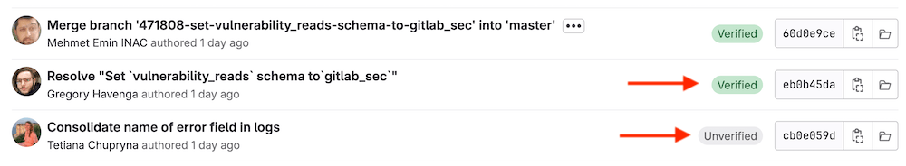
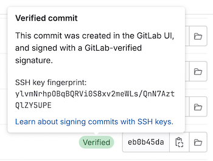
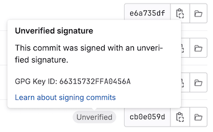



- Tier: 基础版，专业版，旗舰版
- Offering: JihuLab.com，私有化部署



当您为提交添加数字签名时，您提供了额外的保证，证明该提交源自您本人，而非冒充者。数字签名是一种用于验证真实性的加密输出。

理解已签名提交和已验证提交的区别很重要：

- 已签名提交附加了一个加密签名，证明该提交的完整性和真实性。该签名使用私钥创建。
- 已验证提交的签名，极狐GitLab 能够根据用户极狐GitLab 个人资料中存储的已知公钥进行验证。

如果极狐GitLab 能够使用公钥验证提交者的身份，该提交在极狐GitLab UI 中会标记为 **已验证**。

> [!note]
> 在 Git 中，提交者和作者字段是不同的。作者编写提交，提交者应用它。提交签名仅验证提交者的身份。

极狐GitLab 验证提交和标签上的签名。支持以下签名方法：

- [SSH 密钥](ssh.md)：提交和标签
- [GPG 密钥](gpg.md)：仅提交
- [X.509 证书](x509.md)：提交和标签

## 验证提交

要审查合并请求的提交或整个项目的提交，并验证它们是否已签名：

1. 在顶部栏中，选择 **搜索或跳转到** 并找到您的项目。
1. 要审查提交：
   - 对于项目，选择 **代码** > **提交**。
   - 对于合并请求：
     1. 在左侧边栏中，选择 **代码** > **合并请求**，然后选择您的合并请求。
     1. 选择 **提交**。
1. 确定您要审查的提交。根据签名的验证状态，已签名提交会显示 **已验证** 或 **未验证** 徽章。

   

   未签名的提交不显示徽章。

1. 要显示提交的签名详细信息，请选择 **已验证** 或 **未验证** 以查看指纹或密钥 ID：

   

   

您也可以[使用提交 API](../../../../api/commits.md#retrieve-commit-signature) 来检查提交的签名。

### 验证 Web UI 提交

极狐GitLab 使用 SSH 对通过 Web UI 创建的提交进行签名。
要在本地验证这些提交，请使用 [Web 提交 API](../../../../api/web_commits.md#retrieve-public-signing-key) 获取极狐GitLab 用于签名 Web 提交的公钥。

### 已签名提交的 Mailmap 邮件检测



- 于极狐GitLab 17.5 引入，带有功能标志 `check_for_mailmapped_commit_emails`，默认禁用。
- 于极狐GitLab 18.9 在 JihuLab.com 上启用。



> [!flag]
> 此功能的可用性由功能标志控制。有关更多信息，请参见历史记录。
> 此标志启用了 `mailmap` 检测的基础架构。完整的 `mailmap` 支持需要额外配置，且默认尚未启用。

当已验证签名提交的提交者电子邮件不再对签名用户验证时，极狐GitLab 会显示一个带有警告符号的橙色已验证徽章（ **已验证**）。

这可能在以下情况下发生：

- 提交者电子邮件已从用户的已验证电子邮件中移除。
- [`.mailmap`](https://git-scm.com/docs/gitmailmap) 文件将提交者电子邮件重新映射到签名用户未验证的地址。

要恢复绿色 **已验证** 徽章，请将提交者电子邮件地址添加到您的极狐GitLab 个人资料并进行验证。

## 使用推送规则强制签名提交



- Tier: 专业版，旗舰版
- Offering: JihuLab.com，私有化部署



您可以使用推送规则在项目中要求已签名提交。
**拒绝未签名提交** 推送规则可防止任何未签名提交被推送到仓库，帮助组织维护代码完整性并满足合规要求。

有关此规则的工作原理及其限制的详细信息，请参见[要求已签名提交](../push_rules.md#require-signed-commits)。

## 故障排除

### 修复签名提交的验证问题

使用 GPG 密钥或 X.509 证书签名的提交的验证过程可能因多种原因失败：

| 值 | 描述 | 可能的修复方法 |
|-----------------------------|-------------|----------------|
| `UNVERIFIED` | 提交签名无效。 | 使用有效签名对提交进行签名。 |
| `SAME_USER_DIFFERENT_EMAIL` | 用于签名的 GPG 密钥不包含提交者电子邮件，但包含该提交者的另一个有效电子邮件。 | 修订提交以使用与 GPG 密钥匹配的电子邮件地址，或更新 GPG 密钥[以包含该电子邮件地址](https://security.stackexchange.com/a/261468)。 |
| `OTHER_USER` | 签名和 GPG 密钥有效，但该密钥属于与提交者不同的用户。 | 修订提交以使用正确的电子邮件地址，或修订提交以使用与您用户关联的 GPG 密钥。 |
| `UNVERIFIED_KEY` | 与 GPG 签名关联的密钥没有与提交者关联的已验证电子邮件地址。 | 将电子邮件添加并验证到您的极狐GitLab 个人资料，[更新 GPG 密钥以包含该电子邮件地址](https://security.stackexchange.com/a/261468)，或修订提交以使用不同的提交者电子邮件地址。 |
| `UNKNOWN_KEY` | 与此提交的 GPG 签名关联的 GPG 密钥对于极狐GitLab 是未知的。 | [将 GPG 密钥添加](gpg.md#add-a-gpg-key-to-your-account)到您的极狐GitLab 个人资料。 |
| `MULTIPLE_SIGNATURES` | 为该提交找到了多个 GPG 或 X.509 签名。 | 修订提交以仅使用一个 GPG 或 X.509 签名。 |

