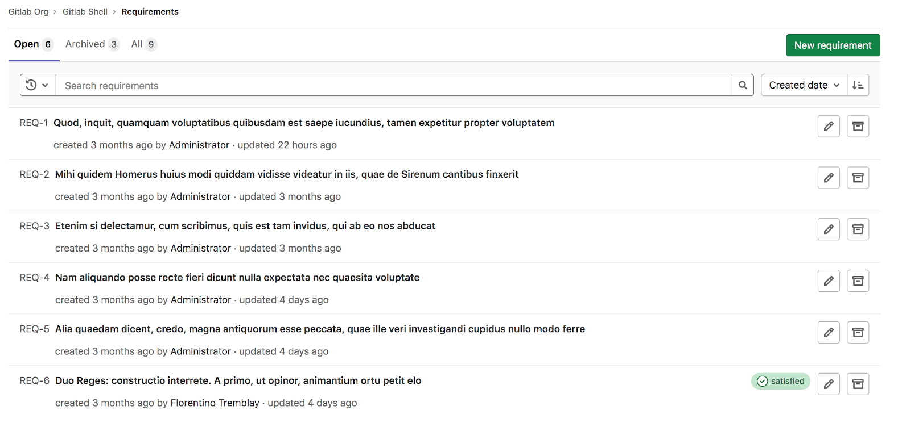
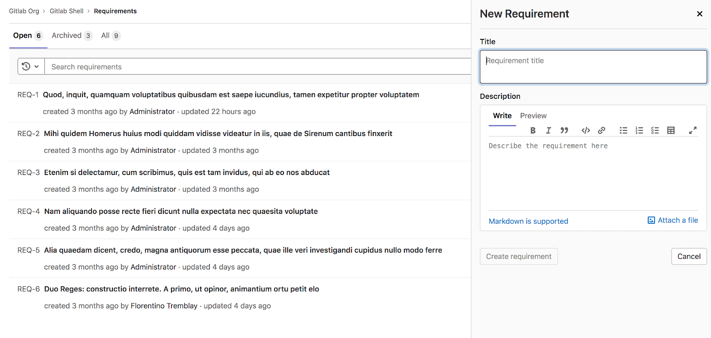
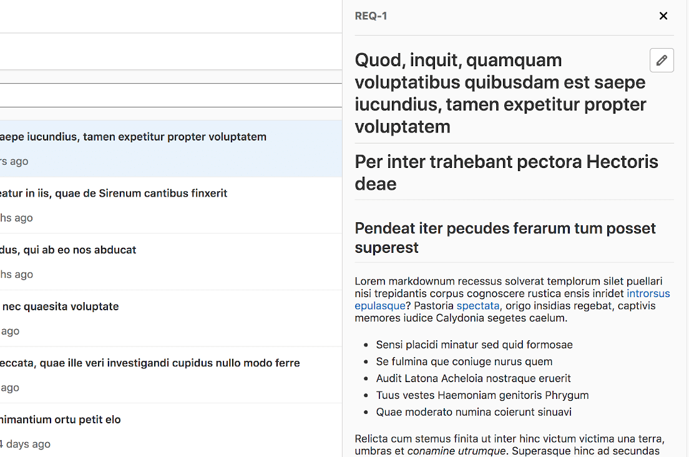
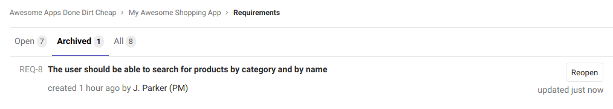



- Tier: 旗舰版
- Offering: JihuLab.com，私有化部署



通过需求，您可以设定标准来检验您的产品。这些标准可以基于用户、利益相关者、系统、软件，或任何您认为重要且需要记录的内容。

需求是极狐GitLab 中的一种产物，用于描述产品的具体行为。需求是长期存在的，除非手动清除，否则不会消失。

如果行业标准要求您的应用程序具备某项功能或行为，您可以[创建需求](#create-a-requirement)来体现这一点。当某项功能不再需要时，您可以[归档相关需求](#archive-a-requirement)。

<!-- Video published on 2020-04-09 -->

<!-- Video published on 2020-02-12 -->



<a id="create-a-requirement"></a>

## 创建需求

每个项目中都有一个分页的需求列表，您可以在其中创建新需求。

先决条件：

- 您必须具有计划者、报告者、开发者、维护者或所有者角色。

要创建需求：

1. 在项目中，转到 **计划** > **需求**。
1. 选择 **新建需求**。
1. 输入标题和描述，然后选择 **新建需求**。



您可以在列表顶部看到新创建的需求，需求列表按创建日期降序排序。

<a id="view-a-requirement"></a>

## 查看需求

您可以从列表中选择一个需求来查看它。



在查看需求时，要编辑它，请选择需求标题旁边的 **编辑** 图标 ()。

<a id="edit-a-requirement"></a>

## 编辑需求

您可以从需求列表页面编辑需求。

先决条件：

- 您必须具有计划者、报告者、开发者、维护者或所有者角色，或者是该需求的作者或指派人。

要编辑需求：

1. 在需求列表中，选择 **编辑** 图标 ()。
1. 在文本输入字段中更新标题和描述。您也可以在编辑表单中使用 **已满足** 复选框将需求标记为已满足。
1. 选择 **保存更改**。

<a id="archive-a-requirement"></a>

## 归档需求

当您位于 **未归档** 标签页时，可以归档一个未归档的需求。

先决条件：

- 您必须具有计划者、报告者、开发者、维护者或所有者角色，或者是该需求的作者或指派人。

要归档需求，请选择 **归档** ()。

需求一旦归档，它将不再出现在 **未归档** 标签页中。

<a id="reopen-a-requirement"></a>

## 重新打开需求

您可以在 **已归档** 标签页中查看已归档需求的列表。

先决条件：

- 您必须具有计划者、报告者、开发者、维护者或所有者角色，或者是该需求的作者或指派人。



要重新打开已归档的需求，请选择 **重新打开**。

需求一旦重新打开，它将不再出现在 **已归档** 标签页中。

<a id="search-for-a-requirement"></a>

## 搜索需求

您可以根据以下条件从需求列表页面搜索需求：

- 标题
- 作者的用户名
- 状态（已满足、失败或缺失）

要搜索需求：

1. 在项目中，转到 **计划** > **需求** > **列表**。
1. 选择 **搜索或筛选结果** 字段。将出现一个下拉列表。
1. 从下拉列表中选择需求作者或状态，或输入纯文本以按需求标题搜索。
1. 在键盘上按 <kbd>Enter</kbd> 以筛选列表。

您还可以按以下方式对需求列表进行排序：

- 创建日期
- 更新日期

<a id="allow-requirements-to-be-satisfied-from-a-ci-job"></a>

## 允许从 CI 作业满足需求

极狐GitLab 现在支持[需求测试报告](../../../ci/yaml/artifacts_reports.md#artifactsreportsrequirements)。您可以向 CI 流水线添加一个作业，当该作业被触发时，会将所有现有需求标记为已满足（您也可以在编辑表单中手动满足需求，请参阅[编辑需求](#edit-a-requirement)）。

<a id="add-the-manual-job-to-ci"></a>

### 向 CI 添加手动作业

要配置您的 CI，以便在手动作业被触发时将需求标记为已满足，请将以下代码添加到您的 `.gitlab-ci.yml` 文件中。

```yaml
requirements_confirmation:
  when: manual
  allow_failure: false
  script:
    - mkdir tmp
    - echo "{\"*\":\"passed\"}" > tmp/requirements.json
  artifacts:
    reports:
      requirements: tmp/requirements.json
```

此定义向 CI 流水线添加了一个手动触发的 (`when: manual`) 作业。它是阻塞性的 (`allow_failure: false`)，但触发 CI 作业的条件由您决定。此外，您可以使用任何现有的 CI 作业来将所有需求标记为已满足，只要该 CI 作业生成并上传了 `requirements.json` 产物。

当您手动触发此作业时，包含 `{"*":"passed"}` 的 `requirements.json` 文件将作为产物上传到服务器。在服务器端，会检查需求报告中的“全部通过”记录 (`{"*":"passed"}`)，如果成功，则将所有现有的未归档需求标记为已满足。

<a id="specifying-individual-requirements"></a>

#### 指定单个需求

可以指定单个需求及其状态。

如果存在以下需求：

- `REQ-1` (IID 为 `1`)
- `REQ-2` (IID 为 `2`)
- `REQ-3` (IID 为 `3`)

可以指定第一个需求通过，第二个需求未通过。有效值为“passed”和“failed”。通过省略某个需求的 IID（在此例中为 `REQ-3` 的 IID `3`），则不会记录该需求的结果。

```yaml
requirements_confirmation:
  when: manual
  allow_failure: false
  script:
    - mkdir tmp
    - echo "{\"1\":\"passed\", \"2\":\"failed\"}" > tmp/requirements.json
  artifacts:
    reports:
      requirements: tmp/requirements.json
```

<a id="add-the-manual-job-to-ci-conditionally"></a>

### 有条件地向 CI 添加手动作业

要配置您的 CI，使其仅在存在未归档需求时才包含手动作业，请添加一条检查 `CI_HAS_OPEN_REQUIREMENTS` CI/CD 变量的规则。

```yaml
requirements_confirmation:
  rules:
    - if: '$CI_HAS_OPEN_REQUIREMENTS == "true"'
      when: manual
    - when: never
  allow_failure: false
  script:
    - mkdir tmp
    - echo "{\"*\":\"passed\"}" > tmp/requirements.json
  artifacts:
    reports:
      requirements: tmp/requirements.json
```

由于需求与[测试用例](../../../ci/test_cases/_index.md)正在[迁移到工作项](https://gitlab.com/groups/gitlab-org/-/epics/5171)，如果您在项目中启用了工作项，则必须将先前配置中的 `requirements` 替换为 `requirements_v2`：

```yaml
      requirements_v2: tmp/requirements.json
```

<a id="import-requirements-from-a-csv-file"></a>

## 从 CSV 文件导入需求

您必须具有计划者、报告者、开发者、维护者或所有者角色。

您可以通过上传包含 `title` 和 `description` 列的 [CSV 文件](https://en.wikipedia.org/wiki/Comma-separated_values) 将需求导入到项目中。

导入后，上传 CSV 文件的用户将被设置为所导入需求的作者。

<a id="import-the-file"></a>

### 导入文件

在导入文件之前：

- 考虑先导入一个仅包含少量需求的测试文件。如果不使用极狐GitLab API，则无法撤销大规模导入。
- 确保您的 CSV 文件符合[文件格式](#imported-csv-file-format)要求。

要导入需求：

1. 在项目中，转到 **计划** > **需求**。
   - 对于已有需求的项目，在右上角选择垂直省略号 ()，然后选择 **导入需求** ()。
   - 对于没有需求的项目，在页面中间选择 **导入 CSV**。
1. 选择文件，然后选择 **导入需求**。

该文件将在后台处理，导入完成后，您将收到一封通知电子邮件。

<a id="imported-csv-file-format"></a>

### 导入的 CSV 文件格式

从 CSV 文件导入需求时，文件必须遵循特定格式：

- **标题行**：CSV 文件必须包含以下标题：`title` 和 `description`。标题不区分大小写。
- **列**：除 `title` 和 `description` 之外的其他列的数据不会被导入。
- **分隔符**：列分隔符会根据标题行自动检测。支持的分隔符字符包括：逗号 (`,`)、分号 (`;`) 和制表符 (`\t`)。行分隔符可以是 `CRLF` 或 `LF`。
- **双引号字符**：双引号 (`"`) 字符用于引用字段，从而允许在字段中使用列分隔符（请参阅下方示例 CSV 数据的第三行）。要在带引号的字段中插入双引号 (`"`)，请连续使用两个双引号字符 (`""`)。
- **数据行**：在标题行下方，后续行必须遵循相同的列顺序。标题文本是必需的，而描述是可选的，可以为空。

示例 CSV 数据：

```plaintext
title,description
My Requirement Title,My Requirement Description
Another Title,"A description, with a comma"
"One More Title","One More Description"
```

<a id="file-size"></a>

### 文件大小

限制取决于极狐GitLab 实例的“最大附件大小”配置值。

对于 JihuLab.com，该值设置为 10 MB。

<a id="export-requirements-to-a-csv-file"></a>

## 将需求导出到 CSV 文件

您可以将极狐GitLab 需求导出为 [CSV 文件](https://en.wikipedia.org/wiki/Comma-separated_values)，该文件将作为附件发送到您的默认通知电子邮件。

通过导出需求，您和您的团队可以将其导入到其他工具中，或与您的客户共享。导出需求有助于与更高级别的系统协作，以及完成审计和合规性任务。

先决条件：

- 您必须具有计划者、报告者、开发者、维护者或所有者角色。

要导出需求：

1. 在项目中，转到 **计划** > **需求**。
1. 在右上角，选择垂直省略号 ()，然后选择 **导出为 CSV** ()。

   将出现一个确认对话框。

1. 在 **高级导出选项** 下，选择要导出的字段。

   默认情况下会选中所有字段。要排除某个字段不被导出，请清除其旁边的复选框。

1. 选择 **导出需求**。导出的 CSV 文件将发送到与您的用户关联的电子邮件地址。

<a id="exported-csv-file-format"></a>

### 导出的 CSV 文件格式

<!-- vale gitlab_base.Spelling = NO -->

您可以在电子表格编辑器中预览导出的 CSV 文件，例如 Microsoft Excel、OpenOffice Calc 或 Google Sheets。

<!-- vale gitlab_base.Spelling = YES -->

导出的 CSV 文件包含以下标题：

- 需求 ID
- 标题
- 描述
- 作者
- 作者用户名
- 创建时间 (UTC)
- 状态
- 状态更新时间 (UTC)
