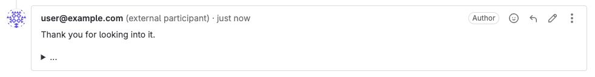
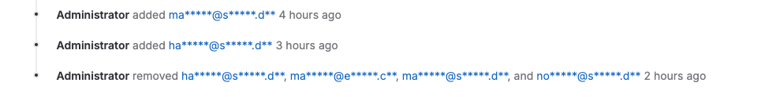
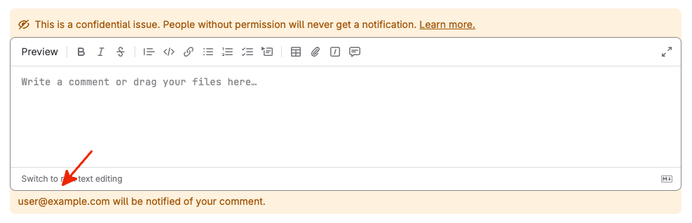



- Tier: 基础版，专业版，旗舰版
- Offering: JihuLab.com，私有化部署





- 于极狐GitLab 17.0 推出。



外部参与者是指没有极狐GitLab 账号，但可以通过电子邮件与议题或服务台工单进行交互的用户。
他们会通过[服务台电子邮件](configure.md#customize-emails-sent-to-external-participants)收到议题或工单上公开评论的通知。

议题或工单上最多可有 10 名外部参与者。

## 服务台工单

极狐GitLab 将服务台工单的外部作者添加为外部参与者。
通常是创建工单的初始电子邮件中 `From` 标头发件人的电子邮件地址。

### 从 `Cc` 头部添加外部参与者

默认情况下，极狐GitLab 仅将创建服务台工单的电子邮件发件人添加为外部参与者。

您可以将极狐GitLab 配置为同时将 `Cc` 头部中的所有电子邮件地址添加到服务台工单中。
这适用于初始电子邮件以及对 [`thank_you` 电子邮件](configure.md#customize-emails-sent-to-external-participants)的所有回复。

从 `Cc` 头部添加的外部参与者会收到 `new_participant` 电子邮件，而不是 `thank_you` 电子邮件，以告知他们已被添加到工单中。

先决条件：

- 您必须具有项目的维护者或所有者角色。

要为项目启用此设置：

1. 在顶部栏中，选择 **搜索或跳转到** 并找到您的项目。
1. 在左侧边栏中，选择 **设置** > **通用**。
1. 展开 **服务台**。
1. 选择 **从 `Cc` 头部添加外部参与者**。
1. 选择 **保存更改**。

## 作为外部参与者

外部参与者会使用[服务台电子邮件](configure.md#customize-emails-sent-to-external-participants)针对议题或工单上的每个公开评论收到通知。

### 回复通知电子邮件

外部参与者可以[回复已收到的通知电子邮件](../../../administration/reply_by_email.md#you-reply-to-the-notification-email)。
这会为议题或工单创建一条新评论，并显示外部参与者的电子邮件地址，而不是极狐GitLab 用户名。电子邮件地址后会带 `(外部参与者)` 字样。

### 取消订阅通知电子邮件

外部参与者可以使用默认服务台电子邮件模板中的取消订阅链接，取消订阅该议题或工单。

如果您[自定义了 `thank_you`、`new_participant` 和 `new_note` 电子邮件模板](configure.md#customize-emails-sent-to-external-participants)，可以使用 `%{UNSUBSCRIBE_URL}` 占位符将取消订阅链接添加到模板中。

为使外部参与者能够成功取消订阅，您的极狐GitLab 实例必须可访问（例如，从公共互联网）。否则，可考虑从模板中删除取消订阅链接。

极狐GitLab 发出的电子邮件也包含特殊标头，允许受支持的电子邮件客户端和其他软件[自动为外部参与者取消订阅](../../profile/notifications.md#using-an-email-client-or-other-software)。

## 作为极狐GitLab 用户

要查看外部参与者的电子邮件地址，您必须具有项目的报告者、开发者、维护者或所有者角色。

在同时满足以下两个条件时，外部参与者的电子邮件地址会被混淆：

- 您不是项目成员或只具有访客角色。
- 该议题或工单是公开的（[非机密](../issues/confidential_issues.md)）。

以下位置的外部参与者的电子邮件地址会被混淆：

- 服务台工单的创建者字段。
- 所有提及外部参与者的[系统笔记](../system_notes.md)。
- [REST](../../../api/notes.md) 和 [GraphQL](../../../api/graphql/_index.md) API。
- 评论编辑器下方的警告消息。

例如：

### 发送给外部参与者的通知

外部参与者会收到议题上所有公开评论的通知。
如需私下沟通，请使用[内部评论](../../discussions/_index.md#add-an-internal-note)。

外部参与者不会收到任何其他议题或工单事件的通知。

### 查看所有外部参与者

概览所有将收到新评论服务台电子邮件的外部参与者。

先决条件：

- 您必须具有项目的报告者、开发者、维护者或所有者角色。

要查看所有外部参与者的列表：

1. 进入议题或工单。
1. 向下滚动到评论编辑器。
1. 如果该议题或工单有外部参与者，您可以在评论编辑器下方看到一条警告，其中列出了所有外部参与者。

### 添加外部参与者



- 于极狐GitLab 13.8 推出，带有一个功能标志 `issue_email_participants`。默认启用。
- 于极狐GitLab 18.10 GA。功能标志 `issue_email_participants` 已移除。



当您希望随时将某人纳入讨论中时，可以使用 [`/add_email` 快速操作](../quick_actions.md#add_email)添加外部参与者。

添加后，外部参与者即会开始使用服务台电子邮件接收通知。

新外部参与者会收到 `new_participant` 电子邮件，以告知他们已被添加到工单中。
极狐GitLab 不会为手动添加的外部参与者发送 `thank_you` 电子邮件。

您应该在单独的评论中添加外部参与者，因为他们不会收到包含 `/add_email` 快速操作的评论的通知电子邮件。

先决条件：

- 您必须具有项目的计划者、报告者、开发者、维护者或所有者角色。

要向议题或工单添加外部参与者：

1. 进入议题或工单。
1. 添加一条仅包含快速操作 `/add_email user@example.com` 的评论。
   您可以链接最多 6 个电子邮件地址。例如 `/add_email user@example.com user2@example.com`。

您应该看到一条成功消息和一条带有该电子邮件地址的新系统笔记。

### 移除外部参与者



- 于极狐GitLab 13.8 推出，带有一个功能标志 `issue_email_participants`。默认启用。
- 于极狐GitLab 18.10 GA。功能标志 `issue_email_participants` 已移除。



当您希望外部参与者停止接收通知时，可以使用 [`/remove_email` 快速操作](../quick_actions.md#remove_email)将他们从议题或服务台工单中移除。

从议题或工单中移除后，他们不会再收到新通知。
但他们仍然可以回复之前收到的电子邮件，并创建对该议题或工单的新评论。

先决条件：

- 您必须具有项目的计划者、报告者、开发者、维护者或所有者角色。
- 该议题或工单上至少已有一名外部参与者。

要从议题或工单中移除现有的外部参与者：

1. 进入议题或工单。
1. 添加一条仅包含快速操作 `/remove_email user@example.com` 的评论。
   您可以链接最多 6 个电子邮件地址。例如 `/remove_email user@example.com user2@example.com`。

您应该看到一条成功消息和一条带有该电子邮件地址的新系统笔记。