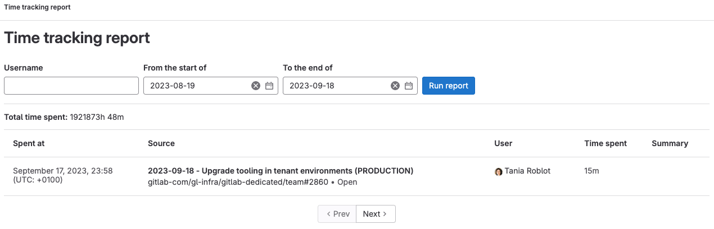



- Tier: 基础版，专业版，旗舰版
- Offering: JihuLab.com，私有化部署





- 任务的时间跟踪在 极狐GitLab 17.0 中引入。
- 史诗的时间跟踪在 极狐GitLab 17.5 中引入。必须启用[史诗的新外观](../group/epics/_index.md#epics-as-work-items)。
- 添加、编辑和删除预估的最低角色在 极狐GitLab 17.7 中从报告者变更为计划者。
- 史诗的时间跟踪在 极狐GitLab 18.1 中 GA。
- 在 极狐GitLab 18.10 中，支持的总时间花费上限从 1 年提升至 4 年。



时间跟踪有助于记录和管理投入到 极狐GitLab 工作项中的时间。
时间跟踪可以：

- 记录在议题、合并请求、史诗和任务上花费的实际时间。
- 估算完成所需的总时间。
- 提供时间条目的详细报告。
- 使用标准化的时间单位计算总和。
- 通过快速操作和 UI 跟踪历史记录。

你可以在工作项的右侧边栏中查看时间跟踪信息：


使用[快速操作](quick_actions.md)或用户界面输入和删除时间跟踪数据。
将快速操作输入在单独的行上。
如果你在单个评论中多次使用任何快速操作，则仅应用其最后一次出现。

<a id="permissions"></a>

## 权限

根据你的角色，可以使用不同的时间跟踪功能：

- 要添加、编辑和删除预估，你需要对议题和任务具有计划者、报告者、开发者、维护者或所有者角色，或对合并请求具有开发者角色。
- 要添加和编辑已花费时间，你需要对项目具有计划者、报告者、开发者、维护者或所有者角色。
- 要删除时间条目，你必须是作者或具有维护者或所有者角色。

<a id="estimates"></a>

## 预估

预估旨在显示完成某个项目所需的总时间。

当你将鼠标悬停在右侧边栏的时间跟踪信息上时，可以看到预计剩余时间。


<a id="add-an-estimate"></a>

### 添加预估

先决条件：

- 对于议题，你必须对项目具有计划者、报告者、开发者、维护者或所有者角色。
- 对于任务，你必须对项目具有计划者、报告者、开发者、维护者或所有者角色。
- 对于合并请求，你必须对项目具有开发者、维护者或所有者角色。

要输入预估，请使用 [`/estimate` 快速操作](quick_actions.md#estimate)，后跟时间。

例如，如果你需要输入 1 个月、2 周、3 天、4 小时和 5 分钟的预估，
输入 `/estimate 1mo 2w 3d 4h 5m`。
查看[你可以使用的时间单位](#available-time-units)。

一个项目只能有一个预估。
每次你输入新的时间预估，它都会覆盖之前的值。

<a id="remove-an-estimate"></a>

### 删除预估

先决条件：

- 对于议题，你必须对项目具有计划者、报告者、开发者、维护者或所有者角色。
- 对于任务，你必须对项目具有计划者、报告者、开发者、维护者或所有者角色。
- 对于合并请求，你必须对项目具有开发者、维护者或所有者角色。

要完全删除预估，请使用 [`/remove_estimate` 快速操作](quick_actions.md#remove_estimate)。

<a id="time-spent"></a>

## 已花费时间

在你工作时，你可以记录已花费的时间。

每个新的已花费时间条目都会添加到议题、任务或合并请求的当前总已花费时间中。

在一个议题、任务或合并请求上花费的总时间不能超过 4 年。

<a id="add-time-spent"></a>

### 添加已花费时间

先决条件：

- 你必须对项目具有计划者、报告者、开发者、维护者或所有者角色。

<a id="using-the-user-interface"></a>

#### 使用用户界面



- 在 极狐GitLab 15.7 中引入。
- 在 极狐GitLab 17.0 中变更。当你未指定花费时间时，将使用当前时间。



要使用用户界面添加时间条目：

1. 在侧边栏的 **时间跟踪** 部分，选择 **添加时间条目** ()。将打开一个对话框。
1. 输入：

   - 花费的时间量。
   - 可选。何时花费。如果留空，则使用当前时间。
   - 可选。摘要。

1. 选择 **保存**。

侧边栏中的 **已花费** 总数将更新，你可以在[时间跟踪报告](#view-an-items-time-tracking-report)中查看所有条目。

<a id="using-a-quick-action"></a>

#### 使用快速操作

要输入已花费时间，请使用 [`/spend` 快速操作](quick_actions.md#spend)，后跟时间。

例如，如果你需要
记录 1 个月、2 周、3 天、4 小时和 5 分钟，输入 `/spend 1mo 2w 3d 4h 5m`。
查看[你可以使用的时间单位](#available-time-units)。

要添加带有备注的[时间跟踪报告](#view-an-items-time-tracking-report)条目，请创建一个包含描述和快速操作的评论。
然后它会显示在时间跟踪报告的 **摘要/备注** 列中。例如：

```plaintext
起草 MR 并回复初始评论

/spend 30m
```

要记录花费时间的时间点，请在时间后输入日期，格式为 `YYYY-MM-DD`。

例如，要记录 2021 年 1 月 31 日花费的 1 小时，
输入 `/spend 1h 2021-01-31`。

如果你输入未来的日期，则不会记录任何时间。

<a id="using-commit-messages"></a>

#### 使用提交消息



- 在 极狐GitLab 18.3 中引入，带有一个名为 `commit_time_tracking` 的功能标志。默认禁用。
- 在 极狐GitLab 18.7 中 GA。功能标志 `commit_time_tracking` 已移除。



你可以直接在提交消息中记录在议题上花费的时间。当你希望在工作时跟踪时间，而无需单独更新议题时，此方法很有用。

要在提交消息中添加已花费时间，请以 `@<time>` 格式包含议题引用和时间跟踪标记，时间单位之间不要有空格。

例如：

```plaintext
修复登录表单中的一个错误 #123 @1mo2d3h15m
```

此提交消息为议题 #123 添加了 1 个月、2 天、3 小时和 15 分钟的时间花费。

时间跟踪标记必须：

- 以 `@` 符号开头。
- 紧接着是时间单位，单位之间不能有空格。
- 支持以下时间单位：月 (`mo`)、天 (`d`)、小时 (`h`)、分钟 (`m`) 和秒 (`s`)。
- 使用与常规时间跟踪相同的[时间单位](#available-time-units)。

当你推送带有时间跟踪信息的提交时：

1. 极狐GitLab 从提交消息中提取已花费时间。
1. 时间被添加到同一条提交消息中引用的任何议题。
1. 系统备注被添加到议题，表明时间是从提交中添加的。
1. 时间跟踪条目包含提交 SHA 和标题作为描述。

<a id="commit-author-permissions"></a>

##### 提交作者权限

只有当提交作者有权限更新议题时，时间才会从提交消息添加到议题：

- 对于议题所在的项目，提交作者必须具有计划者、报告者、开发者、维护者或所有者角色。
- 如果作者没有足够的权限，其提交中的时间跟踪信息将被忽略。
- 权限检查使用与常规时间跟踪相同的规则。

<a id="known-issues"></a>

##### 已知问题

**一个提交中有多个时间量**

当提交消息引用多个具有不同时间量的议题时，只有第一个时间量会应用于所有引用的议题。

例如，这条提交消息：

```plaintext
修复 #41 @1h30m 和修复 #40 @2h
```

为议题 #41 和议题 #40 都添加了 1h30m。第二个时间量 (`@2h`) 被忽略。

**因提交 SHA 变更导致的重复时间条目**

当提交的 SHA 发生变更时（例如，在变基或修改之后），对于时间跟踪，极狐GitLab 会将其视为新的提交。如果原始和新提交都在议题中被引用，这可能会创建重复的时间条目。

为避免在提交 SHA 可能变更时出现重复时间条目：

- 使用 UI 或快速操作直接将时间添加到议题，而不是使用提交消息。
- 如果你必须使用提交消息进行时间跟踪，请仅在你的分支历史记录最终确定后再添加时间。
- 在合并之前，检查议题的时间跟踪报告以识别并移除任何潜在的重复项。

<a id="prevent-duplicate-time-tracking-in-merge-requests"></a>

### 防止合并请求中的重复时间跟踪

当你合并包含带有时间跟踪信息的提交的合并请求时，极狐GitLab 会防止重复的时间跟踪：

- 每个提交只跟踪一次时间，即使相同的提交消息在仓库历史记录中多次出现。
- 极狐GitLab 通过检查议题是否已存在具有相同提交标题和 ID 的时间条目来防止重复时间跟踪。
- 当提交被合并时，不会跟踪额外的时间。这可以防止在功能分支合并到默认分支时重复计算时间。

<a id="subtract-time-spent"></a>

### 减去已花费时间

先决条件：

- 你必须对项目具有计划者、报告者、开发者、维护者或所有者角色。

要减去时间，请输入一个负值。例如，`/spend -3d` 从总已花费时间中移除三天。你不能低于 0 分钟的时间花费，因此，如果你移除的时间超过已输入的时间，极狐GitLab 将忽略该减法。

<a id="delete-time-spent"></a>

### 删除已花费时间



- 删除按钮在 极狐GitLab 15.1 中引入。



时间日志是单条已花费时间条目，可以是正数或负数。

先决条件：

- 你必须是该时间日志的作者，或对项目具有维护者或所有者角色。

要删除时间日志，可以：

- 在时间跟踪报告中，在时间日志条目的右侧，选择 **删除已花费时间** ()。
- 使用 [GraphQL API](../../api/graphql/reference/_index.md#mutationtimelogdelete)。

<a id="delete-all-the-time-spent"></a>

### 删除所有已花费时间

先决条件：

- 你必须对项目具有计划者、报告者、开发者、维护者或所有者角色。

要一次性删除所有已花费时间，请使用 [`/remove_time_spent` 快速操作](quick_actions.md#remove_time_spent)。

<a id="view-an-items-time-tracking-report"></a>

## 查看项目的时间跟踪报告

要查看在某个项目上花费的时间的时间跟踪报告：

- 在右侧边栏中，**已花费** 旁边，选择时间。


显示的已花费时间细分明细最多限制为 100 个条目。

<a id="global-time-tracking-report"></a>

## 全局时间跟踪报告



- Status: 实验





- 在 极狐GitLab 15.11 中引入，带有一个名为 `global_time_tracking_report` 的功能标志。默认禁用。
- 在 极狐GitLab 16.5 中于 JihuLab.com 上启用。



> [!flag]
> 在 极狐GitLab 私有化部署 上，默认情况下此功能不可用。要使其可用，管理员可以启用名为 `global_time_tracking_report` 的[功能标志](../../administration/feature_flags/_index.md)。
> 在 JihuLab.com 上，此功能可用。
> 此功能尚未准备好用于生产环境。

查看跨所有 极狐GitLab 议题、任务和合并请求所花费时间的报告。

此功能是一个[实验](../../policy/development_stages_support.md)。
如果你发现了错误，请在反馈议题中告知我们。

要查看全局时间跟踪报告：

1. 在你的浏览器中，输入全局报告的 URL：
   - 对于 极狐GitLab 私有化部署，在你的基础 URL 后添加 `/-/timelogs`。例如，`https://gitlab.example.com/-/timelogs`。
   - 对于 JihuLab.com，访问 <https://gitlab.com/-/timelogs>。
1. 可选。要按特定用户过滤，输入其用户名，不带 `@` 符号。
1. 选择开始和结束日期。
1. 选择 **运行报告**。



<a id="available-time-units"></a>

## 可用时间单位

以下时间单位可用：

| 时间单位 | 输入内容                    | 转换率          |
| ---- | --------------------------- | --------------- |
| 月   | `mo`、`month` 或 `months`   | 4 w (160 h)     |
| 周   | `w`、`week` 或 `weeks`      | 5 d (40 h)      |
| 天   | `d`、`day` 或 `days`        | 8 h             |
| 小时  | `h`、`hour` 或 `hours`      | 60 m            |
| 分钟  | `m`、`minute` 或 `minutes`  |                 |

<a id="limit-displayed-units-to-hours"></a>

### 将显示单位限制为小时



- Tier: 基础版，专业版，旗舰版
- Offering: 私有化部署



极狐GitLab 管理员可以将时间单位的显示限制为小时。
要做到这一点：

1. 在右上角，选择 **管理员**。
1. 在左侧边栏中，选择 **设置** > **偏好设置**。
1. 展开 **本地化**。
1. 在 **时间跟踪** 下，选择 **将时间跟踪单位的显示限制为小时** 复选框。
1. 选择 **保存更改**。

启用此选项后，将显示 `75h` 而不是 `1w 4d 3h`。

<a id="related-topics"></a>

## 相关主题

- 时间跟踪 GraphQL 参考：
  - [Connection](../../api/graphql/reference/_index.md#timelogconnection)
  - [Edge](../../api/graphql/reference/_index.md#timelogedge)
  - [Fields](../../api/graphql/reference/_index.md#timelog)
  - [Timelogs](../../api/graphql/reference/_index.md#querytimelogs)
  - [Group timelogs](../../api/graphql/reference/_index.md#grouptimelogs)
  - [Project Timelogs](../../api/graphql/reference/_index.md#projecttimelogs)
  - [User Timelogs](../../api/graphql/reference/_index.md#usertimelogs)