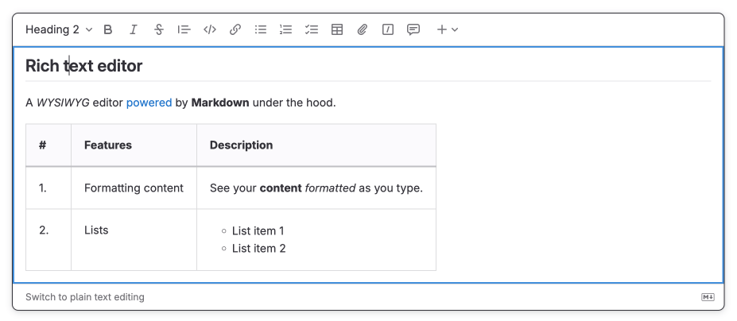
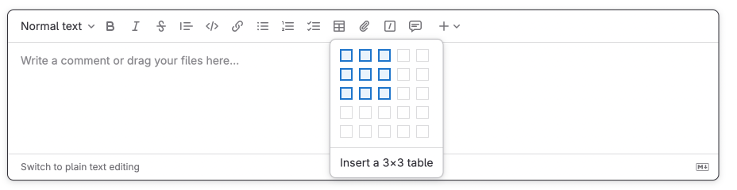
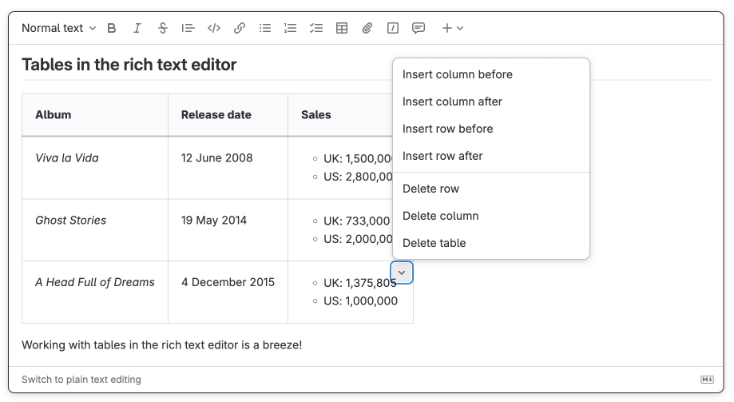
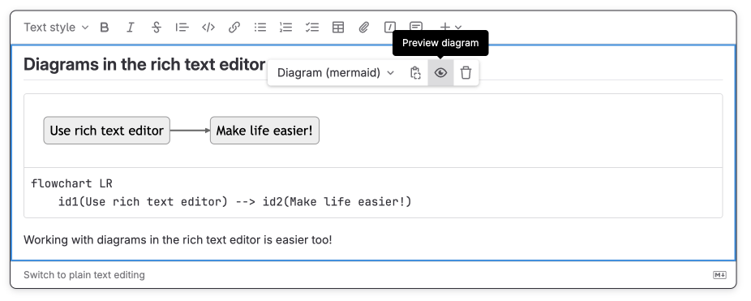



- Tier: 基础版，专业版，旗舰版
- Offering: JihuLab.com，私有化部署





- 在 极狐GitLab 15.5 中引入了编辑议题描述的功能，带有功能标志 `content_editor_on_issues`。默认禁用。
- 在 极狐GitLab 15.11 中，为讨论以及创建和编辑议题和合并请求引入了相同功能标志的功能。
- 在 极狐GitLab 16.1 中，为史诗引入了相同功能标志的功能。
- 功能标志 `content_editor_on_issues` 在 极狐GitLab 16.2 中默认启用。
- 功能标志 `content_editor_on_issues` 在 极狐GitLab 16.5 中被移除。
- 富文本编辑器在 极狐GitLab 18.2 中被设置为新用户的默认编辑器。



富文本编辑器是 极狐GitLab 中新用户的默认文本编辑器。

富文本编辑器可在以下位置使用：

- [Wiki](project/wiki/_index.md)
- 议题
- 史诗
- 合并请求
- [设计](project/issues/design_management.md)

编辑器功能包括：

- 格式化文本，包括粗体、斜体、块引用、标题和内联代码。
- 格式化有序列表、无序列表和检查清单。
- 插入链接、附件、图片、视频和音频。
- 创建和编辑表格结构。
- 插入并格式化带有语法高亮的代码块。
- 实时预览 Mermaid、PlantUML 和 Kroki 图表。

要跟踪将富文本编辑器添加到 极狐GitLab 更多位置的工作，请参阅[史诗 7098](https://gitlab.com/groups/gitlab-org/-/epics/7098)。

<a id="switch-to-the-rich-text-editor"></a>

## 切换到富文本编辑器

使用富文本编辑器编辑描述、Wiki 页面、添加评论。

要切换到富文本编辑器：在文本框的左下角，选择 **切换到富文本编辑**。

<a id="switch-to-the-plain-text-editor"></a>

## 切换到纯文本编辑器

如果要在文本框中输入 Markdown 源代码，请返回使用纯文本编辑器。

要切换到纯文本编辑器：在文本框的左下角，选择 **切换到纯文本编辑**。



<a id="compatibility-with-gitlab-flavored-markdown"></a>

## 与 极狐GitLab Flavored Markdown 的兼容性

富文本编辑器与[极狐GitLab Flavored Markdown](markdown.md)完全兼容。这意味着您可以在纯文本和富文本模式之间切换而不会丢失任何数据。

<a id="input-rules"></a>

### 输入规则

富文本编辑器还支持输入规则，让您像输入 Markdown 一样处理富文本内容。

支持的输入规则：

| 输入规则语法 | 插入的内容 |
| --- | --- |
| `# 标题 1` 到 `###### 标题 6` | 标题 1 到 6 |
| `**粗体**` 或 `__粗体__` | 粗体文本 |
| `_斜体_` 或 `*斜体*` | 斜体文本 |
| `~~删除线~~` | 删除线 |
| `[链接](https://example.com)` | 超链接 |
| `代码` | 内联代码 |
| ` ```rb ` + <kbd>Enter</kbd> <br> ` ```js ` + <kbd>Enter</kbd> | 代码块 |
| `* 列表项`，或<br> `- 列表项`，或<br> `+ 列表项` | 无序列表 |
| `1. 列表项` | 编号列表 |
| `<details>` | 可折叠部分 |

<a id="tables"></a>

## 表格

与原始 Markdown 不同，您可以使用富文本编辑器在表格单元格中插入块内容段落、列表项、图表（甚至另一个表格！）。

<a id="insert-a-table"></a>

### 插入表格

要插入表格：

1. 选择 **插入表格** 。
1. 从下拉列表中，选择新表格的尺寸。



<a id="edit-a-table"></a>

### 编辑表格

在表格单元格内，您可以使用菜单插入或删除行或列。

要打开菜单：在单元格的右上角，选择 V 形图标 。



<a id="operations-on-multiple-cells"></a>

### 对多个单元格的操作

选择多个单元格并合并或拆分它们。

要将所选单元格合并为一个：

1. 选择多个单元格 - 选择一个并拖动光标。
1. 在单元格的右上角，选择 V 形图标  > **合并 N 个单元格**。

要拆分合并的单元格：在单元格的右上角，选择 V 形图标  > **拆分单元格**。

<a id="insert-diagrams"></a>

## 插入图表

插入 [Mermaid](https://mermaidjs.github.io/) 和 [PlantUML](https://plantuml.com/) 图表，并在您输入图表代码时实时预览它们。

要插入图表：

1. 在文本框的顶部栏中，选择  **更多选项**，然后选择 **Mermaid 图表** 或 **PlantUML 图表**。
1. 输入图表的代码。图表预览会出现在文本框中。



<a id="related-topics"></a>

## 相关主题

- [设置默认文本编辑器](profile/preferences.md#set-the-default-text-editor)
- 富文本编辑器的[键盘快捷键](shortcuts.md#rich-text-editor)
- [极狐GitLab Flavored Markdown](markdown.md)

