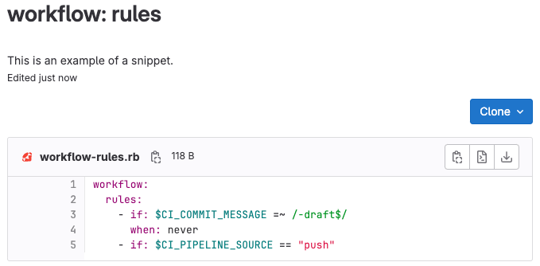



- Tier: 基础版，专业版，旗舰版
- Offering: JihuLab.com，私有化部署



通过极狐GitLab 代码片段，你可以与其他用户存储和分享代码和文本。
你可以对代码片段进行[评论](#对代码片段进行评论)、[克隆](#克隆代码片段)以及
[使用版本控制](#版本化代码片段)。它们可以
[包含多个文件](#添加或删除多个文件)。它们还支持
[语法高亮](#文件名)、[嵌入](#嵌入代码片段)、[下载](#下载代码片段)，
并且你可以通过[代码片段 API](../api/snippets.md) 维护你的代码片段。

你可以通过以下方式创建和管理你的代码片段：

- 极狐GitLab 用户界面。



极狐GitLab 提供两种类型的代码片段：

- 个人代码片段：独立于任何项目。你可以设置
  [可见性级别](public_access.md)为公开或私有。
- 项目代码片段：与特定项目关联。你可以设置可见性
  为公开或仅对项目成员可见。

在 JihuLab.com 上，群组所有者可以为
[企业用户](enterprise_user/_index.md)
[限制个人代码片段的创建](group/manage.md#restrict-personal-snippets-for-enterprise-users)。

<a id="snippet-visibility"></a>

## 代码片段可见性

对于项目代码片段，项目的可见性始终优先于代码片段的
可见性设置。一个标记为公开的代码片段，对于任何原本无法访问该项目的人都是不可访问的。

| 项目可见性 | 谁可以访问公开代码片段 | 谁可以访问私有代码片段 |
|--------------------|-------------------------------|--------------------------------|
| 私有            | 仅项目成员          | 仅项目成员           |
| 内部           | 已认证用户（外部用户除外） | 仅项目成员 |
| 公开             | 所有人                      | 仅项目成员           |

> [!note]
> 在 JihuLab.com 上，对于新项目、群组和代码片段，`内部` 可见性设置已被禁用。
> 使用了 `内部` 可见性设置的现有代码片段将保留此设置。
> 更多信息，请参阅 [issue 12388](https://gitlab.com/gitlab-org/gitlab/-/issues/12388)。

对于个人代码片段，代码片段的可见性设置直接控制访问：

- **公开**：任何人都可以在未认证的情况下访问该代码片段。
- **私有**：只有你可以访问该代码片段。

<a id="create-snippets"></a>

## 创建代码片段

你可以通过多种方式创建代码片段，具体取决于你想要创建个人代码片段还是项目代码片段：

1. 选择你想要创建的代码片段类型：
   - 要创建个人代码片段，请执行以下任一操作：
     - 在[代码片段仪表板](https://jihulab.com/dashboard/snippets)上，选择 **新代码片段**。
     - 从项目中：在左侧边栏中，选择 **新建**（）。在 **在极狐GitLab 中** 下方，选择 **新代码片段**。
     - 从任何其他页面：在右上角，选择 **新建**（）然后选择 **新代码片段**。
   - 要创建项目代码片段：前往你的项目页面。选择
     **新建**（）。在 **在此项目中** 下方，选择 **新代码片段**。
1. 在 **标题** 中，添加一个标题。
1. 可选。在 **描述** 中，描述该代码片段。
1. 在 **文件** 中，为你的文件提供一个合适的名称和扩展名，例如 `example.rb` 或 `index.html`。
   带有合适扩展名的文件名将显示[语法高亮](#文件名)。
   未添加文件名可能会导致一个已知的复制粘贴错误。
   如果你不提供文件名，极狐GitLab 会[为你创建一个名称](#文件名)。
1. 可选。向你的代码片段[添加多个文件](#添加或删除多个文件)。
1. 选择一个可见性级别，然后选择 **创建代码片段**。

对于项目代码片段，项目的可见性充当外部边界。
更多信息，请参阅[代码片段可见性](#代码片段可见性)。

在你创建代码片段后，你仍然可以[向其添加更多文件](#添加或删除多个文件)。
代码片段[默认是版本化的](#版本化代码片段)。

<a id="discover-snippets"></a>

## 发现代码片段

要发现极狐GitLab 中对你有可见的所有代码片段，你可以：

- 查看项目的代码片段：
  1. 在顶部栏中，选择 **搜索或跳转到** 并找到你的项目。
  1. 在左侧边栏中，选择 **代码** > **代码片段**。
- 查看你创建的所有代码片段：
  1. 在顶部栏中，选择 **搜索或跳转到**。
  1. 选择 **您的工作**。
  1. 选择 **代码片段**。

  在 JihuLab.com 上，你也可以直接访问你的[代码片段](https://jihulab.com/dashboard/snippets)。

- 探索所有公开的代码片段：
  1. 在顶部栏中，选择 **搜索或跳转到**。
  1. 选择 **探索**。
  1. 选择 **代码片段**。

  在 JihuLab.com 上，你也可以直接访问[所有公开代码片段](https://jihulab.com/explore/snippets)。

<a id="change-default-visibility-of-snippets"></a>

## 更改代码片段的默认可见性

项目代码片段默认启用且可用。要更改其默认可见性：

1. 在你的项目中，前往 **设置** > **常规**。
1. 展开 **可见性、项目功能、权限** 部分，滚动到 **代码片段**。
1. 切换默认可见性，并选择是让每个人都能查看代码片段，还是仅项目成员能够查看。
1. 选择 **保存更改**。

<a id="versioned-snippets"></a>

## 版本化代码片段

个人和项目代码片段默认都使用版本控制。

这意味着所有代码片段在创建时都会获得一个用默认分支初始化的底层仓库。每当保存对代码片段的更改时，都会向默认分支记录一次新的提交。提交信息会自动生成。代码片段的仓库只有一个分支。你无法删除此分支，也无法创建其他分支。

<a id="filenames"></a>

## 文件名

代码片段根据提供的文件名和扩展名支持语法高亮。你可以提交不带文件名和扩展名的代码片段，但需要一个有效的名称才能在仓库中创建文件内容。

如果没有为代码片段提供文件名和扩展名，极狐GitLab 会以 `snippetfile<x>.txt` 的格式添加一个文件名，其中 `<x>` 代表添加到文件的一个数字，从 1 开始。如果你添加更多未命名的代码片段，此数字会递增。

当从早期版本的极狐GitLab 升级到 13.0 时，没有受支持文件名的现有代码片段将重命名为兼容的格式。例如，如果代码片段的文件名是 `http://a-weird-filename.me`，它会被更改为 `http-a-weird-filename-me`，以便可以包含在代码片段的仓库中。由于代码片段按 ID 存储，更改其文件名会破坏指向该代码片段的直接链接或嵌入链接。

<a id="add-or-remove-multiple-files"></a>

## 添加或删除多个文件

一个代码片段最多支持 10 个文件，这有助于将相关文件放在一起，例如：

- 包含脚本及其输出的代码片段。
- 包含 HTML、CSS 和 JavaScript 代码的代码片段。
- 包含 `docker-compose.yml` 文件及其关联 `.env` 文件的代码片段。
- 一个 `gulpfile.js` 文件和一个 `package.json` 文件，它们可以一起用于引导一个项目并管理其依赖项。

如果你的代码片段需要超过 10 个文件，你应该创建一个 [Wiki](project/wiki/_index.md)。Wiki 对所有订阅级别的项目可用，并且 [群组](project/wiki/group.md) 可用于 [极狐GitLab 专业版](https://gitlab.cn/pricing/)。

包含多个文件的代码片段会在[代码片段列表](https://jihulab.com/dashboard/snippets)中显示文件计数：


你可以通过 Git 管理代码片段（因为它们由 Git 仓库[版本化](#版本化代码片段)），通过[代码片段 API](../api/snippets.md) 以及极狐GitLab 用户界面进行管理。

要通过极狐GitLab 用户界面向你的代码片段添加新文件：

1. 在极狐GitLab 用户界面中前往你的代码片段。
1. 选择右上角的 **编辑**。
1. 选择 **添加另一个文件**。
1. 在提供的表单字段中将你的内容添加到文件中。
1. 选择 **保存更改**。

要通过极狐GitLab 用户界面从你的代码片段中删除文件：

1. 在极狐GitLab 用户界面中前往你的代码片段。
1. 选择右上角的 **编辑**。
1. 沿着你想要删除的每个文件的文件名，选择 **删除文件**。
1. 选择 **保存更改**。

<a id="clone-snippets"></a>

## 克隆代码片段

为了确保你收到更新，请克隆代码片段而不是将其复制到本地。克隆操作会保持代码片段与仓库的连接。

要克隆一个代码片段：

- 选择 **克隆**，然后复制 SSH 或 HTTPS 的 URL 进行克隆。

你可以提交对已克隆代码片段的更改，并将这些更改推送到极狐GitLab。

<a id="embed-snippets"></a>

## 嵌入代码片段

公开代码片段可以分享并嵌入到任何网站。你可以在多个地方重用一个极狐GitLab 代码片段，对源文件的任何更改都会反映在嵌入的代码片段中。嵌入后，用户可以下载它，或以原始格式查看该代码片段。

要嵌入代码片段：

1. 确认你的代码片段是公开可见的：
   - 对于项目代码片段：
     1. 项目和代码片段都必须公开。私有或内部项目中的公开代码片段无法被嵌入。
     1. 在你的项目中，前往 **设置** > **常规**。展开 **可见性、项目功能、权限** 部分，滚动到 **代码片段**。将代码片段权限设置为 **有访问权限的每个人**。
   - 对于个人代码片段：
     1. 前往你的代码片段。
     1. 选择 **编辑**。
     1. 将可见性设置为 **公开**，然后选择 **保存更改**。
1. 在你的代码片段的 **嵌入** 部分，选择 **复制** 以复制一段你可以添加到任何网站或博客文章的单行脚本。例如：

   ```html
   <script src="https://jihulab.com/namespace/project/snippets/SNIPPET_ID.js"></script>
   ```

1. 将你的脚本添加到你的文件中。

嵌入的代码片段会显示一个头部，其中包含：

- 文件名（如果已定义）。
- 代码片段大小。
- 一个指向极狐GitLab 的链接。
- 实际的代码片段内容。

例如：

<script src="https://jihulab.com/gitlab-cn/gitlab-foss/snippets/1717978.js"></script>

<a id="download-snippets"></a>

## 下载代码片段

你可以下载代码片段的原始内容。默认情况下，它们以 Linux 风格的换行符 (`LF`) 下载。如果你想保留原始的换行符，你必须添加一个参数 `line_ending=raw`（例如：`https://jihulab.com/snippets/SNIPPET_ID/raw?line_ending=raw`）。如果代码片段是使用极狐GitLab Web 界面创建的，其原始的换行符是 Windows 风格的 (`CRLF`)。

<a id="comment-on-snippets"></a>

## 对代码片段进行评论

通过代码片段，你可以围绕这段代码展开对话，这可以鼓励用户协作。

<a id="mark-snippet-as-spam"></a>

## 将代码片段标记为垃圾信息



- Tier: 基础版，专业版，旗舰版
- Offering: 私有化部署



私有化部署实例上的管理员可以将代码片段标记为垃圾信息。

先决条件：

- 你必须是实例的管理员。
- 实例上必须启用 [Akismet](../integration/akismet.md) 垃圾信息防护。

要执行此任务：

1. 在顶部栏中，选择 **搜索或跳转到** 并找到你的项目。
1. 在左侧边栏中，选择 **代码** > **代码片段**。
1. 选择你想要报告为垃圾信息的代码片段。
1. 选择 **作为垃圾信息提交**。

极狐GitLab 会将垃圾信息转发给 Akismet。

<a id="troubleshooting"></a>

## 故障排查

<a id="snippet-limitations"></a>

### 代码片段限制

- 对你可以创建的代码片段数量没有限制。
- 不支持创建或删除分支。仅使用默认分支。
- 代码片段仓库不支持 Git 标签。
- 代码片段的仓库最多限制为 10 个文件。尝试推送超过 10 个文件会导致错误。
- 用户在极狐GitLab 用户界面上看不到修订版本，但有相关更新提案。
- 代码片段的默认[最大大小](../administration/snippets/_index.md)目前（截至 2024-04-17）为 50 MB。
- 不支持 Git LFS。

<a id="reduce-snippets-repository-size"></a>

### 缩减代码片段仓库大小

由于版本化代码片段被视为[命名空间存储大小](../administration/settings/account_and_limit_settings.md)的一部分，建议尽可能保持代码片段仓库紧凑。

有关压缩仓库工具的更多信息，请参阅有关[缩减仓库大小](project/repository/repository_size.md#缩减仓库大小的方法)的文档。

<a id="cannot-enter-text-into-the-snippet-text-box"></a>

### 无法在代码片段文本框中输入文本

如果文件名字段后的文本区域被禁用并且阻止你创建新的代码片段，请使用以下解决方法：

1. 为你的代码片段输入一个标题。
1. 滚动到 **文件** 字段的底部，然后选择 **添加另一个文件**。极狐GitLab 会显示第二组字段以添加第二个文件。
1. 在第二个文件的文件名字段中，输入一个文件名以避免已知问题。
1. 在第二个文件的文本区域中输入任意字符串。
1. 滚动回第一个文件名，然后选择 **删除文件**。
1. 创建你文件的其余部分，完成后选择 **创建代码片段**。

<a id="related-topics"></a>

## 相关主题

- 私有化部署实例上的[配置代码片段设置](../administration/snippets/_index.md)