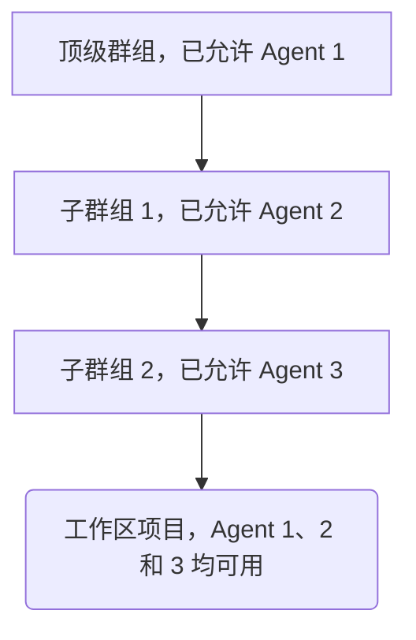



- Tier: 专业版，旗舰版
- Offering: JihuLab.com，私有化部署





- 功能标志 `remote_development_feature_flag` 在极狐GitLab 16.0 中在 JihuLab.com 和私有化部署上启用。
- 在极狐GitLab 16.7 中 GA。功能标志 `remote_development_feature_flag` 已移除。



当你[设置工作空间基础设施](configuration.md#set-up-workspace-infrastructure)时，必须配置一个 Kubernetes 的极狐GitLab agent 以支持工作区。本指南假设极狐GitLab agent 已经安装在 Kubernetes 集群中。

前提条件：

- 你必须完成[设置极狐GitLab agent for Kubernetes 教程](set_up_gitlab_agent_and_proxies.md)中的设置步骤。
- agent 配置必须启用 `remote_development` 模块，且该模块的必填字段必须正确设置。

  > [!note]
  > 如果在具有活跃工作区的 agent 上禁用 `remote_development` 模块，那些工作区将变得不可用。更多信息，请参见[工作区设置](settings.md#enabled)。
- 必须在群组中允许该 agent 用于创建工作区。创建工作区时，用户可以选择与工作区项目的任何父群组关联的已允许 agent。
- 工作区创建者必须对 agent 的项目具有开发者角色。

## 在群组中授权 agent 用于创建工作区



- 新授权策略在极狐GitLab 17.2 中引入。



新授权策略取代了[旧版 agent 授权策略](#legacy-agent-authorization-strategy)。群组所有者和管理员可以控制哪些集群 agent 在其群组中托管工作区。

例如，如果你的工作区项目路径是 `top-level-group/subgroup-1/subgroup-2/workspace-project`，可以使用为 `top-level-group`、`subgroup-1` 或 `subgroup-2` 群组配置的任何 agent。

如果允许某个集群 agent 用于特定群组，例如 `subgroup-1`，则该 agent 可用于在该群组下的所有项目中创建工作区。请仔细考虑允许群组的范围，因为它决定了集群 agent 可以在哪里托管工作区。

## 在群组中允许用于工作区的集群 agent

前提条件：

- 你必须[设置工作区基础设施](configuration.md#set-up-workspace-infrastructure)。
- 你必须具有实例管理员访问权限或群组的所有者角色。

要在群组中允许用于工作区的集群 agent：

1. 在顶部栏，选择 **搜索或跳转到** 并找到你的群组。
1. 在左侧边栏，选择 **设置** > **工作区**。
1. 在 **群组 agent** 部分，选择 **所有 agent** 标签。
1. 从可用 agent 列表中，找到状态为 **已阻止** 的 agent，然后选择 **允许**。
1. 在确认对话框中，选择 **允许 agent**。

极狐GitLab 将所选 agent 的状态更新为 **已允许**，并在 **已允许的 agent** 标签中显示该 agent。

## 在群组中移除已允许的工作区集群 agent

前提条件：

- 你必须[设置工作区基础设施](configuration.md#set-up-workspace-infrastructure)。
- 你必须具有实例管理员访问权限或群组的所有者角色。

要从群组中移除已允许的集群 agent：

1. 在顶部栏，选择 **搜索或跳转到** 并找到你的群组。
1. 在左侧边栏，选择 **设置** > **工作区**。
1. 在 **群组 agent** 部分，选择 **已允许的 agent** 标签。
1. 从已允许的 agent 列表中，找到你想要移除的 agent，然后选择 **阻止**。
1. 在确认对话框中，选择 **阻止 agent**。

极狐GitLab 将所选 agent 的状态更新为 **已阻止**，并从 **已允许的 agent** 标签中移除该 agent。

> [!note]
> 从群组中移除已允许的集群 agent 不会立即停止使用该 agent 的运行中的工作区。运行中的工作区将在自动终止或手动停止时停止。

## 在实例上允许用于工作区的集群 agent



- 在极狐GitLab 18.2 中引入。



前提条件：

- 你必须[设置工作区基础设施](configuration.md#set-up-workspace-infrastructure)。
- 你必须具有[启用远程开发](settings.md#enabled)的 agent。
- 你必须具有实例管理员访问权限。

要在实例上允许用于工作区的集群 agent：

1. 在右上角，选择 **管理员**。
1. 在左侧边栏，选择 **设置** > **通用**。
1. 展开 **可用于工作区的 agent**。
1. 从启用工作区的 agent 列表中，找到你想要允许的 agent，然后选择可用性切换开关。

## 在实例上移除已允许的工作区集群 agent



- 在极狐GitLab 18.2 中引入。



前提条件：

- 你必须具有实例管理员访问权限。

要从实例上移除已允许的集群 agent：

1. 在右上角，选择 **管理员**。
1. 在左侧边栏，选择 **设置** > **通用**。
1. 展开 **可用于工作区的 agent**。
1. 从已允许的 agent 列表中，找到你想要移除的 agent，然后清除可用性切换开关。

> [!note]
> 从实例上移除已允许的集群 agent 不会立即停止使用该 agent 的运行中的工作区。运行中的工作区将在自动终止或手动停止时停止。

## 旧版 agent 授权策略

在极狐GitLab 17.1 及更早版本中，群组中 agent 的可用性并非创建工作区的先决条件。如果满足以下两个条件，你可以使用工作区项目顶级群组中的任何 agent 来创建工作区：

- 远程开发模块已启用。
- 你对顶级群组拥有开发者、维护者或所有者角色。

例如，如果你的工作区项目路径是 `top-level-group/subgroup-1/subgroup-2/workspace-project`，则可以使用 `top-level-group` 及其任何子群组中配置的任何 agent。

## 使用远程开发配置用户访问

你可以配置 `user_access` 模块，以使用你的极狐GitLab 凭据访问连接的 Kubernetes 集群。该模块独立于 `remote_development` 模块进行配置和运行。

在同一个 agent 中配置 `user_access` 和 `remote_development` 时请务必小心。`remote_development` 集群将用户凭据（例如个人访问令牌）作为 Kubernetes 密钥进行管理。`user_access` 中的任何错误配置都可能导致这些私有数据通过 Kubernetes API 被访问。

有关配置 `user_access` 的更多信息，请参见[配置 Kubernetes 访问](../clusters/agent/user_access.md#configure-kubernetes-access)。