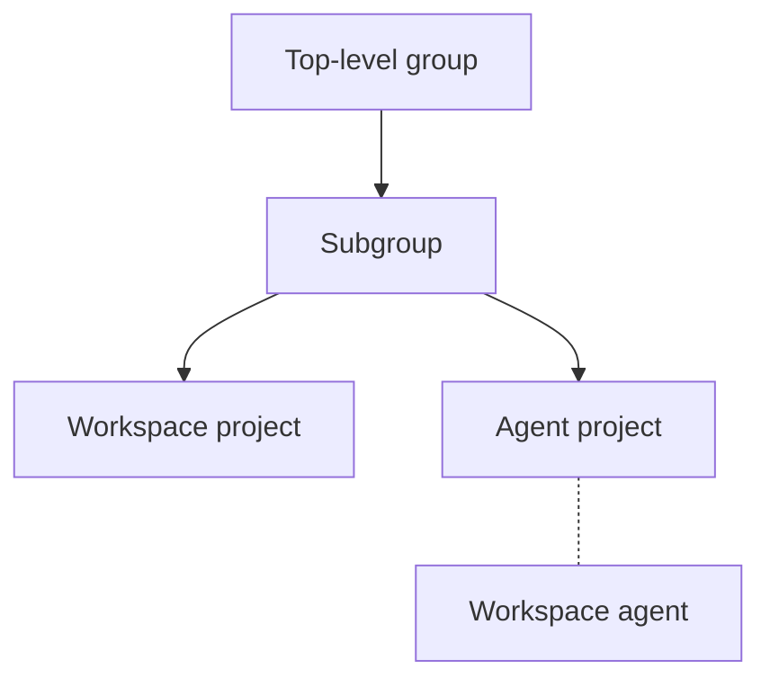

<!-- vale gitlab_base.FutureTense = NO -->

本教程向您展示如何：

- 设置[极狐GitLab Kubernetes Agent](../clusters/agent/_index.md)
  以便用户可以在项目中创建和管理工作区。
- 设置极狐GitLab Workspaces Proxy 以在您的集群中认证和授权[工作区](_index.md)。

> [!note]
> 在为极狐GitLab Kubernetes Agent 配置以支持工作区之前，您必须先完成本教程中的设置步骤。
> 完成本教程后，请使用[极狐GitLab Kubernetes Agent 配置](gitlab_agent_configuration.md)来配置您的 Agent。

<a id="before-you-begin"></a>

## 准备工作

在开始本教程之前，您必须具有：

- 对极狐GitLab 实例的管理员访问权限或对群组的所有者角色。
- 一个正在运行的 Kubernetes 集群。
- 本地机器上安装了 `helm` 3.11.0 或更高版本以及 `kubectl`。
- 能够配置您的 DNS 提供商中的通配符域。
  例如，工作区访问需要 `*.workspaces.example.dev`。

本教程使用以下层级结构：



<a id="install-an-ingress-controller"></a>

## 安装 Ingress 控制器

在您的 Kubernetes 集群中安装一个您选择的 [Ingress 控制器](https://kubernetes.io/docs/concepts/services-networking/ingress-controllers/)，以将外部流量路由到您的工作区。Ingress 控制器必须支持 WebSocket。以下示例使用 [Ingress NGINX 控制器](https://github.com/kubernetes/ingress-nginx)。

1. 在您的 Kubernetes 集群中，安装 Ingress 控制器。

   ```shell
   helm repo add ingress-nginx https://kubernetes.github.io/ingress-nginx
   helm repo update
   helm install ingress-nginx ingress-nginx/ingress-nginx \
     --namespace gitlab-ingress-controller \
     --create-namespace
   ```

1. 获取负载均衡器的外部 IP 地址。在更新 [DNS 记录](#update-your-dns-records)时，您将需要此地址。

   ```shell
   kubectl get svc -n gitlab-ingress-controller ingress-nginx-controller
   ```

<a id="install-the-gitlab-agent-for-kubernetes"></a>

## 安装极狐GitLab Kubernetes Agent

在您的 Kubernetes 集群中安装[极狐GitLab Kubernetes Agent](../clusters/agent/_index.md#kubernetes-integration-glossary)，以将您的集群连接到极狐GitLab：

1. 完成[安装 Kubernetes Agent](../clusters/agent/install/_index.md) 中提供的安装选项之一。
1. 记下您配置的 `agentName`。在配置 Agent 以支持工作区时，需要用到它。

<a id="install-gitlab-relay-kas"></a>

## 安装 GitLab Relay (KAS)

GitLab Relay (KAS) 是与集群中的 Agent 通信的组件。

- 在 JihuLab.com 上，GitLab Relay (KAS) 默认位于 `wss://kas.gitlab.com`。
- 在极狐GitLab 私有化部署实例上，管理员必须
  [设置 GitLab Relay (KAS)](../../administration/clusters/kas.md)。
  设置后可于 `wss://gitlab.example.com/-/kubernetes-agent/` 访问。

<a id="configure-the-gitlab-agent-for-kubernetes"></a>

## 配置极狐GitLab Kubernetes Agent

要在 Agent 项目中配置 `remote_development` 模块：

1. 在顶部栏中，选择 **搜索或跳转到** 并找到您的项目。
1. 在您的项目中，创建一个 `.gitlab/agents/<agentName>/config.yaml` 文件。
   `agentName` 是您设置工作区基础设施时配置的 Agent 的名称。
1. 在 `config.yaml` 中，为工作区设置使用以下配置：

   ```yaml
   remote_development:
     enabled: true
     dns_zone: "<workspaces.example.dev>" # 工作区可用的 URL 的 DNS 区域
   ```

有关配置选项的完整列表，请参阅工作区[配置参考](settings.md#configuration-reference)。

> [!note]
> 极狐GitLab Kubernetes Agent 在一个项目中配置，但您可以在其他项目的工作区中使用它。
> 无需为每个项目单独配置 Agent。
>
> 在您在群组中[允许该 Agent](#allow-the-gitlab-agent-for-kubernetes-in-your-group) 之前，已配置的 Agent 是不可见的。

<a id="allow-the-gitlab-agent-for-kubernetes-in-your-group"></a>

## 在群组中允许极狐GitLab Kubernetes Agent

当您在群组中允许一个 Agent 后，该群组、其子群组以及这些群组中的所有项目都可以使用该 Agent。

> [!note]
> 只需要一个 Agent。您可以使用同一个 Agent 从群组中的所有项目创建工作区。

要在群组中允许极狐GitLab Kubernetes Agent 并使其对该群组中的所有项目可用：

1. 在顶部栏中，选择 **搜索或跳转到** 并找到您的群组。
1. 在左侧边栏中，选择 **设置** > **工作区**。
1. 在 **群组 Agent** 部分，选择 **所有 Agent** 选项卡。
1. 对于极狐GitLab Kubernetes Agent，选择 **允许**。
1. 在确认对话框中，选择 **允许 Agent**。

<a id="grant-workspace-permissions"></a>

## 授予工作区权限

为拥有工作区和 Agent 项目的 开发者、维护者 或 所有者 角色的用户授予创建和管理工作区所需的权限。您可以：

- [将用户添加到项目](../project/members/_index.md#add-users-to-a-project)
- [将用户添加到群组](../group/_index.md#add-users-to-a-group)

<a id="generate-tls-certificates"></a>

## 生成 TLS 证书

工作区访问需要通配符域，因为每个工作区都有自己的子域。
您必须为以下域生成 TLS 证书：

- `gitlab-workspaces-proxy` 监听的域 (`GITLAB_WORKSPACES_PROXY_DOMAIN`)。
- 工作区可用的通配符域 (`GITLAB_WORKSPACES_WILDCARD_DOMAIN`)。

例如，如果您的基础域是 `workspaces.example.dev`：

- `GITLAB_WORKSPACES_PROXY_DOMAIN` 为 `workspaces.example.dev`。
- `GITLAB_WORKSPACES_WILDCARD_DOMAIN` 为 `*.workspaces.example.dev`。
- 单个工作区可通过 `workspace-1.workspaces.example.dev` 这样的 URL 访问。

您可以从任何证书颁发机构生成证书。
如果您的 Kubernetes 集群配置了 [`cert-manager`](https://cert-manager.io/docs/)，您可以使用它自动创建和续订 TLS 证书。

要手动生成证书：

1. 安装 [Certbot](https://certbot.eff.org/) 以启用 HTTPS：

   ```shell
   brew install certbot
   ```

1. 使用 ACME DNS 生成 Let's Encrypt 证书，并在您的 DNS 提供商中创建 `TXT` 记录：

   ```shell
   export EMAIL="YOUR_EMAIL@example.dev"
   export GITLAB_WORKSPACES_PROXY_DOMAIN="workspaces.example.dev"
   export GITLAB_WORKSPACES_WILDCARD_DOMAIN="*.workspaces.example.dev"

   certbot -d "${GITLAB_WORKSPACES_PROXY_DOMAIN}" \
     -m "${EMAIL}" \
     --config-dir ~/.certbot/config \
     --logs-dir ~/.certbot/logs \
     --work-dir ~/.certbot/work \
     --manual \
     --preferred-challenges dns certonly

   certbot -d "${GITLAB_WORKSPACES_WILDCARD_DOMAIN}" \
     -m "${EMAIL}" \
     --config-dir ~/.certbot/config \
     --logs-dir ~/.certbot/logs \
     --work-dir ~/.certbot/work \
     --manual \
     --preferred-challenges dns certonly
   ```

1. 使用输出中的证书目录设置以下环境变量：

   ```shell
   export WORKSPACES_DOMAIN_CERT="${HOME}/.certbot/config/live/${GITLAB_WORKSPACES_PROXY_DOMAIN}/fullchain.pem"
   export WORKSPACES_DOMAIN_KEY="${HOME}/.certbot/config/live/${GITLAB_WORKSPACES_PROXY_DOMAIN}/privkey.pem"
   export WILDCARD_DOMAIN_CERT="${HOME}/.certbot/config/live/${GITLAB_WORKSPACES_PROXY_DOMAIN}-0001/fullchain.pem"
   export WILDCARD_DOMAIN_KEY="${HOME}/.certbot/config/live/${GITLAB_WORKSPACES_PROXY_DOMAIN}-0001/privkey.pem"
   ```

   根据您的环境，`certbot` 命令可能会将证书和密钥保存在不同的路径。
   要获取确切的路径，请运行：

   ```shell
   certbot certificates \
     --config-dir ~/.certbot/config \
     --logs-dir ~/.certbot/logs \
     --work-dir ~/.certbot/work
   ```

> [!note]
> 证书过期时您必须续订。
> 例如，Let's Encrypt 证书三个月后过期。
> 要自动续订证书，请参阅 [`cert-manager`](https://cert-manager.io/docs/)。

<a id="register-a-gitlab-oauth-application"></a>

## 注册极狐GitLab OAuth 应用程序

要在您的极狐GitLab 实例上注册 OAuth 应用程序：

1. 在极狐GitLab 中[创建 OAuth 应用程序](../../integration/oauth_provider.md)。您可以创建：
   - 用户拥有的应用程序
   - 群组拥有的应用程序
   - 从管理区域创建的实例范围应用程序
1. 将重定向 URI 设置为 `https://${GITLAB_WORKSPACES_PROXY_DOMAIN}/auth/callback`。
1. 确保选中了 **机密** 复选框。默认应已选中。
1. 如果您创建实例范围的应用程序，也请选中 **受信任** 复选框。
1. 将作用域设置为 `api`、`read_user`、`openid` 和 `profile`。
1. 导出您的配置值：

   ```shell
   export GITLAB_URL="https://gitlab.com"
   export CLIENT_ID="your_application_id"
   export CLIENT_SECRET="your_application_secret"
   export REDIRECT_URI="https://${GITLAB_WORKSPACES_PROXY_DOMAIN}/auth/callback"
   export SIGNING_KEY="make_up_a_random_key_consisting_of_letters_numbers_and_special_chars"
   ```

1. 安全存储客户端 ID 和生成的密钥，例如存储在 1Password 中。

<a id="generate-an-ssh-host-key"></a>

## 生成 SSH 主机密钥

要生成 RSA 密钥：

```shell
ssh-keygen -f ssh-host-key -N '' -t rsa
export SSH_HOST_KEY=$(pwd)/ssh-host-key
```

或者，您也可以生成 ECDSA 密钥。

<a id="create-kubernetes-secrets"></a>

## 创建 Kubernetes 密钥

要创建 Kubernetes 密钥：

```shell
kubectl create namespace gitlab-workspaces

kubectl create secret generic gitlab-workspaces-proxy-config \
  --namespace="gitlab-workspaces" \
  --from-literal="auth.client_id=${CLIENT_ID}" \
  --from-literal="auth.client_secret=${CLIENT_SECRET}" \
  --from-literal="auth.host=${GITLAB_URL}" \
  --from-literal="auth.redirect_uri=${REDIRECT_URI}" \
  --from-literal="auth.signing_key=${SIGNING_KEY}" \
  --from-literal="ssh.host_key=$(cat ${SSH_HOST_KEY})"

kubectl create secret tls gitlab-workspace-proxy-tls \
  --namespace="gitlab-workspaces" \
  --cert="${WORKSPACES_DOMAIN_CERT}" \
  --key="${WORKSPACES_DOMAIN_KEY}"

kubectl create secret tls gitlab-workspace-proxy-wildcard-tls \
  --namespace="gitlab-workspaces" \
  --cert="${WILDCARD_DOMAIN_CERT}" \
  --key="${WILDCARD_DOMAIN_KEY}"
```

<a id="install-the-gitlab-workspaces-proxy-helm-chart"></a>

## 安装极狐GitLab Workspaces Proxy Helm Chart

要安装极狐GitLab Workspaces Proxy 的 Helm Chart：

1. 添加 `helm` 仓库：

   ```shell
   helm repo add gitlab-workspaces-proxy \
     https://jihulab.com/api/v4/projects/gitlab-cn%2fworkspaces%2fgitlab-workspaces-proxy/packages/helm/devel
   ```

   对于 Helm Chart 0.1.13 及更早版本，请使用以下命令：

   ```shell
   helm repo add gitlab-workspaces-proxy \
     https://jihulab.com/api/v4/projects/gitlab-cn%2fremote-development%2fgitlab-workspaces-proxy/packages/helm/devel
   ```

1. 安装并升级 Chart：

   > [!warning]
   > Chart 版本 0.1.22 及更早版本包含一个安全漏洞，可通过命令行参数暴露敏感信息。更多信息，请参阅[漏洞](https://jihulab.com/gitlab-cn/gitlab/-/issues/567267)。
   >
   > Chart 版本 0.1.20 及更早版本还包含一个安全漏洞，会在通配符域上设置 Cookie。更多信息，请参阅[漏洞修复](https://jihulab.com/gitlab-cn/workspaces/gitlab-workspaces-proxy/-/merge_requests/34)。
   >
   > 您应升级到 Chart 版本 0.1.23 或更高版本以解决这两个漏洞。
   >
   > 在 Chart 版本 0.1.16 之前，Helm Chart 安装会自动创建密钥。如果您从早于 0.1.16 的版本升级，请在运行升级命令之前[创建所需的 Kubernetes 密钥](#create-kubernetes-secrets)。

   ```shell
   helm repo update

   helm upgrade --install gitlab-workspaces-proxy \
     gitlab-workspaces-proxy/gitlab-workspaces-proxy \
     --version=0.1.25 \
     --namespace="gitlab-workspaces" \
     --set="ingress.enabled=true" \
     --set="ingress.hosts[0].host=${GITLAB_WORKSPACES_PROXY_DOMAIN}" \
     --set="ingress.hosts[0].paths[0].path=/" \
     --set="ingress.hosts[0].paths[0].pathType=ImplementationSpecific" \
     --set="ingress.hosts[1].host=${GITLAB_WORKSPACES_WILDCARD_DOMAIN}" \
     --set="ingress.hosts[1].paths[0].path=/" \
     --set="ingress.hosts[1].paths[0].pathType=ImplementationSpecific" \
     --set="ingress.tls[0].hosts[0]=${GITLAB_WORKSPACES_PROXY_DOMAIN}" \
     --set="ingress.tls[0].secretName=gitlab-workspace-proxy-tls" \
     --set="ingress.tls[1].hosts[0]=${GITLAB_WORKSPACES_WILDCARD_DOMAIN}" \
     --set="ingress.tls[1].secretName=gitlab-workspace-proxy-wildcard-tls" \
     --set="ingress.className=nginx"
   ```

   如果您使用不同的 Ingress 类，请修改 `ingress.className` 参数。

<a id="verify-your-setup"></a>

## 验证您的设置

1. 验证 `gitlab-workspaces` 命名空间的 Ingress 配置：

   ```shell
   kubectl -n gitlab-workspaces get ingress
   ```

1. 验证 Pod 是否正在运行：

   ```shell
   kubectl -n gitlab-workspaces get pods
   ```

<a id="update-your-dns-records"></a>

## 更新您的 DNS 记录

要更新您的 DNS 记录：

1. 将 `${GITLAB_WORKSPACES_PROXY_DOMAIN}` 和 `${GITLAB_WORKSPACES_WILDCARD_DOMAIN}`
   指向由 [Ingress 控制器](#install-an-ingress-controller)暴露的负载均衡器外部 IP 地址。
1. 检查 `gitlab-workspaces-proxy` 是否可访问：

   ```shell
   curl --verbose --location ${GITLAB_WORKSPACES_PROXY_DOMAIN}
   ```

   在创建第一个工作区之前，此命令会返回 `400 Bad Request` 错误。

1. 在另一个终端中，检查代理日志：

   ```shell
   kubectl -n gitlab-workspaces logs -f -l app.kubernetes.io/name=gitlab-workspaces-proxy
   ```

   在创建工作区之前，此命令会返回 `could not find upstream workspace upstream not found` 错误。

<a id="update-the-gitlab-agent-for-kubernetes-configuration"></a>

## 更新极狐GitLab Kubernetes Agent 配置

如果您将代理的 Helm Chart 部署到 `gitlab-workspaces` 以外的命名空间，请更新您的[极狐GitLab Kubernetes Agent 配置](gitlab_agent_configuration.md)：

```yaml
remote_development:
  gitlab_workspaces_proxy:
    namespace: "<custom-gitlab-workspaces-proxy-namespace>"
```

<a id="related-topics"></a>

## 相关主题

- [配置工作区](configuration.md)
- [极狐GitLab Kubernetes Agent 配置](gitlab_agent_configuration.md)

